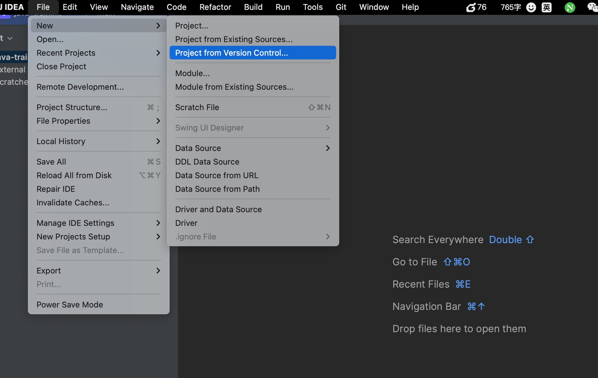

# 后端培训 Java 部分练习

简易服务端

## 功能

在本地启动一个 HTTP 服务，监听 18080 端口，当以 POST 访问 `http://127.0.0.1:18080/medical-info` 时，入参结构为

```json
{
  "name": "xxx",
  "age": "xx岁",
  "sex": "男/女"
}
```

服务端从 `resources` 目录下的 `medicalArray.json` 文件中读取所有患者病例，然后根据入参中的 `name`、`age`、`sex` 三个字段，从中筛选出符合条件的患者病例，返回给客户端。

### 示例代码说明

1. `com.iflytek.haic.training.http.server.SimpleHttpServer` 是一个简易的 HTTP 服务器封装类
    - 启动一个本地 HTTP 服务
    - 解析 HTTP 请求报文
    - 返回 HTTP 响应报文
2. `com.iflytek.haic.training.http.server.SimpleHttpRequest` 是一个简易的 HTTP 请求报文封装类
3. `com.iflytek.haic.training.http.server.SimpleHttpResponse` 是一个简易的 HTTP 响应报文封装类
4. `com.iflytek.haic.training.http.server.RequestHandler` 是一个处理 HTTP 请求的处理器接口
    - `com.iflytek.haic.training.http.server.handlers.DefaultRequestHandler` 是一个默认的处理器实现类，用于返回 404 响应报文
    - `com.iflytek.haic.training.http.server.handlers.MedicalInfoGetHandler` 一个处理 `GET /medical-info` 的请求处理器实现类
5. `com.iflytek.haic.training.http.SimpleHttpServerDemo` 是简易 HTTP 服务器使用示例
6. `com.iflytek.haic.training.http.util.ReadFileUtil` 一个用于读取 `resources` 目录下文件的工具类
7. `com.iflytek.haic.training.http.util.LoggerFactory` 一个打印日志的工具类
8. `resources/medicalArray.json` 是一个患者病例 JSON 数组文件

### 练习功能实现

可以从 `master` 分支拉取每个人的分支。然后导入到 `IDEA` 中  


具体实现可以参考 `com.iflytek.haic.training.http.server.handlers.MedicalInfoGetHandler` 类的实现。

1. 重写 `canHandle(SimpleHttpRequest request)` 方法时，判断请求是否为 `POST /medical-info` 请求
2. 重写 `handle(SimpleHttpRequest request, SimpleHttpResponse response)` 方法时
    1. 从 `resources/medicalArray.json` 文件中读取所有患者病例转为列表
    2. 从请求中获取 `name`、`age`、`sex` 三个字段
    3. 遍历患者病例列表，筛选出符合条件的患者病例
    4. 将筛选出的患者病例列表转为 JSON 字符串，设置到响应报文中
