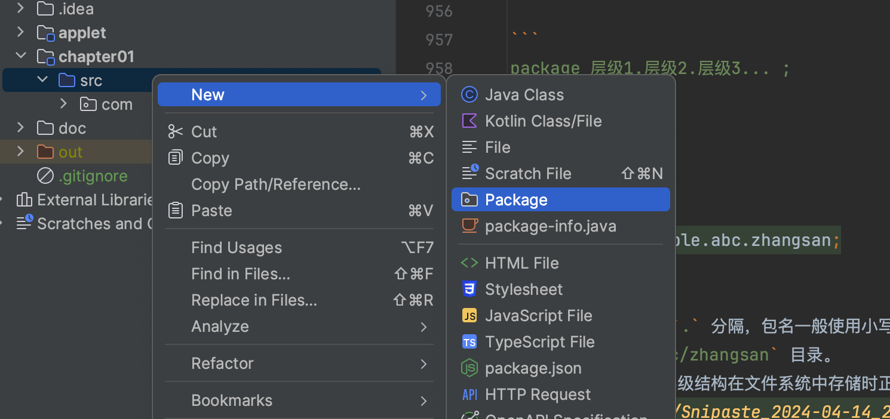

# Java 基础部分

## Java 语言概述

任职于 Sun 公司的 James Gosling（詹姆斯·高斯林）等人于 1991 年 6 月发起了 Java 语言项目。Java 最初是为交互式电视而设计的，但对于当时的数字有线电视行业来说太先进了。该语言最初被称为 Oak，以 Gosling 办公室外的一棵橡树命名。后来该项目被命名为
Green，最后更名为 Java，源自爪哇咖啡，一种来自印度尼西亚的咖啡。Gosling 使用系统和应用程序程序员会熟悉的 C/C++（发行于 1972/1983 年）风格语法来设计 Java。

Sun 公司于 1996 年发布了第一个公共实现 Java 1.0。它承诺一次编写、随处运行 (WORA) 功能，在流行平台上提供免费运行时。它相当安全并具有可配置的安全性，允许网络和文件访问限制。同时在这个版本中页引入可以在网页端运行的 Java Applet（Java 小程序）。主要的
Web 浏览器很快就具备了在网页中运行 Java 小程序的功能，Java 很快就流行起来。Java 伴随着互联网的迅猛发展而发展，逐渐成为重要的网络编程语言。

> JavaScript：1995 年，Netscape 决定在 Navigator 中添加一种编程语言，聘请 Brendan Eich（布兰登·艾克）设计一种新语言，其语法类似于 Java 的“帮助非程序员创建动态的交互式网站”的“面向大众的语言”。最初命名为 Mocha，1995 年 9 月在 Netscape Navigator 2.0 的
> Beta 版中改名为 LiveScript，同年 12 月，Netscape Navigator 2.0 Beta3 中部署时被重命名为 JavaScript。当时互联网热潮已经开始，Java 是一种流行的新语言，因此 Eich 认为 JavaScript 这个名字是 Netscape 的营销策略。日后这成为大众对这门语言有诸多误解的原因之一。

Java 编程语言的风格十分接近 C++语言。继承了 C++语言面向对象技术的核心，舍弃了容易引起错误的指针，以引用取代；移除了 C++ 中的运算符重载和多重继承特性，用接口取代；增加垃圾回收器功能。Sun 公司对 Java 语言的解释是：“Java
编程语言是个简单、面向对象、分布式、解释性、健壮、安全、与系统无关、可移植、高性能、多线程和动态的语言”。当下 Java 在移动应用开发（Android）、大数据处理（Apache Hadoop、Apache Spark）、企业应用（电商、管理系统）、金融领域（交易系统、风险管理系统）等场景下都有广泛的应用。

## Java 开发环境搭建

### JDK 与 JRE

- **JDK** (Java Development Kit)：是 Java 程序开发工具包，包含`JRE` 和开发人员使用的工具。
- **JRE** (Java Runtime Environment) ：是 Java 程序的运行时环境，包含`JVM` 和运行时所需要的`核心类库`。

JDK、JRE、JVM 之间的关系如下  


JVM 正是保证 Java 能够跨平台运行（WORA）的关键。完整的 Java 体系结构如下（Java SE8）。  


**总结：**

- JDK = JRE + 开发工具集（例如 Javac 编译工具等）
- JRE = JVM + Java SE 标准类库

> JDK 可以类比于 Node.js [Run JavaScript Everywhere](https://nodejs.org/en)  
> 

### 安装 JDK

JDK 各个版本发布时间

|      发行版本       |      发行时间      |                                        备注                                         |
|:---------------:|:--------------:|:---------------------------------------------------------------------------------:|
|     JDK 1.0     |   1996.01.23   |                             Sun 公司发布了 Java 的第一个开发工具包                              |
|     JDK 1.1     |   1997.02.19   |                            JavaOne 会议召开，创当时全球同类会议规模之最。                            |
|    J2SE 1.2     |   1998.12.08   |                      Java 拆分成：J2SE（标准版）、J2EE（企业版）、J2ME（小型版）                       |
|    J2SE 1.3     |   2000.05.08   |                                       …………                                        |
|    J2SE 1.4     |   2004.02.06   |                                       …………                                        |
| **Java SE 5.0** | **2004.09.30** |               **① 版本号从 1.4 直接更新至 5.0；② 平台更名为 JavaSE、JavaEE、JavaME**               |
|    Java SE 6    |   2006.12.11   |                           2009.04.20 Oracle 宣布收购 SUN 公司                           |
|    Java SE 7    |   2011.07.02   |                                       …………                                        |
|  **Java SE 8**  | **2014.03.18** |                     **此版本是继 Java 5.0 以来变化最大的版本。是长期支持版本（LTS）**                     |
|    Java SE 9    |   2017.09.22   |         ① 从 Java 9 开始，**每半年更新一次（3 月、9 月）** ②Java 9 开始不再支持 windows 32 位系统          |
|   Java SE 10    |   2018.03.21   |                                       …………                                        |
| **Java SE 11**  | **2018.09.25** |                       **JDK 安装包取消独立 JRE 安装包，是长期支持版本（LTS）**                        |
|   Java SE 12    |   2019.03.19   |                                       …………                                        |
|       ...       |      ...       |                                                                                   |
| **Java SE 17**  |  **2021.09**   | ①**长期支持版本（LTS）** ②**Spring 6.x 和 Spring Boot 3.x 要求的最低 Java 版本** ③**也是集团接下来推荐版本** |
|       ...       |      ...       |                                                                                   |
|   Java SE 21    |    2023.09     |                  **最新的长期支持版本（LTS），虚拟线程（Virtual Threads）特性正式发布**                   |
|   Java SE 22    |    2024.03     |                                       …………                                        |

目前 3.0、4.0 以及 5.0 都还是基于 Java SE8 开发的，同时基本的语法上 Java8 与 Java17 是兼容的，所以这里使用 Java8  
[下载 JDK](https://adoptium.net/zh-CN/temurin/releases/) 切记不要选择安装版本，而是选择压缩包版本，解压后配置环境变量即可。  
  
解压后打开 `电脑->设置->关于->高级系统设置->环境变量->xxx用户环境变量->新建->JAVA_HOME` 值为解压后的目录（`bin` 所在目录）  
  
接着 `Path->编辑->新建->%JAVA_HOME%\bin`  
  
打开终端输入 `echo %JAVA_HOME%` 和 `java -version` 查看是否安装成功  


### IntelliJ IDEA

开发工具 IDEA 直接从公司门户网站下载即可 [IntelliJ IDEA Community Edition](https://soft.iflytek.com/front/detail?id=1461261220348043265)。  


不想使用 IDEA 的话，使用 VsCode 也可以，安转 `Extension Pack for Java` 扩展  


## Hello World

### 使用 VSCode

`新建一个文件夹->VScode打开->新建 HelloWorld.java`，输入如下代码

```java
public class HelloWorld {
    public static void main(String[] args) {
        System.out.println("Hello world!");
    }
}
```

`右键->Run Java` 得到  


### 使用 IDEA

`Projects->New Project->helloworld->Create`  


`src->New->Java Class->HelloWorld` 输入上述同样代码。  
点击右上角 `Run` 按钮执行程序。  


## Java 基本语法

### 关键字与标识符

Java 中的关键字（Keywords）差不多有 50 个，其中`const`和`goto`是`保留字`（Reserved Words）  
`true`，`false`，`null`不在其中，它们看起来像关键字，其实是字面量，表示特殊的布尔值和空值。  
官方完整的关键字和保留字列表[Java Language Keywords](https://docs.oracle.com/javase/tutorial/java/nutsandbolts/_keywords.html)  


  


> 相比于 Java，JavaScript 的关键字更少一些，但是规则上更加复杂 [EcmaScript 关键字](Keywords and Reserved Words )  
> 

在编程语言中，**标识符（Identifier）就是程序员自己规定的具有特定含义的词**。  
比如类名称，属性名称，变量名等。  
在 Java 中**所有的关键字和保留字**都不能作为标识符。

> 但是在 JavaScript 中就比较复杂了，还需要根据上下文环境以及是否是严格模式（Strict Mode）来判断是否可以把某些关键字或保留字作为标识符。

#### Java 中标识符命名规则

1. 由 26 个英文字母大小写，0-9 ，\_或 $ 组成
2. 数字不可以开头。
3. 不可以使用关键字和保留字，但能包含关键字和保留字。
4. Java 中严格区分大小写，长度无限制。
5. 标识符不能包含空格。

> 所以如果在使用 JavaScript 时始终保持不把关键字和保留字作为标识符的编程习惯，这些规则跟 JavaScript 基本上是一样的。

### 变量与运算符

#### 声明、初始化与使用

Java 中变量声明语句  
`数据类型 变量名;`  
初始化语句为  
`变量名 = 变量值;`  
或者合并为  
`数据类型 变量名 = 变量值;`

使用变量注意：

- Java 中每个变量必须先声明，后使用。
- 使用变量名来访问这块区域的数据。
- 变量的作用域：其定义所在的一对{ }内。
- 变量只有在其`作用域`内才有效。出了作用域，变量不可以再被调用。
- 同一个作用域内，不能定义重名的变量。

> 某些方面跟 JavaScript 有些区别，例如 JavaScript 中使用 `var` 声明的变量作用域提升使得可以在声明之前使用这个变量问不会报错。

[Java 中变量的数据类型分为两大类](https://docs.oracle.com/javase/specs/jls/se8/html/jls-4.html)，基本数据类型和引用数据类型。  


| 类型      | 内存占用       | 初始化值     | 范围                                              | 备注                                                 |
|:--------|:-----------|:---------|:------------------------------------------------|:---------------------------------------------------|
| byte    | 1 字节（8 位）  | 0        | -2^7~2^7-1                                      | 无                                                  |
| short   | 2 字节（16 位） | 0        | -2^15~2^15-1                                    | 无                                                  |
| int     | 4 字节（32 位） | 0        | -2^31~2^31-1                                    | 无                                                  |
| long    | 8 字节（64 位） | 0L       | -2^63~2^63-1                                    | 无                                                  |
| float   | 4 字节（32 位） | 0.0F     | ±1.401298E−45 并 ±3.402823E+38                   | IEEE 754 标准单精度浮点数，有效数字位数 6~7 为                     |
| double  | 8 字节（64 位） | 0.0D     | ±4.94065645841246E−324 并 ±1.79769313486232E+308 | IEEE 754 标准双精度浮点数，有效数字位数 15 位                      |
| char    | 2 字节（16 位） | '\u0000' | 从'\u0000'到'\uffff'，即从 0 到 2^16-1                | 对应 UTF-16 编码中的一个代码单元，一般不建议使用                       |
| boolean | 规范未说明      | false    | true/false                                      | 具体占用内存大小依赖 JVM 的实现，可以认为**单独使用时占用 4 字节，在数组中占 1 字节** |
| 引用类型    | 根据具体对象而不同  | null     | -                                               | -                                                  |

> 实际上 Java 中还有一种特殊的类型 `null`，它是 `null 表达式`的类型。它没有类型名称因而不能声明或者进行强制类型转换，`null 引用`
> 是该类型唯一的值，所以一般都忽略将它作为一个类型，而只是把它作为一个可以转换为任意其它引用类型的`字面量`。[参考](https://docs.oracle.com/javase/specs/jls/se8/html/jls-4.html#jls-4.1)  
> Java 虚拟机中没有任何供 boolean 值专用的字节码指令，Java 语言表达所操作的 boolean 值，在编译之后都使用 java 虚拟机中的 int 数据类型来代替：true 用 1 表示，false 用 0 表示。——《java 虚拟机规范 8 版》  
> [boolean 大小参考 1](https://forums.oracle.com/ords/apexds/post/what-s-the-size-of-a-java-boolean-type-in-memory-6843)  
> [参考 2](https://stackoverflow.com/questions/383551/what-is-the-size-of-a-boolean-variable-in-java)
>
> 对比一下 JavaScript 的原始数据类型以下是 JavaScript 的原始数据类型的详细描述，[参考](https://developer.mozilla.org/zh-CN/docs/Web/JavaScript/Data_structures) JavaScript
> 中的内存大小并非严格固定，它们是根据实现和平台的不同而变化的 [v8 bigint](https://v8.dev/blog/bigint) [参考 2](https://stackoverflow.com/questions/54297544/v8-bigint-size-in-memory)

| 类型        | 内存大小  | 取值范围                                                             | 默认值       | 备注                                                  |
|-----------|-------|------------------------------------------------------------------|-----------|-----------------------------------------------------|
| Undefined | 不适用   | 不适用                                                              | undefined | -                                                   |
| Null      | 不适用   | 不适用                                                              | null      | -                                                   |
| Boolean   | 1 个字节 | true 或 false                                                     | false     | -                                                   |
| Number    | 8 个字节 | ±4.94065645841246E−324 并 ±1.79769313486232E+308，包括正无穷大、负无穷大和 NaN | 0         | 同样是 IEEE 754 标准双精度浮点数，有效数字位数 15 位                   |
| BigInt    | 不固定   | 任意整数                                                             | 0n        | 只用来表示整数，没有位数的限制，任何位数的整数都可以精确表示                      |
| String    | 不固定   | 任意长度                                                             | ""        | 文本数据并编码为 UTF-16 码元的 16 位无符号整数值序列，长度就是 UTF-16 代码单元数量 |
| Symbol    | 不适用   | 不适用                                                              | 不适用       | 表示唯一的标识符                                            |
| Object    | 不适用   | 不适用                                                              | 不适用       | -                                                   |

> 不同于 JavaScript 的 **动态弱类型** 语言特性，Java 是一个 **静态强类型** 语言，变量声明必须指定类型，并且变量的类型一旦确定就不能改变（自动装箱拆箱除外，属于编译器优化）。  
> 动态/静态类型：可以简单的理解为变量的类型检查是在**运行时**还是**编译期**  
> 强/弱类型：可以简单的理解为变量的类型转换是**隐式**还是**显式**  
> [参考 1](https://en.wikipedia.org/wiki/Type_system#STATIC) [参考 2](https://stackoverflow.com/questions/2351190/static-dynamic-vs-strong-weak) [参考 3](https://www.zhihu.com/question/19918532)

```java
public class Main {
    public static void main(String[] args) {
        // 声明一个整数类型变量
        int age;
        // 声明多个字符串类型变量
        String name, address, email;

        // 整数变量赋值
        age = 100;
        // 字符串变量赋值
        name = "张三";
        address = "一天电气499";

        // 声明并初始化一个 double 类型变量
        double weight = 61.2;

        System.out.printf("姓名：%s，年龄：%d，体重：%.2f，地址：%s\n", name, age, weight, address);
    }
}
```

#### 变量运算

基本上与 JavaScript 中变量的运算是一样的，只是没有 JavaScript 中的多种隐式转换（尤其是 boolean 相关的隐式转换）

- 整型数值

    1. 加减乘除取模运算
    2. 自增自减运算
    3. 比较运算
    4. 位运算
    5. 左移右移

  ```java
  public class Main {
      public static void main(String[] args) {
          int a = 123, b = 456;
          //  加减乘除取模运算
          int add = a + b, sub = a - b, mult = a * b, div = b / a, mod = b % a;
          System.out.printf("a + b = %s, a - b = %s, a * b = %s, b / a = %s, b %% a = %s%n", add, sub, mult, div, mod);

          // 自增自减运算
          a++;
          b--;
          System.out.printf("a = %s, b = %s%n", a, b);

          // 比较运算
          System.out.printf("a > b = %s, a <= b = %s, a == b = %s%n", a > b, a <= b, a == b);

          // 位运算
          System.out.printf("a | b = %s, a ^ b = %s, ~a = %s%n", a | b, a ^ b, ~a);

          // 左移右移
          int c = 100, d = -200;
          System.out.printf("c >> 2 = %s, d << 2 = %s, c >>> 2 = %s, d >>> 2 = %s%n", c >> 2, d << 2, c >>> 2, d >>> 2);
      }
  }
  ```

- 浮点型数值

    1. 加减乘除取模运算
    2. 自增自减运算
    3. 比较运算

  ```java
  public class Main {
      public static void main(String[] args) {
          double a = 12.3, b = 45.6;
          //  加减乘除取模运算
          double add = a + b, sub = a - b, mult = a * b, div = b / a, mod = b % a;
          System.out.printf("a + b = %s, a - b = %s, a * b = %s, b / a = %s, b %% a = %s%n", add, sub, mult, div, mod);

          // 自增自减运算
          a++;
          b--;
          System.out.printf("a = %s, b = %s%n", a, b);

          // 比较运算
          System.out.printf("a > b = %s, a <= b = %s, a == b = %s%n", a > b, a <= b, a == b);
      }
  }
  ```

- 布尔型变量
    - 逻辑运算

> 定义常量时，Java 与 JavaScript 所用关键字不一样。Java 使用 `final` 关键字，JavaScript 使用 `const` 关键字。  
> Java 中 `const` 虽然是保留字，但不是用来定义常量的。

```java
public class Main {
    public static void main(String[] args) {
        final int MAX = 100;
        System.out.printf("MAX = %s", MAX);
    }
}
```

```javascript
function main() {
    const MAX = 100;
    console.log("MAX = ", MAX);
}
```

> <span style="color:red;font:bold;font-size:32px;">&#x203C;</span> JavaScript 语句不强制要求以分号（;）结尾  
> 但是 Java 语言要求每个语句必须以分号（;）结尾，否则会报错，导致编译无法通过。

### 流程控制

流程控制基本上跟 JavaScript 一样

#### if-else 语句

Java 写法

```java
public class Main {
    public static void main(String[] args) {
        final long age = System.currentTimeMillis() % 100;
        if (age < 18) {
            System.out.printf("未成年: %s", age);
        } else if (age >= 18 && age < 65) {
            System.out.printf("青年: %s", age);
        } else {
            System.out.printf("退休: %s", age);
        }
    }
}
```

JavaScript 写法

```javascript
function main() {
    const age = Date.now() % 100;
    if (age < 18) {
        console.log(`未成年: ${age}`);
    } else if (age >= 18 && age < 65) {
        console.log(`青年: ${age}`);
    } else {
        console.log(`退休: ${age}`);
    }
}
```

> 除了 JavaScript 中 布尔值 的隐式转换之外，没区别。

#### switch-case 语句

Java 写法

```java
public class Main {
    public static void main(String[] args) {
        final int num = (int) (System.currentTimeMillis() % 2);

        switch (num) {
            case 0:
                System.out.println("num 是偶数");
                break;
            case 1:
                System.out.println("num 是奇数");
                break;
            default:
                System.out.println("num 不存在");
        }
    }
}
```

JavaScript 写法

```javascript
function main() {
    const num = Date.now() % 2;
    switch (num) {
        case 0:
            console.log("num 是偶数");
            break;
        case 1:
            console.log("num 是奇数");
            break;
        default:
            console.log("num 不存在");
    }
}
```

> 写法上基本上没有区别，但是语法细节上有一些区别

1. switch(表达式)

    - Java 中的 `表达式`必须是 `char`、`byte`、`short`、`int`、`Character`、`Byte`、`Short`、`Integer`、`String`、`enum` 类型的表达式（表达式表示可求值）。
    - JavaScript 中的 `表达式` 除了`Number`、`String`之外，还可以是 `Object`、`undefined`、`null` 等。
    - [Java 参考](https://docs.oracle.com/javase/specs/jls/se8/html/jls-14.html#jls-14.11) [JavaScript 参考](https://tc39.es/ecma262/#sec-switch-statement)
    - Java 中禁止的写法

   ```java
    public class Main {
      public static void main(String[] args) {
        Object num = null;
        // 编译期 异常
        switch (num) {
          case 0:
              System.out.println("num 是偶数");
              break;
          case 1:
              System.out.println("num 是奇数");
              break;
              System.out.println("num null");
          default:
              System.out.println("num 不存在");
        }
      }
    }
   ```

    - JavaScript 中正常的写法

   ```javascript
   function main() {
     // const num = undefined;
     const num = null;
     // 无论是 undefined 还是 null 都能够正常执行
     switch (num) {
       case 0:
         console.log("num 是偶数");
         break;
       case 1:
         console.log("num 是奇数");
         break;
       default:
         console.log("num 不存在");
     }
   }
   ```

2. case 表达式

    - Java 中，case 中的表达式必须是一个`常量表达式`（`基本类型值`或者`字符串`经过`+-*/%`等操作得到，可以简单理解为能在编译期求值的表达式）活着`枚举常量`。
    - JavaScript 中，case 中的表达式可以是任意表达式，不限于常量表达式。
    - Java 中禁止的写法

   ```java
   public class Main {
       private static int someNumber() {
           return (int) (System.currentTimeMillis() % 2);
       }

       public static void main(String[] args) {
           int num = (int) (System.currentTimeMillis() % 2);
           switch (num) {
               case 0:
                   System.out.println("num 是偶数");
                   break;
               case 1:
                   System.out.println("num 是奇数");
                   break;
               // 编译期异常
               case someNumber():
                   System.out.println("num 是 someNumber() 求值结果");
                   break;
               // 编译期异常
               case null:
                   System.out.println("num 是 null");
                   break;
               default:
                   System.out.println("num 不存在");
           }
       }
    }
   ```

    - JavaScript 中正常的写法

   ```javascript
   function someNumber() {
     return Date.now() % 2;
   }

   function main() {
     const num = Date.now() % 2;
     switch (num) {
       // 函数求值表达式，没问题
       case someNumber():
         console.log("num 是someNumber() 返回的值");
         break;
       // undefined 没问题
       case undefined:
         console.log("num 是 undefined");
         break;
       // null 没问题
       case null:
         console.log("num 是 null");
         break;
       default:
         console.log("num 不存在");
     }
   }
   ```

### for 循环语句

Java 中的语法结构与 JavaScript 中的语法结构基本一样  
Java 中的写法

```java
public class Main {
    public static void main(String[] args) {
        for (int i = 0; i < 10; i++) {
            System.out.printf("i = %s\t", i);
        }
    }
}
```

JavaScript 中的写法

```javascript
function main() {
    for (let i = 0; i < 10; i++) {
        console.log(`i = ${i}`);
    }
}
```

### while 循环语句

Java 中的语法结构与 JavaScript 中的语法结构基本一样 Java 中的写法

```java
public class Main {
    public static void main(String[] args) {
        int i = 0;
        while (i < 10) {
            System.out.printf("i = %s\t", i);
            i++;
        }
    }
}
```

JavaScript 中的写法

```javascript
function main() {
    let i = 0;
    while (i < 10) {
        console.log(`i = ${i}`);
        i++;
    }
}
```

#### do-while 循环语句

Java 中的语法结构与 JavaScript 中的语法结构基本一样  
Java 中的写法

```java
public class Main {
    public static void main(String[] args) {
        int i = 0;
        do {
            System.out.printf("i = %s\t", i);
            i++;
        } while (i < 10);
    }
}
```

JavaScript 中的写法

```javascript
function main() {
    let i = 0;
    do {
        console.log(`i = ${i}`);
        i++;
    } while (i < 10);
}
```

### 数组

#### 数组的概念

数组是存储`相同类型`值的序列，数组中的每个数据称为元素，每个元素在数组中的位置称为下标。

#### 数组的声明和初始化

声明数组变量

```
元素类型[] 数组名称;
```

例如

```java
public class Main {
    public static void main(String[] args) {
        int[] arr0;
        double[] arr1;
        Object[] arr2;
        Person[] arr3;
    }
}
```

初始化数组

```
数组名称 = new 元素类型[数组长度];
数组名称 = new 元素类型[]{元素1, 元素2, ...};
```

例如

```java
public class Main {
    public static void main(String[] args) {
        int[] arr0;
        double[] arr1;

        arr0 = new int[5];
        arr1 = new double[]{1.1, 2.0, 3.9, 4.4, 5.5};
    }
}
```

或者将声明与初始化合并

```java
public class Main {
    public static void main(String[] args) {
        int[] arr0 = new int[5];
        double[] arr1 = new double[]{1.1, 2.0, 3.9, 4.4, 5.5};
        // 只有当声明和初始化同时进行时，才能使用简化语法
        Object[] arr2 = {new Object(), new Object(), new Object()};
    }
}
```

> JavaScript 中声明和初始化数组

```javascript
function main() {
    let arr0;
    let arr1 = [];
    let arr2 = [1, 2, 3, 4, 5];
    let arr3 = new Array();
    let arr4 = new Array(5);
    let arr5 = new Array(1.0, 2.1, 3.2, 4.3, 5.4);
    let arr6 = Array(1.0, 2.1, 3.2, 4.3, 5.4);
}
```

#### 数组的元素访问

与 JavaScript 中数组一样，使用 `.length` 属性获取数组长度，通过下标访问数组元素。  
Java 中访问数组的元素

```java
public class Main {
    public static void main(String[] args) {
        int[] arr0 = new int[5];
        double[] arr1 = new double[]{1.1, 2.0, 3.9, 4.4, 5.5};

        System.out.printf("arr0.length = %s\n", arr0.length);
        System.out.printf("arr1[0] = %s, arr1[3] = %s\n", arr1[0], arr1[3]);
    }
}
```

JavaScript 中访问数组的元素

```javascript
function main() {
    let arr0 = [1, 2, 3, 4, 5];
    let arr1 = Array(1.1, 1.2, 2.1, 2.2, 3.1, 3.2);
    console.log(`arr0.length = ${arr0.length}`);
    console.log(`arr1[0] = ${arr1[0]}, arr1[3] = ${arr1[3]}`);
}
```

#### 数组的遍历

Java 中数组的遍历与 JavaScript 中数组的遍历也基本一样，使用 `for` 循环，一种是通过数组下标，一种是使用 `for-each（增强for循环）` 语法。  
Java 中数组遍历

```java
public class Main {
    public static void main(String[] args) {
        double[] arr = new double[]{1.1, 2.0, 3.9, 4.4, 5.5};

        // for 循环
        for (int i = 0; i < arr.length; i++) {
            System.out.printf("arr[%d] = %4.1f\t", i, arr[i]);
        }
        System.out.println();

        // for-each 循环（增强for循环）
        for (double element : arr) {
            System.out.printf("%13.1f\t", element);
        }
    }
}
```

JavaScript 中数组遍历

```javascript
function main() {
    let arr = [1.1, 2.0, 3.9, 4.4, 5.5];
    // for 循环遍历
    for (let i = 0; i < arr.length; i++) {
        console.log(`arr[${i}] = ${arr[i]}`);
    }

    // for of 循环遍历
    for (let num of arr) {
        console.log(`item = ${num}`);
    }

    // for in 循环遍历
    for (let i in arr) {
        console.log(`arr[${i}] = ${arr[i]}`);
    }
}
```

#### 修改数组元素的值

Java 与 JavaScript 修改数组元素值的语法也是一样的，通过下标访问数组元素，然后赋值。  
Java 中修改数组元素值

```java
public class Main {
    public static void main(String[] args) {
        double[] arr = new double[]{1.1, 2.0, 3.9, 4.4, 5.5};

        // 修改数组元素值
        arr[0] = 1.2;
        arr[3] = 4.5;

        // 遍历数组
        for (double element : arr) {
            System.out.printf("%13.1f\t", element);
        }
    }
}
```

JavaScript 中修改数组元素的值

```javascript
function main() {
    let arr = [1.1, 2.0, 3.9, 4.4, 5.5];
    // 修改数组元素值
    arr[0] = 1.2;
    arr[3] = 4.5;

    // 遍历数组
    for (let num of arr) {
        console.log(`item = ${num}`);
    }
}
```

### Java 与 JavaScript 中数组的差异

<span style="color:red;font:bold;font-size:32px;">&#x203C; 虽然乍一看 Java 中的数组与 JavaScript 中的数组区别不大，但实际上这两者区别还是相当大的。</span>  
JavaScript 中的数组可以说是 Java 中数组的 **Pro Max Ultra** 版本。相对于 JavaScript 中的数组，Java 的数组可以说是前者的 **Lite Mini Se** 版本，主要的区别如下

| 特性            | Java                                                     | JavaScript                                           |
|:--------------|:---------------------------------------------------------|:-----------------------------------------------------|
| &#x2757; 数组类型 | Java 的数组是静态的，一旦创建，其大小就不能改变                               | JavaScript 的数组是动态的，可以随时添加或删除元素                       |
| &#x2757; 元素类型 | Java 的数组在创建时必须指定元素的类型，所有元素必须是这个类型                        | JavaScript 的数组可以包含任何类型的元素，甚至可以在同一个数组中混合不同类型的元素       |
| &#x2757; 错误处理 | 如果尝试访问 Java 数组的不存在的索引，会抛出 ArrayIndexOutOfBoundsException | 如果尝试访问 JavaScript 数组的不存在的索引，会返回 undefined，而不会抛出错误    |
| &#x2757;初始化   | Java 的数组在声明时必须指定大小，或者在声明时初始化元素                           | JavaScript 的数组可以在声明时不指定大小，也可以在声明时初始化元素               |
| &#x2757;方法    | Java 的数组没有内置方法，例如 push，pop，slice 等                       | JavaScript 的数组有许多内置方法，例如 push，pop，slice，map，filter 等 |
| 性能            | Java 的数组在内存中是连续的，这使得访问速度非常快                              | JavaScript 的数组在内存中可能是不连续的，这可能会影响访问速度                 |
| 类型检查          | Java 的数组在编译时进行类型检查。                                      | JavaScript 的数组在运行时进行类型检查。                            |

造成这种差异的原因主要有两点：

1. Java 是**静态强类型**语言而 JavaScript 是**动态弱类型**语言
2. JavaScript 的数组实际上相当于 Java 中的 `List` 集合。

> 所以在 Java 中要么是一开始便明确知道需要处理的数据的数目，同时为了特别的性能优化，一般使用后面提供的 List 集合便可以满足绝大部分功能和性能要求。  
> 另外在使用数组时一定要事先明确数组长度，避免数组越界异常。  
> 在遍历数组时，如无特殊情况，尽量使用 for-each（增强 for 循环） 形式来遍历。

## 面向对象

对于 JavaScripter 来说，对象也是非常熟悉的概念。例如在浏览器环境下常用的 `window`、`document`、`navigator` 等对象。  
很多 Javascript 的教程中有一句话：**JavaScript 中的一切都是对象**。  
这句话虽然不是特别严谨，但是基本上也能说明 Javascript 中对象的重要性。同样作为典型的面向对象语言，Java 中的面向对象编程与 Javascript 中的面向对象编程有着很多不同之处。  
它们的具体差异性先按下不表，先来看下面向对象（Object-Oriented Programming）的简介。

### 面向对象编程概述

面向对象编程（OOP）是一种基于对象概念的`编程范式`，对象可以包含数据和代码：数据以字段（通常称为字段或属性）的形式存在，代码以过程（通常称为方法）的形式存在。在面向对象编程中，计算机程序是通过将它们组成对象并相互交互来设计的。  
许多最广泛使用的编程语言（如 C ++、Java、Python 等）是多范式的，并且它们以不同程度支持面向对象编程，通常与命令式编程、过程式编程和函数式编程结合使用。[参考](https://en.wikipedia.org/wiki/Object-oriented_programming)  
总结一下就是：

1. 面向对象编程关注的焦点是**对象**
2. 对象同时包含了**数据（属性）**和**行为（方法）**
3. 面向对象编程中程序设计是通过定义各种对象并通过对象之间的交互来实现的

面向对象编程范式有一些共通的特性，主要包括`对象（Object）`、`继承（Inheritance）`、`动态分配（Dynamic Dispatch`、`消息传递（Message Passing）`、`数据抽象和封装（Data abstraction and Encapsulation）`、`多态（Polymorphism）`等。  
针对 Java 来说，面向对象编程的主要特性包括以下几点

1. 类和对象（Class and Object）
2. 封装（Encapsulation）
3. 继承（Inheritance）
4. 抽象类和接口 （Abstract Class and Interface）
5. 多态（Polymorphism）

### 类与对象

类(Class) 和 对象(Object) 是面向对象的核心概念。

1. 类: 具有相同特征的事物的抽象描述，是**抽象的** 、概念上的定义，是用于创建对象的**蓝图**和**模版**
2. 对象: 实际存在的该类事物的**每个个体** ，是**具体的** ，因而也称为 **实例（instance）** 。

例如 `程序员（Programmer）` 类是一个抽象的概念，而 `张三`、`李四` 是 `Programmer` 类的实例。  
Java 中用类是一组相关 `属性` 和 `行为` 的集合，这也是类最基本的两个成员。

- 属性: 该类事物的状态信息。对应类中的 `成员变量`
    - 成员变量 <=> 属性 <=> Field
- 行为: 该类事物要做什么操作，或者基于事物的状态能做什么。对应类中的 `成员方法（方法）`
    - （成员）方法 <=> 函数 <=> Method

### 成员变量与方法与构造器

类的定义语法如下

```
[修饰符] class 类名 {
    定义属性;
    定义方法;
}
```

> 在新的 ES6 语法中，同样提供了类（Class）的概念，并提供 class 语法糖来定义类。在这种语法下，Java 类的定义和 Javascript 类的定义基本上是一样的。 <span style="color:red;font:bold;font-size:32px;">&#x203C;</span> 关于构造函数，Java 中类的构造函数必须与类名相同，而
> JavaScript 中类的构造函数是固定的 `constructor`。

Java 中定义类

```java
public class Person {
    // 定义属性
    int age;
    String name;

    // 构造函数
    public Person(int age, String name) {
        this.age = age;
        this.name = name;
    }

    // 定义方法
    public void sayHello() {
        System.out.println("Hello World");
    }
}
```

JavaScript 中定义类

```javascript
class Person {
    // 定义属性
    age;
    name;

    // 构造函数
    constructor(age, name) {
        this.age = age;
        this.name = name;
    }

    // 定义方法
    sayHello() {
        console.log("Hello World");
    }
}
```

通过关键字 `new` 从类创建对象`实例化（Instantiate）`

> 在新的 ES6 语法中，Javascript 中创建对象的方式与 Java 中创建对象的方式基本上是一样的。

```txt
类名 对象名 = new 类名(构造函数参数列表);
```

通过点号 `.` 访问对象的属性和方法

> 这点在 Javascript 中也是相同的

```txt
对象名.属性名
对象名.方法名(方法参数列表)
```

Java 中创建和使用对象

```java
public class Main {
    public static void main(String[] args) {
        Person person = new Person(18, "张三");
        System.out.printf("age = %d，name = %s\n", person.age, person.name);
        person.sayHello();
    }
}
```

JavaScript 中创建和使用对象

```javascript
function main() {
    let person = new Person(18, "张三");
    console.log(`age = ${person.age}, name = ${person.name}`);
    person.sayHello();
}
```

> <span style="color:red;font:bold;font-size:32px;">&#x203C;</span> 在类的定义方面，Java 与 Javascript 另外一个显示的区别是  
> 在 Javascript 中，一个 `.js` 文件中可以定义多个类，并且 `.js` 的文件名与其中定义的类名称没有任何语言上的限制（完全可以在一个 person.js 文件中定义一个 class Dog{}）  
> 但是在 Java 中一个 `.java` 文件中只能定义一个类（不考虑内部类的情况），并且 `.java` 的文件名必须与其中定义的类名称完全一样，`Person.java` 里面只能定义 `class Person`，`class Person` 也只能定义在名称为 `Person.java` 的文件中。

  


所以从一定意义上来说，java 的一个类就对应一个单独的`.java` 文件，两者一一对应，经常也将一个 `.java` 文件称为`xxx类文件`。

### Java 代码的组织 包 和 导入

当项目中定义的类越来越多时，为了更好的组织代码，Java 提供了包（Package）的概念。包的作用主要包括以下几点

1. 更好地管理和组织项目代码
    - 将当前项目的代码与引入的其它依赖的代码区分开来
    - 将自己写的代码与其他人写的代码区分开来
    - 将整个项目按照不同的业务、功能划分成不同的包，由不同的人员分开开发
2. 解决类的命名冲突问题
    - 当不同的类具有相同的类名时，可以通过包名来区分。对于真正执行 java 编译器来说，真正唯一确定一个类的其实是 `包名称+类名称`，也称为`全限定类名（Fully Qualified Class Name）`
    - 顺带提一下，对于真正执行 Java 代码的 JVM 虚拟机来说，类的唯一标识是 `类加载器+全限定类名`
3. 控制访问权限
    - 包可以控制类的访问权限，通过包的划分可以控制某些类不会被其它代码访问和修改

> 在当前 JDK8 的版本下，从**代码拆分管理**和**隔离性**方面来看，可以将包的概念类比于 ES6 或者 Node.js 的模块（Module）的概念。 JDK9 之后，Java 也引入了模块化的概念，这个概念与 ES6 的模块化概念更加的接近，也在一定程度上替代了包的部分功能，解决了包的一些问题。

包的定义语法如下

```
package 层级1.层级2.层级3... ;
```

例如

```java
package com.example.abc.zhangsan;
```

不同的层级之间使用 `.` 分隔，包名一般使用小写字母。多层级的包名称完全类比于文件系统中的目录结构，例如 `com.example.abc.zhangsan` 包就类似于文件系统中的 `com/example/abc/zhangsan` 目录。  
实际上，Java 的包层级结构在文件系统中存储时正是按照对应的目录结构存储的  


> 所以在日常编码中，只要合理设置好包的层级结构，对应的源码文件自然地会按照合理的目录保存。  
> 同时为了尽量保证 `全限定类名` 的唯一性，一般会将包名设置为公司域名的反转形式，例如 `com.iflytek`  
> 在此基础上再根据业务线、项目名称、功能名称划分子包，例如当前智医助理 5.0 业务线 haic，AI 能力项目 medicalai，病历质检功能 medicalqc  
> 那么对应的包名就可以设置为 `com.iflytek.haic.medicalai.medicalqc`

IDEA 中创建包的方式，从 `src` 目录开始，逐级创建包，IDEA 会自动在文件系统中创建对应的目录，或者一次性创建多级包  
  
  


JDK 提供的一些内置类所在的包（可以类比 Node.js 内置模块和其中的对象、方法）

- java.lang：包含一些 Java 语言的核心类
    - 例如 `String`、`Math`、`Integer`、 `System`
    - 可类比 Node.js 环境下的 EcmaScript 内置对象，例如 `Math`、`Date` 等，不用额外引入就可以直接使用
- java.net：包含执行与网络相关的操作的类和接口
    - 例如 `URL`、`URLConnection`
    - 可类比 Node.js 环境下的 `http`、`https` 模块
- java.io：包含能提供多种输入/输出功能的类
    - 例如 `File`、`InputStream`、`OutputStream`、`Reader`、`Writer`
    - 可类比 Node.js 环境下的 `fs` 模块
- java.util：包含一些实用工具类，如定义系统特性、接口的集合框架类、使用与日期日历相关的函数
    - 例如 `ArrayList`、`HashMap`、`Date`、`Calendar`
    - Node.js 中没有非常合适模块对应

为了使用定义在其它包中的 Java 类，需用 import 语句来显式引入指定包下所需要的类。相当于 `import 告诉编译器去哪里寻找这个类`。  
`import` 语法如下

```
import 完整包名称.类名称;
```

例如 

导入包的一些注意事项

1. import 语句，声明在包的声明和类的声明之间。
    - 简单地说，将 import 语句紧接着 package 语句的下面，然后再是类的声明
    - 类似于使用 ES6 的模块时，import 语句必须放在文件的最前面
2. 如果需要导入多个类或接口，那么就并列显式多个 import 语句即可
    - 类似于 ES6 的模块，需要引入多个模块时，可以使用多个 import 语句
3. 如果使用 some.pack.* 导入结构，表示可以导入 a 包下的所有的结构。举例:可以使用 java.util.*的方式，一 次性导入 util 包下所有的类或接口。
    - 类似于 ES6 的模块，可以使用 `*` 导入所模块下的所有内容
4. 如果导入的类或接口是 java.lang 包下的，或者是当前包下的，则可以省略此 import 语句。
    - 前一个类似于 ES6 的模块，可以直接使用内置模块，不用额外引入；后一个类似以 ES6 同一个模块内的对象，不用额外引入
5. 如果已经导入 some.pack 包下的类，那么如果需要使用 pack 包的子包下的类的话，例如 some.pack.sonpack 包下面的类，仍然需要导入。
    - 类似于 ES6 的模块，如果导入了目录 some/pack 下的 a 模块，要使用 some/pack/sonpack 下的 b 模块，还是需要单独引入
6. 如果在代码中使用不同包下的同名的类，那么就需要使用类的全类名的方式指明调用的是哪个类。
    - 例如有两个类的全限定类名分别是 `com.iflytek.haic.medicalai.medicalqc.Util` 和 `com.iflytek.haic.medicalai.dqc.Util`，某个 `Test` 类中同时导入了这两个类，则使用时需要带上包名称
    - Java 的 import 导入没有类似于 ES6 模块导入的 `as` 起别名的语法

### 面向对象重要特征一：封装

当其他部分的代码想要执行对象的某些操作时，可以借助对象向外部提供的接口完成操作，借此，对象保持了自身的内部状态不会被外部代码随意修改。  
也就是说，对象的内部状态保持了私有性，而外部代码只能通过对象所提供的接口访问和修改对象的内部状态，不能直接访问和修改对象的内部状态。  
保持对象内部状态的私有性、明确划分对象的公共接口和内部状态，这些特性称之为**封装（encapsulation）**。

封装的好处在于，当程序员需要修改一个对象的某个操作时，程序员只需要修改对象对应方法的内部实现即可，而不需要在所有代码中找出该方法的所有实现，并逐一修改。  
某种意义上来说，封装在对象内部和对象外部设立了一种特别的“防火墙”。

> 通俗的讲，封装就是把不希望被外部读取和修改的状态隐藏起来，只提供希望被外部访问的属性和方法。  
> 具体到 Java 的面向对象编程来说，一般都选择将对象的数据（属性）设置为私有的，通过公共的方法来访问和修改对象的数据。

#### Java 实现数据封装

实现封装就是控制类或成员的可见性范围。这就需要依赖**访问控制修饰符**，也称为**权限修饰符**来控制。  
权限修饰符: `public`、`protected`、`缺省（default）`、`private`。  
下表列出了 Java 中的访问权限修饰符及其对应的可见性范围：

| 修饰符       | 当前类 | 当前包的子类 | 当前包的非子类 | 其他包的子类 | 其他包的非子类 |
|-----------|-----|--------|---------|--------|---------|
| private   | ✔️  | ❌      | ❌       | ❌      | ❌       |
| default   | ✔️  | ✔️     | ✔️      | ❌      | ❌       |
| protected | ✔️  | ✔️     | ✔️      | ✔️     | ❌       |
| public    | ✔️  | ✔️     | ✔️      | ✔️     | ✔️      |

这些修饰符的含义如下：

- private：私有的，只能在声明它的类内部访问。
- default（无修饰符）：默认的，只能在同一包内的类中访问。
- protected：受保护的，只能在同一包内的类和子类中访问，以及不同包中的子类。
- public：公共的，任何地方都可以访问。

在表格中，✔️ 表示可以访问，❌ 表示不可访问。  
访问修饰符的使用机构为:

- 对于外部类可使用: public、缺省
- 对于成员变量、成员方法、构造器、成员内部类可使用：public、protected、缺省、private

示例  
  
当前类的全限定类名 `com.iflytek.haic.training.pack1.Base`，包含 `public`、`protected`、`缺省（default）`、`private` 四种访问权限的属性各一个

当前类自身访问各个属性，都是可以读取到的

```java
public class Base {
    // 私有属性
    private int privateField;

    // 保护属性
    protected String protectedField;

    // 默认属性
    Date defaultField;

    // 公有属性
    public String publicField;

    public Base() {
        this.privateField = 18;
        this.protectedField = "张三";
        this.defaultField = new Date();
        this.publicField = "1234567890@qq.com";
    }

    public void test() {
        // 当前类中访问
        System.out.printf("privateField: %d\n", privateField);
        System.out.printf("protectedField: %s\n", protectedField);
        System.out.printf("defaultField: %s\n", defaultField);
        System.out.printf("publicField: %s\n", publicField);
    }

    public static void main(String[] args) {
        Base base = new Base();
        base.test();
    }
}
```

同一个包下面的子类访问各个属性，除了 `private` 属性外，其他属性都可以读取到  
`CurrentPackDerived` 类的全限定类名 `com.iflytek.haic.training.pack1.CurrentPackDerived`

```java
public class CurrentPackDerived extends Base {
    public static void main(String[] args) {
        CurrentPackDerived currentPackDerived = new CurrentPackDerived();
        currentPackDerived.test();
    }

    public void test() {
        // 当前包中的子类访问

        // System.out.printf("privateField: %d\n", privateField); // 访问异常
        System.out.printf("protectedField: %s\n", protectedField);
        System.out.printf("defaultField: %s\n", defaultField);
        System.out.printf("publicField: %s\n", publicField);
    }
}
```

同一个包下面的非子类访问各个属性，除了 `private` 属性外，其他属性都可以读取到  
`CurrentPack` 类的全限定类名 `com.iflytek.haic.training.pack1.CurrentPack`

```java
public class CurrentPack {
    public static void main(String[] args) {

        // 当前包的非子类访问
        Base base = new Base();
        // System.out.printf("privateField: %d\n", base.privateField); // 访问异常
        System.out.printf("protectedField: %s\n", base.protectedField);
        System.out.printf("defaultField: %s\n", base.defaultField);
        System.out.printf("publicField: %s\n", base.publicField);
    }
}
```

不同包下面的子类访问各个属性，只可以访问到 `protected` 和 `public` 属性  
`OtherPackDerived` 类的全限定类名 `com.iflytek.haic.training.pack2.OtherPackDerived`

```java
public class OtherPackDerived extends Base {

    public static void main(String[] args) {
        OtherPackDerived otherPackDerived = new OtherPackDerived();
        otherPackDerived.test();
    }


    public void test() {
        // 其它包的子类访问

        // System.out.printf("privateField: %d\n", privateField); // 访问异常
        System.out.printf("protectedField: %s\n", protectedField);
        // System.out.printf("defaultField: %s\n", defaultField); // 访问异常
        System.out.printf("publicField: %s\n", publicField);
    }
}
```

不同包下面的非子类访问各个属性，只可以访问到 `public` 属性  
`OtherPack` 类的全限定类名 `com.iflytek.haic.training.pack2.OtherPack`

```java
public class OtherPack {
    public static void main(String[] args) {
        // 其它包的非子类访问
        Base base = new Base();
        // System.out.printf("privateField: %d\n", base.privateField); // 访问异常
        // System.out.printf("protectedField: %s\n", base.protectedField); // 访问异常
        // System.out.printf("defaultField: %s\n", base.defaultField); // 访问异常
        System.out.printf("publicField: %s\n", base.publicField);
    }
}
```

> 上述示例虽然都是使用的类的 `属性` 来说明，但是对于类的 `方法` 也是一样的。  
> 一般的开发约定：将类的属性设置为 `private`，通过 `public` 的 `getXXX` 和 `setXXX` 方法来访问和修改属性，这样可以更好地控制类的内部状态。  
> 一些内部逻辑处理的方法也都设置成 `private`，只有对外提供的接口方法设置成 `public`，这样可以更好地控制类的行为。

例如下面的 `病例质检的入参类`（简化了部分）

```java
public class MedicalRecordBaseDTO {
    /**
     * 主诉（主诉、现病史、既往史、辅助检查、体格检查、诊断信息不可同时为空）
     */
    private String mainSuit;

    /**
     * 现病史
     */
    private String illnessHistory;

    /**
     * 既往史
     */
    private String previousHistory;

    /**
     * 辅助检查
     */
    private String auxExam;

    /**
     * 体格检查
     */
    private String checkup;

    /**
     * 年龄
     */
    private String age;

    /**
     * 性别
     */
    private String sex;

    /**
     * 舌象
     */
    private String tongue;

    /**
     * 脉象
     */
    private String pulse;

    public String getMainSuit() {
        return mainSuit;
    }

    public void setMainSuit(String mainSuit) {
        this.mainSuit = mainSuit;
    }

    public String getIllnessHistory() {
        return illnessHistory;
    }

    public void setIllnessHistory(String illnessHistory) {
        this.illnessHistory = illnessHistory;
    }

    public String getPreviousHistory() {
        return previousHistory;
    }

    public void setPreviousHistory(String previousHistory) {
        this.previousHistory = previousHistory;
    }

    public String getAuxExam() {
        return auxExam;
    }

    public void setAuxExam(String auxExam) {
        this.auxExam = auxExam;
    }

    public String getCheckup() {
        return checkup;
    }

    public void setCheckup(String checkup) {
        this.checkup = checkup;
    }

    public String getAge() {
        return age;
    }

    public void setAge(String age) {
        this.age = age;
    }

    public String getSex() {
        return sex;
    }

    public void setSex(String sex) {
        this.sex = sex;
    }

    public String getTongue() {
        return tongue;
    }

    public void setTongue(String tongue) {
        this.tongue = tongue;
    }

    public String getPulse() {
        return pulse;
    }

    public void setPulse(String pulse) {
        this.pulse = pulse;
    }
}
```

> 在 ES6 中，类的属性和方法默认是 `public` 的，如果需要设置为 `private`，需要使用 `#` 符号实现  
> 但是对于不同模块间的访问控制没有这么细致

```javascript
// base.js
class Base {
    // 私有属性
    #privateField = 123;
    // 共有属性
    publicField = 456;

    constructor() {
    }

    // Private field accessor methods
    getPrivateField() {
        return this.#privateField;
    }

    setPrivateField(value) {
        this.#privateField = value;
    }
}

export default Base;


// derived.js
import Base from './base.mjs';

class Derived extends Base {
    constructor() {
        super();
    }

    test() {
        console.log(`私有属性 ${this.privateField}`); // undefined
        console.log(`公有属性 ${this.publicField}`);
    }
}

export default Derived;

// index.js
import Derived from "./derived.mjs";

const derived = new Derived();
derived.test();
```

### this 关键字

在 Java 中，它在方法（准确的说是实例方法或非 static 的方法）内部使用，表示调用该方法的对象

1. 它在构造器内部使用，表示该构造器正在初始化的对象。
2. this 可以调用的结构：成员变量、方法和构造器

```java
class Person {
    private String name;
    private int age;

    public Person() {
        // 通过 this 调用构造函数
        this("张三", 18);
    }

    public Person(String name, int age) {
        // 通过 this 访问类中的属性
        this.name = name;
        this.age = age;
    }

    public void setName(String name) {
        this.name = name;
    }

    public void setAge(int age) {
        this.age = age;
    }

    public void getInfo() {
        System.out.println("姓名：" + name);
        // 通过 this 调用方法
        this.speak();
    }

    public void speak() {
        System.out.println("年龄：" + this.age);
    }
}
```

> Java 中的 this 非常简单，它是`编译时绑定的`，要么作为当前类的`构造函数`使用，要么代替`当前类的实例对象`。除了作为构造函数使用之外，this 始终是当前对象的引用，不能被改变  
> 相比而言，Javascript 的 this 复杂许多，它是 `运行时绑定的`，具体指向需要考虑运行时上下文。
>
> 在 ES6 的 class 上下文下，Javascript 的 this 与这里 Java 类中 this 基本一样，但是 Javascript 的 class 中没法使用 this 来调用构造函数。

### 面向对象重要特征二：继承

OOP 语言多种多样，但通常 OOP 语言允许以**类**或**原型**的形式继承以实现代码重用和可扩展性。这些继承形式有很大不同，但使用类似的术语来定义对象和实例的概念。

Java 便是以类的形式继承的。在这种编程中，首先给出类的定义，包括成员变量（类属性）和方法。对象是通过调用类中称为构造函数的特殊类型的方法来创建的。  
类可以继承自其他类，因此它们排列在表示 `is-a-type-of` 关系的层次结构中。例如，类 `Employee` 可能继承自类 `Person`。父类可用的所有数据和方法也以相同的名称出现在子类中。例如，类 `Person` 可以使用方法 `makeFullName()` 定义变量 `firstName`
和 `lastName`。这些也可以在 `Employee` 类中使用，它可能会添加变量 `position` 和 `salary`。保证类 Employee 的所有实例都具有相同的属性，例如`姓名`、`职位`和 `薪水`。

> 从代码的重用和可扩展性来看，Java 的继承与 Javascript 的继承有着很大的相似性。  
> 但是 Javascript 的继承是基于 `原型` 的。在这种编程中，对象是主要实体。一般来说，`类` 的概念根本不存在（ES6 的 class 是一个语法糖）。相反，对象的原型或父对象只是该对象链接到的另一个对象。

继承的作用：

1. 继承的出现减少了代码冗余，提高了代码的复用性。
2. 继承的出现，更有利于功能的扩展。
3. 继承的出现让类与类之间产生了 `is-a-type-of` 的关系，为多态的使用提供了前提。
    - 继承描述事物之间的所属关系，这种关系是：`is-a-type-of` 的关系。可见，父类更通用、更一般，子类更具体。

继承的语法：通过 extends 关键字，可以声明一个类 B 继承另外一个类 A，定义格式如下：

```
[修饰符] class 类A {
	...
}

[修饰符] class 类B extends 类A {
	...
}
```

1. 类 B，称为子类（SubClass）、派生类(Derived Class)、
2. 类 A，称为父类、超类（SuperClass）、基类(Base Class)

示例

```java
/**
 * 父类 程序员
 */
public class Programmer {
    // 属性，都是私有的
    private String name;
    private int age;
    private String languages;

    // 构造函数
    public Programmer(String name, int age, String languages) {
        this.name = name;
        this.age = age;
        this.languages = languages;
    }

    // 方法，公有的
    public void introSelf() {
        System.out.println("姓名 " + name + "，今年 " + age + " 岁，擅长 " + languages);
    }

    // Getters and setters
    public String getName() {
        return name;
    }


    public int getAge() {
        return age;
    }


    public String getLanguage() {
        return languages;
    }
}
```

```java
/**
 * 子类 服务端程序员
 */
public class BackendProgrammer extends Programmer {
    /**
     * 新增属性，运维技能
     */
    String opsSkill;

    public BackendProgrammer(String name, int age, String languages, String opsSkill) {
        super(name, age, languages);
        this.opsSkill = opsSkill;
    }

    // 新增部署服务器方法
    public void deployServer() {
        // 通过父类的公共方法获取私有属性
        System.out.println(getAge() + " 岁的 " + getName() + " 使用 " + opsSkill + " 部署服务器");
    }
}
```

```java
/**
 * 子类 前端程序员
 */
public class FrontendProgrammer extends Programmer {
    /**
     * 新增属性 UI 技能
     */
    private String uiSkill;

    public FrontendProgrammer(String name, int age, String languages, String uiSkill) {
        super(name, age, languages);
        this.uiSkill = uiSkill;
    }

    // 新增子类方法，设计应用
    public void designApp() {
        System.out.println(getAge() + " 岁的 " + getName() + " 使用 " + uiSkill + " 设计应用");
    }
}
```

```java
/**
 * 测试类
 */
public class TestProgrammer {
    public static void main(String[] args) {
        // 创建一个服务端程序员对象
        BackendProgrammer backendProgrammer = new BackendProgrammer("张三", 25, "Java", "Docker");
        // 调用父类的方法
        backendProgrammer.introSelf();
        // 调用子类特有的方法
        backendProgrammer.deployServer();

        // 创建一个前端程序员对象
        FrontendProgrammer frontendProgrammer = new FrontendProgrammer("李四", 24, "JavaScript", "Photoshop");
        // 调用父类的方法
        frontendProgrammer.introSelf();
        // 调用子类特有的方法
        frontendProgrammer.designApp();
    }
}
```

与上述 Java 代码相同功能的 JavaScript 代码

```javascript
// 程序员类
class Programmer {
    // 构造函数
    constructor(name, age, languages) {
        this.name = name;
        this.age = age;
        this.languages = languages;
    }

    // 方法，公有的
    introSelf() {
        console.log(
            `姓名 ${this.name}，今年 ${this.age} 岁，擅长 ${this.languages}`
        );
    }

    // Getters
    getName() {
        return this.name;
    }

    getAge() {
        return this.age;
    }

    getLanguage() {
        return this.languages;
    }
}

// 后端程序员类，继承自程序员类
class BackendProgrammer extends Programmer {
    constructor(name, age, languages, opsSkill) {
        super(name, age, languages);
        this.opsSkill = opsSkill;
    }

    // 新增部署服务器方法
    deployServer() {
        console.log(
            `${this.getAge()} 岁的 ${this.getName()} 使用 ${this.opsSkill} 部署服务器`
        );
    }
}

// 前端程序员类，继承自程序员类
class FrontendProgrammer extends Programmer {
    constructor(name, age, languages, uiSkill) {
        super(name, age, languages);
        this.uiSkill = uiSkill;
    }

    // 新增设计界面方法
    designUI() {
        console.log(
            `${this.getAge()} 岁的 ${this.getName()} 使用 ${this.uiSkill} 设计界面`
        );
    }
}

// 测试
function main() {
    let backendProgrammer = new BackendProgrammer("张三", 25, "Java", "Docker");
    backendProgrammer.introSelf();
    backendProgrammer.deployServer();

    let frontendProgrammer = new FrontendProgrammer(
        "李四",
        24,
        "JavaScript",
        "Photoshop"
    );
    frontendProgrammer.introSelf();
    frontendProgrammer.designUI();
}
```

关于 Java 中的继承

1. 在 Java 中，继承的关键字用的是“extends”，即子类不是父类的子集，而是对父类的“扩展”
    - 子类在继承父类以后，还可以定义自己特有的方法，这就可以看做是对父类功能上的扩展。
2. ava 支持多层继承(继承体系)，即一个类可以有一个父类，一个父类可以有一个父类，以此类推。所有类的顶层的父类是 `Object` 类。 
   ```java
   class A{}
   class B extends A{}
   class C extends B{}
   ```
3. Java 只支持单继承，不支持多重继承。即一个类只能有一个父类，不能有多个父类。

#### 方法重写（Override）

父类的所有方法子类都会继承，但是当某个方法被继承到子类之后，子类觉得父类原来的实现不适合于自己当前的类，则子类可以对从父类中继承来的方法进行改造，我们称为方法的重写 (override、overwrite)。  
也称为方法的重置、覆盖。

```java
// Phone.java

/**
 * 通用手机父类
 */
public class Phone {
    public void sendMessage() {
        System.out.println("发短信");
    }

    public void call() {
        System.out.println("打电话");
    }

    public void showNum() {
        System.out.println("来电显示号码");
    }
}

// SmartPhone.java

/**
 * 智能手机 子类
 */
public class SmartPhone extends Phone {
    // 重写父类的来电显示功能的方法
    @Override
    public void showNum() {
        //来电显示姓名和图片功能
        System.out.println("显示来电姓名");
        System.out.println("显示头像");
    }

    // 重写父类的通话功能的方法
    @Override
    public void call() {
        System.out.println("语音通话 或 视频通话");
    }
}

// PhoneTest.java

/**
 * 手机测试类
 */
public class PhoneTest {
    public static void main(String[] args) {
        // 创建子类对象
        SmartPhone sp = new SmartPhone();

        // 调用父类继承而来的方法
        sp.call();

        // 调用子类重写的方法
        sp.showNum();
    }
}
```

> @Override 使用说明  
> 写在方法上面，用来检测是不是满足重写方法的要求。这个注解就算不写，只要满足要求，也是正确的方法覆盖重写。  
> 建议保留，这样编译器可以帮助我们检查格式，另外也可以让阅读源代码的程序员清晰的知道这是一个重写的方法。

**方法重写的要求**

1. 子类重写的方法必须和父类被重写的方法具有 **相同的方法名称**、**参数列表**。
2. 子类重写的方法的返回值类型不能大于父类被重写的方法的返回值类型。（例如：SmartPhone < Phone）。
    - 注意：如果返回值类型是基本数据类型和 void，那么必须是相同
3. 子类重写的方法使用的访问权限不能小于父类被重写的方法的访问权限。（public > protected > 缺省 > private）
    - 注意：① 父类私有方法不能重写 ② 跨包的父类缺省的方法也不能重写
4. 子类方法抛出的异常不能大于父类被重写方法的异常
5. 此外，子类与父类中同名同参数的方法必须同时声明为非 static 的(即为重写)，或者同时声明为 static 的（不是重写）。因为 static 方法是属于类的，子类无法覆盖父类的方法。

#### 方法重载（Overload）与 重写（Override）

**方法重载**：如果一个类的两个方法（无论是在同一个类中声明，还是都由一个类继承，或者一个声明一个继承）具有相同的名称，但签名不是重写等效的，则该方法名称被称为重载 [参考](https://docs.oracle.com/javase/specs/jls/se8/html/jls-8.html#jls-8.4.9)。

1. 方法重载仅仅和方法的参数列表有关，与方法的返回类型和访问修饰符无关。
    - 参数列表不同意味着 `参数个数`、`参数类型`、`参数顺序` 只要有一个不同即可
2. 方法可以直接来源于同一个类中，也可以是从父类继承而来
3. 不仅普通的成员方法可以重载，`构造函数` 也是可以重载的

例如下面的 `SuperCalculator` 类中的 `add` 方法，一部分是当前类新定义的，一部分来源于父类中，在 `SuperCalculator` 类中，`add` 方法发生了重载。

```java
// Calculator.java

/**
 * 计算器类
 */
public class Calculator {
    // 计算两整数和
    public int add(int a, int b) {
        return a + b;
    }

    // 计算三个整数和，参数数目不一样，构成重载
    public int add(int a, int b, int c) {
        return a + b + c;
    }

    // 计算两个浮点数和
    public double add(double a, double b) {
        return a + b;
    }

    // 参数列表完全相同，只是返回值不同，不构成重载，且编译报错
    // public int add(double a, double b) {
    //     return (int) (a + b);
    // }

    // 计算 long 数组的和
    public long add(long[] arr) {
        long sum = 0;
        for (long num : arr) {
            sum += num;
        }
        return sum;
    }
}

// SuperCalculator.java

/**
 * 子类
 */
public class SuperCalculator extends Calculator {
    // 计算一个人的和，参数类型不一样，构成重载
    public String add(int age, String name) {
        return age + "岁的" + name;
    }

    // 计算一个人的和，参数顺序不同，构成重载
    public String add(String name, int age) {
        return name + "今年" + age + "岁";
    }

    public static void main(String[] args) {
        SuperCalculator calculator = new SuperCalculator();
        System.out.println(calculator.add(1, 2));
        System.out.println(calculator.add(1, 2, 3));
        System.out.println(calculator.add(1.1, 2.2));
        System.out.println(calculator.add(new long[]{1, 2, 3, 4, 5, 6, 7, 8, 9}));
        System.out.println(calculator.add(18, "张三"));
        System.out.println(calculator.add("张三", 18));
    }
}
```

> <span style="color:red;font:bold;font-size:32px;">&#x203C;</span> JavaScript 没有重载的概念，在相同的作用域中，后定义的函数会覆盖先定义的函数，只要他们的函数名是一样的。  
> 但是 JavaScript 中的函数参数是不定长且参数也是没有类型校验的，所以可以通过 arguments 对象来实现类似于重载的功能。
>
> 函数重载也称为`编译时多态性`和`静态多态性`  
> 函数重载通常与在函数调用中强制进行类型检查的静态类型编程语言相关。重载函数实际上只是一组碰巧具有相同名称的不同函数。  
> 对于任何特定的调用，编译器都会确定要使用哪个重载函数，并在编译时解决这个问题。[参考](https://en.wikipedia.org/wiki/Function_overloading#Rules_in_function_overloading)

Java 中 方法重载 和 方法重写 的区别和联系

| 特征    | 方法重载                              | 方法重写                      |
|-------|-----------------------------------|---------------------------|
| 定义    | 在同一类中，可以定义多个方法，它们具有相同的名称，但参数列表不同。 | 子类中定义了一个与父类中已有方法签名相同的方法。  |
| 参数列表  | 参数列表必须不同。                         | 参数列表必须完全相同（包括类型、顺序、数量）。   |
| 返回类型  | 返回类型可以相同也可以不同。                    | 返回类型必须相同或者是父类方法返回值的子类型    |
| 访问修饰符 | 可修改                               | 必须与父类方法相同或者比父类的大          |
| 抛出异常  | 可修改                               | 必须与父类方法相同或者比父类的小          |
| 调用    | 根据传递的参数类型和数量的不同，自动选择调用合适的方法。      | 在运行时，根据对象的实际类型确定调用的方法。    |
| 影响因素  | 参数列表。                             | 方法签名（方法名和参数列表）。           |
| 目的    | 提供多个具有相同名称但不同功能的方法。               | 子类可以根据需要改变或扩展从父类继承的方法的行为。 |
| 发生时机  | 编译期（静态绑定）                         | 运行期（动态绑定）                 |
| 发生位置  | 发生在同一个类中                          | 发生在父子类之间。                 |
| 继承    | 不涉及继承                             | 涉及继承。                     |

方法重载和方法重写都是多态的体现，它们都能提高代码的灵活性和可扩展性。  
方法重载提供了一种简单的方式来命名和调用多个功能相似但参数不同的方法，实现 **编译时多态性**，而方法重写允许子类覆盖父类的方法并提供自己的实现，从而实现了**运行时的多态性**。

### super 关键字

在继承的关系中，子类可以通过 `super` 关键字来调用父类的构`造方法`、`成员变量` 和 `成员方法`。
Java中 `super` 与 `this` 的对比：

| 特性   | super                                | this                             |
|------|--------------------------------------|----------------------------------|
| 用途   | 引用当前对象的父类                            | 引用当前对象本身                         |
| 调用   | 用于访问父类的成员                            | 用于访问当前类的成员                       |
| 作用域  | 通常用于子类方法或构造函数中，用于访问父类的成员（字段、方法）或构造函数 | 用于当前类的构造函数或方法中，访问当前实例的成员、方法、构造函数 |
| 构造函数 | 可以调用父类的构造函数                          | 调用当前类其它重载的构造函数                   |
| 继承   | 用于解决方法或字段覆盖时的歧义                      | 不用于解决歧义                          |
| 方法重写 | 可用于调用父类的被重写方法                        | 不用于方法重写                          |
| 方法重载 | 可用于调用父类的被重载方法                        | 不用于方法重载                          |
| 示例   | `super.methodName();`                | `this.variableName = value;`     |

1. 如果方法或者属性前面没有 `super.` 和 `this.`
    - 先从子类找匹配方法，如果没有，再从直接父类找，再没有，继续往上追溯
2. 方法前面有 `this.`
    - 先从子类找匹配方法，如果没有，再从直接父类找，再没有，继续往上追溯
3. 方法前面有 `super.`
    - 从当前子类的直接父类找，如果没有，继续往上追溯

> Java 和 JavaScript（ES6 class 语法）中继承的对比

| 特性 | Java                      | JavaScript                  |
|----|---------------------------|-----------------------------|
| 不同 | 基于类的继承机制，通过 extends 关键字实现 | 基于原型的继承机制，通过 `prototype` 实现 |
| 相同 | 子类通过 `extends` 关键字继承父类    | 子类通过 `extends` 关键字继承父类      |
| 相同 | 可以使用 `super` 关键字调用父类的构造函数 | `可以使用` super 关键字调用父类的构造函数   |
| 相同 | 通过 `super` 关键字访问父类公共方法和属性 | 通过 `super` 关键字访问父类公共方法和属性   |
| 不同 | 类只支持单继承，一个类只能直接继承一个父类     | 支持原型链继承，通过 Mixin 混合可以实现多继承  |
| 相同 | 子类可以重写父类的方法               | 可以在子类中重写父类的方法               |

### 面向对象重要特征三：多态性（Polymorphism）

多态性是面向对象编程中的一个重要概念，它指的是 同一个方法 调用可以在 不同的对象上 产生不 同的行为。  
具体来说，多态性允许使用**基类的引用来引用子类的实例**，并根据实际的对象类型调用相应的方法。  
具体到 Java 中，多态性体现在可以将 父类型的引用 指向 子类型的实例，即

```text
父类类型 变量名 = 子类型对象;
```

同时，子类 重写 了父类的方法，当调用这个方法时，实际执行的是子类的方法。例如

```java
// Animal.java

/**
 * 父类 动物
 */
public class Animal {
    public void sound() {
        System.out.println("动物发出声音");
    }
}

// Dog.java

/**
 * 子类 狗
 */
public class Dog extends Animal {
    @Override
    public void sound() {
        System.out.println("发出狗叫");
    }

    public void watchGate() {
        System.out.println("狗看门");
    }
}

// Cat.java

/**
 * 子类 猫
 */
public class Cat extends Animal {
    @Override
    public void sound() {
        System.out.println("发出猫叫");
    }

    public void catchMouse() {
        System.out.println("猫抓老鼠");
    }
}

// AnimalTest.java

/**
 * 测试类
 */
public class AnimalTest {
    public static void main(String[] args) {
        Animal animal = new Animal();
        animal.sound();

        // animalDog 是 Animal 类型的引用，指向 Dog 类型的对象
        // 编译时类型（静态类型）也就是声明的类型，是 Animal
        // 运行时类型（动态类型）也就是赋值的对象的类型，是 DOG
        // animalDog 对象是多态的
        Animal animalDog = new Dog();
        animalDog.sound();
        // animalDog.watchGate(); // 编译错误

        Dog dog = new Dog();
        dog.sound();
        dog.watchGate();

        Animal animalCat = new Cat();
        animalCat.sound();

        Cat cat = new Cat();
        cat.sound();
        cat.catchMouse();
    }
}
```


上述代码中对象 `dog` 和 `cat` 以及后面调用 `sound` 方法时，实际执行的是子类的方法，这就是多态性的体现，我们可以称变量 `dog` 和 `cat` 是多态的。  
体现多态的两个关键前提

1. 父类引用指向子类对象（更确切说是存在继承的层次结构）
2. 子类重写父类的方法

除了在上述示例代码中直接赋值和调用对象方法之外，多态性还可以体现在方法的参数传递和返回值类型上。具体地说

1. 方法的参数类型可以是父类类型，实际传递的是子类对象
2. 方法的返回值类型可以是父类类型，实际返回的是子类对象

```java
/**
 * 测试类
 */
public class AnimalTest {
    /**
     * 入参测试
     *
     * @param animal Animal 类型的对象
     */
    public void paramTest(Animal animal) {
        animal.sound();
    }

    /**
     * 返参测试
     *
     * @return Animal 类型的对象
     */
    public Animal returnTest() {
        return new Dog();
    }

    public static void main(String[] args) {
        AnimalTest animalTest = new AnimalTest();

        Animal animalCat = new Cat();
        // 方法的参数期望一个 Animal 类型的对象，传入一个子类 Cat 类型的对象
        animalTest.paramTest(animalCat); // 输出：发出猫叫

        // 方法的返回值是 Animal 类型的对象，实际类型是子类型 Dog
        Animal animal = animalTest.returnTest();
        animal.sound();  // 输出：发出狗叫
    }
}
```

Java 的多态性，变量引用的子类对象不同，执行的方法就不同，实现动态绑定。代码编写更灵活、功能更强大，可维护性和扩展性更好了。

> 对于弱类型的 JavaScript 来说，变量赋值、函数参数或者是函数返回值，都不存在类型校验。  
> 很难说到底具不具备多态性。[参考1](https://stackoverflow.com/questions/27642239/what-is-polymorphism-in-javascript) [参考2](https://en.wikipedia.org/wiki/Polymorphism_(computer_science))  
> 另一方面，从其动态类型的角度考虑，也可以说 JavaScript 天然就具备多态性。

```javascript
// 定义动物类
class Animal {
    // speak方法，不同的动物有不同的叫声
    sound() {
        console.log('动物发出叫声');
    }
}

// 定义狗类，继承自动物类
class Dog extends Animal {
    // 重写speak方法，狗的叫声为汪汪汪
    sound() {
        console.log('汪汪汪');
    }
}

// 定义猫类，继承自动物类
class Cat extends Animal {
    // 重写speak方法，猫的叫声为喵喵喵
    sound() {
        console.log('喵喵喵');
    }
}


// 动物叫声，入参为动物对象
function animalSound(animal) {
    animal.sound();
}

// 创建动物实例
const animal = new Animal();
// 创建狗实例
const dog = new Dog();
// 创建猫实例
const cat = new Cat();


animalSound(animal); // 输出: 动物发出叫声
animalSound(dog);    // 输出: 汪汪汪
animalSound(cat);    // 输出: 喵喵喵
```

#### Object 类

类 java.lang.Object是类层次结构的根类，即所有其它类的父类。每个类都使用 Object 作为超类。如果一个类没有特别指定父类，那么默认则继承自 Object 类。

```java
public class Animal {
    // ...
}

// 实际上完全等价于
public class Animal extends Object {
    // ...
}
```

完整的继承层次结构为


作为所有类的超类，Object 提供 11 个方法，这些方法可以被所有类继承。

| 方法名                                                                                 | 返回类型    | 可被重写 | 功能                                                                             | 说明                                                            |
|-------------------------------------------------------------------------------------|---------|------|--------------------------------------------------------------------------------|---------------------------------------------------------------|
| <span style="color:red;font:bold;font-size:32px;">&#x203C;</span>  `equals(Object)` | boolean | 是    | 比较此对象与指定对象是否相等。                                                                | 默认实现是比较两个对象的引用是否相同。如果需要自定义相等性判断，需要重写此方法。                      |
| <span style="color:red;font:bold;font-size:32px;">&#x203C;</span>  `hashCode()`     | int     | 是    | 返回对象的哈希码值。                                                                     | 默认实现返回对象的内存地址的哈希码。如果重写了`equals()`方法，通常也需要重写此方法以确保一致性。         |
| <span style="color:red;font:bold;font-size:32px;">&#x203C;</span>  `toString()`     | String  | 是    | 返回对象的字符串表示形式。                                                                  | 默认实现返回对象的类名及其哈希码的十六进制表示。通常需要重写此方法以提供对象的更有意义的字符串表示形式。          |
| `getClass()`                                                                        | Class   | 否    | 返回此对象的运行时类。                                                                    | 返回此对象的类对象，可以通过Class对象获取对象的运行时类型信息。                            |
| `clone()`                                                                           | Object  | 是    | 创建并返回此对象的一个副本。                                                                 | 如果类实现了Cloneable接口，可以通过此方法创建并返回该对象的一个副本。                       |
| `finalize()`                                                                        | void    | 是    | 当垃圾回收器确定不存在对该对象的更多引用时，进行对象清理操作。                                                | 可以在子类中覆盖此方法，执行一些清理操作，例如释放资源。                                  |
| `notify()`                                                                          | void    | 否    | 唤醒在此对象的监视器上等待的单个线程。                                                            | 此方法只有在当前线程拥有此对象的监视器时才能调用，否则会抛出IllegalMonitorStateException异常。 |
| `notifyAll()`                                                                       | void    | 否    | 唤醒在此对象的监视器上等待的所有线程。                                                            | 此方法只有在当前线程拥有此对象的监视器时才能调用，否则会抛出IllegalMonitorStateException异常。 |
| `wait()`                                                                            | void    | 否    | 导致当前线程等待，直到另一个线程调用此对象的`notify()`方法或`notifyAll()`方法，或者指定的时间已经过去。                | 此方法只有在当前线程拥有此对象的监视器时才能调用，否则会抛出IllegalMonitorStateException异常。 |
| `wait(long)`                                                                        | void    | 否    | 导致当前线程等待，直到另一个线程调用此对象的`notify()`方法或`notifyAll()`方法，或者其他某个线程中断当前线程，或者指定的时间已经过去。 | 此方法只有在当前线程拥有此对象的监视器时才能调用，否则会抛出IllegalMonitorStateException异常。 |
| `wait(long, int)`                                                                   | void    | 否    | 导致当前线程等待，直到另一个线程调用此对象的`notify()`方法或`notifyAll()`方法，或者其他某个线程中断当前线程，或者指定的时间已经过去。 | 此方法只有在当前线程拥有此对象的监视器时才能调用，否则会抛出IllegalMonitorStateException异常。 |

在实际开发中，我们需要重点关注的主要是 `equals()`、`hashCode()` 和 `toString()` 这三个方法，也经常在自定义类中重写这三个方法。

##### hashCode 方法

该方法返回对象的哈希码值，一般情况下哈希码值是由对象的内存地址经过哈希算法计算得到的。哈希码是一个整数值，主要在集合类中使用，例如 HashMap、HashSet 等。

```java
public class Person {
    private String name;

    private int age;

    public Person(String name, int age) {
        this.name = name;
        this.age = age;
    }
}

public class Main {
    public static void main(String[] args) {
        String str1 = "Hello World";
        System.out.println(str1.hashCode()); // -862545276

        Person person1 = new Person("张三", 18);
        Person person2 = new Person("张三", 18);

        // 未重写 hashCode 方法，两个对象尽管属性一样，hashCode 也不一样
        System.out.println(person1.hashCode()); // 1975012498
        System.out.println(person2.hashCode()); // 1808253012
        System.out.println(person1.hashCode() == person2.hashCode()); // false
    }
}
```

重写 `hashCode()` 方法

```java
public class Person {
    private String name;

    private int age;

    public Person(String name, int age) {
        this.name = name;
        this.age = age;
    }

    @Override
    public int hashCode() {
        // 通过 JDK 自带的 Objects 工具类的 hash 方法生成哈希值
        return Objects.hash(name, age);
    }
}

public class Main {
    public static void main(String[] args) {
        String str1 = "Hello World";
        System.out.println(str1.hashCode()); // -862545276

        Person person1 = new Person("张三", 18);
        Person person2 = new Person("张三", 18);

        // 重写 hashCode 方法之后，两个对象属性一样，hashCode 也一样
        System.out.println(person1.hashCode()); // 24022538
        System.out.println(person2.hashCode()); // 24022538
        System.out.println(person1.hashCode() == person2.hashCode()); // true
    }
}
```

重写 hashCode() 方法的基本原则

1. 在**程序运行时**，同一个对象多次调用 hashCode() 方法应该返回相同的值。
2. 当两个对象的 equals() 方法比较返回 true 时，这两个对象的 hashCode() 方法的返回值也应相等。
3. 对象中用作 equals() 方法比较的 Field，都应该用来计算 hashCode 值。

##### equals 方法

`equals()` 方法用于比较两个对象是否相等，通常需要重写此方法，以实现自定义的相等性判断。  
`==` 与 `equals()` 的区别：  
对于基本类型（int、byte 等）`==` 直接比较两个变量的数值，例如

```java
public class Main {
    public static void main(String[] args) {
        int a = 10, b = 10;
        System.out.println(a == b); // true
    }
}
```

对于引用类型的话，`==` 实际上判断的是两个对象的内存地址，只有两个对象的内存地址完全一样时才会得到相等的结果，即使是两个对象的属性完全一样，例如

```java
public class Person {
    private String name;

    private int age;

    public Person(String name, int age) {
        this.name = name;
        this.age = age;
    }
}

public class Main {
    public static void main(String[] args) {
        Person p1 = new Person("张三", 18);
        Person p2 = new Person("张三", 18);
        // 利用 == 比较两个对象是否相等，否
        System.out.println(p1 == p2); // false
        // Person 未重写 equals 方法时，利用 equals 方法比较两个对象是否相等，
        System.out.println(p1.equals(p2)); // false
    }
}
```

这种情况下，我们需要重写 `equals()` 方法，以实现自定义的相等性判断，例如

```java
public class Person {
    private String name;

    private int age;

    public Person(String name, int age) {
        this.name = name;
        this.age = age;
    }

    @Override
    public boolean equals(Object obj) {
        if (obj == this) {
            // 判断内存地址是不是一样，是的话表示同一个对象，肯定相等
            return true;
        } else if (!(obj instanceof Person)) {
            // 判断obj是不是Person的实例，不是的话肯定不相等
            return false;
        } else {
            // 将需要对比的对象强制转换为 Person 类型
            Person other = (Person) obj;
            // 判断 name 和 age 两个属性是否都相等
            // name 是引用类型，这里直接使用 String 重写之后的 equals 方法
            // age 是基本类型，直接使用 == 进行比较
            return this.name.equals(other.name) && this.age == other.age;
        }
    }
}

public class Main {
    public static void main(String[] args) {
        Person p1 = new Person("张三", 18);
        Person p2 = new Person("张三", 18);
        // 利用 == 比较两个对象是否相等，否
        System.out.println(p1 == p2); // false
        // Person 重写 equals 方法之后，利用 equals 方法比较两个对象是否相等，
        System.out.println(p1.equals(p2)); // true
    }
}
```

重写 `equals()` 方法时，需要严格遵守以下原则

1. 自反性：对于任何非空引用x，x.equals(x) 应该返回 true。
2. 对称性：对于任何非空引用x和y，如果x.equals(y)返回true，则y.equals(x)也应该返回true。
3. 传递性：对于任何非空引用x、y和z，如果x.equals(y)返回true，并且y.equals(z)也返回true，则x.equals(z)也应该返回true。
4. 一致性：在多次调用equals方法中，对象的状态没有发生改变的情况下，equals方法的返回值应该保持不变。
5. 非空性：对于任何非空引用x，x.equals(null)应该返回false。
6. 相等性判断一致性：重写equals方法时，需要保证相等的对象在任何时候返回相同的结果。即如果两个对象通过equals方法判断相等，则它们的哈希码应该相等。

##### toString 方法

1. 默认情况下，toString()返回的是 `对象的运行时类型@对象的hashCode值的十六进制形式`
2. 在进行String与其它类型数据的连接操作时，自动调用toString()方法
3. 如果我们直接System.out.println(对象)，默认会自动调用这个对象的toString()
4. 可以根据需要在用户自定义类型中重写toString()方法 如String 类重写了toString()方法，返回字符串的值。

```java
public class Main {
    public static void main(String[] args) {
        Person person = new Person("张三", 18);

        // 未重写 toString 方法之前
        System.out.println(person.hashCode()); // 1975012498
        System.out.println(person.toString()); // com.iflytek.haic.training.object.Person@75b84c92
        System.out.println(person); // com.iflytek.haic.training.object.Person@75b84c92
    }
}
```

重写 `toString()` 方法，返回一个自定义格式的字符串

```java
public class Person {
    private String name;

    private int age;

    public Person(String name, int age) {
        this.name = name;
        this.age = age;
    }

    @Override
    public String toString() {
        return "Person{" +
                "姓名: '" + name + '\'' +
                ", 年龄: " + age +
                '}';
    }
}

public class Main {
    public static void main(String[] args) {
        Person person = new Person("张三", 18);

        // 未重写 toString 方法之后
        System.out.println(person.hashCode()); // 1975012498
        System.out.println(person.toString()); // Person{姓名: '张三', 年龄: 18}
        System.out.println(person); // Person{姓名: '张三', 年龄: 18}
    }
}
```

> 不过目前实际项目中更多的是使用一些开源库，直接将对象转换为 JSON 字符串，例如 Jackson、FastJson 等。

另外两个可以被重写的方法 `clone` 和 `finalize` 在大部分的项目开发中都不需要关注。

> JavaScript 在这点上与 Java 很相似。JavaScript 中几乎所有的对象都是 Object 的实例，这些对象最终都继承自 Object.prototype，所以这些对象也都自然地拥有了 Object.prototype 的方法，  
> 例如 `toString()`、`valueOf()` 方法。同样可以在自定义对象中重写这些方法，以实现自定义的功能。

```javascript
class RawPerson {
    constructor(name, age) {
        this.name = name;
        this.age = age;
    }
}

class Person {
    constructor(name, age) {
        this.name = name;
        this.age = age;
    }

    // 重写 toString 方法
    toString() {
        return `Person{姓名：${this.name}, 年龄： ${this.age}}`;
    }
}

const rawPerson = new RawPerson('张三', 18);
// 未重写 toString 方法
console.log(rawPerson.toString()); // [object Object]
// 重写 toString 方法
const person = new Person('张三', 18);
console.log(person.toString())  // Person{姓名：张三, 年龄： 18}
```

### static 关键字

在之前我们使用属性或者方法时，都是先创建对象，然后通过对象来调用属性或者方法，这些属性或者方法都是属于对象的，可以称为是 `实例属性` 和 `实例方法`。  
如果希望属性或者方法被一个类的所有实例共享，可以使用 `static` 关键字来修饰属性或者方法，这些属性或者方法就是 `静态属性` 和 `静态方法`。例如

```java
public class Chinese {
    // 实例属性
    private String name;
    private int age;
    // 静态属性
    public static String country = "中国";

    public Person(String name, int age) {
        this.name = name;
        this.age = age;
    }

    // 实例方法
    public void show() {
        System.out.println("姓名：" + name + "，年龄：" + age + "，国家：" + country);
    }

    // 静态方法
    public static void showCountry() {
        System.out.println("国家：" + country);
    }
}

public class Main {
    public static void main(String[] args) {
        Chinese person1 = new Chinese("张三", 18);
        Chinese person2 = new Chinese("李四", 20);

        person1.show(); // 姓名：张三，年龄：18，国家：中国
        person2.show(); // 姓名：李四，年龄：20，国家：中国

        Chinese.showCountry(); // 国家：中国
    }
}
```

上述代码中 `country` 是一个静态属性，`showCountry` 是一个静态方法，可以通过类名直接调用，而不需要创建对象。

```text
类名.静态属性
类名.静态方法
```

访问静态属性和方法也同样可以使用 `对象名.静态属性` 和 `对象名.静态方法`，不过强烈不建议这么使用。  
除了修饰 `属性` 和 `方法` 之外，`static` 关键字还可以用来修饰 `内部类` 和 `代码块`。
> JavaScript 同样存在静态属性和方法，同样使用 `static` 关键字来修饰， 访问时也同样使用 `类名.静态属性` 和 `类名.静态方法`。

```javascript
class Chinese {
    // 实例属性
    #name;
    #age;

    // 静态属性
    static country = "中国";

    // 构造函数
    constructor(name, age) {
        this.#name = name;
        this.#age = age;
    }

    // 实例方法
    show() {
        console.log(`姓名：${this.#name}，年龄：${this.#age}，国家：${Chinese.country}`);
    }

    // 静态方法
    static showCountry() {
        console.log(`国家：${Chinese.country}`);
    }
}

const person = new Chinese('张三', 18);
person.show();
Chinese.showCountry();
```

### 接口与抽象类

#### 抽象类与抽象方法

随着继承层次中一个个新子类的定义，类变得越来越具体，而父类则更一般，更通用。类的设计应该保证父类和子类能够共享特征。有时将一个父类设计得非常抽象，以至于它没有具体的实例，这样的类叫做抽象类。  
我们声明一些几何图形类：圆、矩形、三角形类等，发现这些类都有共同特征：求面积、求周长。那么这些共同特征应该抽取到一个共同父类：几何图形类中。但是这些方法在父类中又无法给出具体的实现，而是应该交给子类各自具体实现。那么父类在声明这些方法时，就 `只有方法签名，没有方法体`
这类方法称为 **抽象方法**。Java语法规定，`包含抽象方法的类`必须是**抽象类**。

```text
// 定义抽象类
[权限修饰符] abstract class 类名{
    
}
// 或者
[权限修饰符] abstract class 类名 extends 父类 {
    
}

// 定义抽象方法
[权限修饰符] abstract 返回值类型 方法名(参数列表);
```

```java
// Shape.java

/**
 * 几何形状抽象类
 */
public abstract class Shape {
    // 抽象方法，获取集合形状的面积
    public abstract double getArea();

    // 抽象方法，画出几何形状
    public abstract void draw(String color);
}

// Square.java

/**
 * 几何形状具体类 正方形
 */
public class Square extends Shape {
    private double side;

    public Square(double side) {
        this.side = side;
    }

    @Override
    public double getArea() {
        return side * side;
    }

    @Override
    public void draw(String color) {
        System.out.println("+------------+");
        System.out.println("|            |");
        System.out.printf("|    %s     |\n", color);
        System.out.println("|            |");
        System.out.println("+------------+");
    }
}

// Circle.java

/**
 * 几何形状具体类 圆形
 */
public class Circle extends Shape {
    private double radius;

    public Circle(double radius) {
        this.radius = radius;
    }

    @Override
    public double getArea() {
        return Math.PI * radius * radius;
    }

    @Override
    public void draw(String color) {
        System.out.println("     _      ");
        System.out.println(" *       *  ");
        System.out.printf("*  %s  * \n", color);
        System.out.println(" *       * ");
        System.out.println("     -     ");
    }
}

// ShapeTest.java

/**
 * 几何图形 测试
 */
public class ShapeTest {
    public static void main(String[] args) {
        // +------------+
        // |            |
        // |    red     |
        // |            |
        // +------------+
        Shape square = new Square(10.8);
        square.draw("red");


        //      _
        //  *       *
        // *  green  *
        //  *       *
        //      -
        Shape circle = new Circle(10.8);
        circle.draw("green");
    }
}
```

此时的方法重写，是子类对父类抽象方法的完成实现，我们将这种方法重写的操作，也叫做**实现方法**。  
抽象类的使用说明：

1. 抽象类不能创建对象，如果创建，编译无法通过而报错。只能创建其非抽象子类的对象。
2. 抽象类是用来被继承的，抽象类的子类必须重写父类的抽象方法，并提供方法体。若没有重写全部的抽象方法，仍为抽象类。
3. 抽象类中，也有构造方法，是供子类创建对象时，初始化父类成员变量使用的。
4. 抽象类中，不一定包含抽象方法，但是有抽象方法的类必定是抽象类。
5. 抽象类的子类，必须重写抽象父类中所有的抽象方法，否则，编译无法通过而报错。除非该子类也是抽象类。

`abstract` 关键字的注意事项：

1. 不能用 `abstract` 修饰变量、代码块、构造器；
2. 不能用 `abstract` 修饰私有方法、静态方法、final的方法、final的类。

#### 接口（interface）

`interface`（接口）关键字使抽象的概念更深入了一层。我们可将其想象为一个**纯**抽象类。  
接口可以包含 数据成员 和 方法，但是

1. **数据成员都是 static final 的常量**
2. 方法要么是**只有声明没有实现的抽象方法**，要么是被 `default` 修饰的 既有声明也有实现的方法，或者是被 `static` 修饰的静态方法。

接口更像是一种规范，它规定了类应该具有的方法，但是并不关心这些方法的具体实现。我们常把接口用于建立类和类之间的一个**协议**。  
定义接口的语法

```text
[修饰符] interface 接口名 {
    公共的静态常量
    
    公共的抽象方法
    公共的默认方法
    公共的静态方法
}
```

示例

```java
/**
 * 接口：USB3
 */
public interface USB3 {
    // 公共的静态常量
    String NAME = "USB3.0";
    long SPEED = 1024 * 1024 * 1024 * 5L;

    // 公共的抽象方法
    void transferData(String data);

    // 公共的静态方法
    static void showInfo() {
        System.out.println("USB3.0接口，传输速度：" + SPEED + "B/s");
    }

    // 公共的默认方法
    default void charge() {
        System.out.println("提供5V/1A，开始充电...");
    }
}
```

接口不能创建对象，但是可以被类实现（`implements` ，类似于被继承）。  
类与接口的关系为实现关系，即类实现接口，该类可以称为接口的实现类。实现的动作类似继承，格式相仿，只是关键字不同，实现使用 `implements` 关键字。

```text
【修饰符】 class 实现类  implements 接口 {
  重写接口中抽象方法【必须】，如果实现类是抽象类，那么可以不重写
  重写接口中默认方法【可选】
}

【修饰符】 class 实现类 extends 父类 implements 接口 {
  重写接口中抽象方法【必须】，如果实现类是抽象类，那么可以不重写
  重写接口中默认方法【可选】
}
```

示例

```java
// USBFlash.java

/**
 * U盘类，实现 USB3 接口
 */
public class USBFlash implements USB3 {
    @Override
    public void transferData(String data) {
        System.out.println("U盘正在传输数据：" + data);
    }

    // U盘类中可以添加其他特有的方法和属性
    public void format() {
        System.out.println("U盘格式化完成。");
    }
}

// Charger.java

/**
 * 充电器类，实现 USB3 接口
 */
public class Charger implements USB3 {
    @Override
    public void transferData(String data) {
        System.out.println("充电器无法传输数据。");
    }

    @Override
    public void charge() {
        System.out.println("40V/5A 快充，开始充电...");
    }
}

// USB3Test.java

/**
 * USB3 接口测试
 */
public class USB3Test {
    public static void main(String[] args) {
        // 静态常量和静态方法直接使用接口名调用
        System.out.println(USB3.NAME);  // USB3.0
        USB3.showInfo(); // USB3.0接口，传输速度：5368709120B/s

        // 实现接口的 U盘 类实例
        USB3 usbFlash = new USBFlash();
        usbFlash.transferData("101010110"); // U盘正在传输数据：101010110
        usbFlash.charge();  // 提供5V/1A，开始充电...

        // 实现接口的 充电器 类实例
        USB3 charger = new Charger();
        charger.transferData("101010110"); // 充电器无法传输数据。
        charger.charge();  // 40V/5A 快充，开始充电...
    }
}
```

##### 接口的多实现

在之前类的继承体系中，一个类只能继承一个父类。而对于接口而言，一个类是可以实现多个接口的，这叫做接口的多实现。并且，一个类能继承一个父类，同时实现多个接口。  
实现格式：

```text
【修饰符】 class 实现类  implements 接口1，接口2，接口3 ……{
  重写接口中所有抽象方法【必须】，如果实现类是抽象类，那么可以不重写
  重写接口中默认方法【可选】
}

【修饰符】 class 实现类 extends 父类 implements 接口1，接口2，接口3 ……{
  重写接口中所有抽象方法【必须】，如果实现类是抽象类，那么可以不重写
  重写接口中默认方法【可选】
}
```

> 实现多个接口时，如果抽象方法有重名的
> 1. 方法签名和返回值都一样，只需要重写一次
> 2. 返回值一样，但是方法签名不一样，需要重写每个抽象方法（其实是发生了方法重载）
> 3. 返回值不一样，但是方法签名一样，则无法同时实现这两个接口

##### 接口的多继承

一个接口能继承另一个或者多个接口，接口的继承也使用 extends 关键字，子接口继承父接口的方法。

```text
【修饰符】 interface 子接口 extends 接口1，接口2，接口3 ……{
  添加新的公共静态常量【可选】
  添加新的抽象方法【可选】
  默认实现父接口中的抽象方法【可选】
  重写接口中默认方法【可选】
}
```

##### 接口与实现类对象构成多态引用

实现类实现接口，类似于子类继承父类，因此，接口类型的变量与实现类的对象之间，也可以构成多态引用。  
通过接口类型的变量调用方法，最终执行的是你new的实现类对象实现的方法体。

```java
/**
 * USB3 接口测试
 */
public class USB3Test {

    // 形参为 USB3 接口类型
    public void testUsb(USB3 usb3) {
        usb3.transferData("101010110");
        usb3.charge();
    }

    public static void main(String[] args) {
        USB3Test usb3Test = new USB3Test();

        USB3 usbFlash = new USBFlash();
        // U盘 类实例作为实参
        usb3Test.testUsb(usbFlash);

        // 充电器 类实例作为实参
        USB3 charger = new Charger();
        usb3Test.testUsb(charger);
    }
}
```

> 抽象类和接口都可以做到类的抽象，但是由于接口抽象的纯粹性以及接口在扩展方面的灵活性，在实际的开发中，一般更优先选择接口而后才考虑使用抽象类。  
> JavaScript 本身并没有直接提供 接口 和 抽象类 的概念。

### 注解（Annotation）

Java中的注解（Annotation）是一种元数据，它提供了关于程序代码的附加信息，这些信息可以被编译器、解释器或者其他工具程序用来辅助代码的编译、运行或者分析过程。  
注解本身并不影响程序代码的执行逻辑，但可以在编译时或者运行时被读取和处理。

注解可以像修饰符一样被使用，以 `@注解名` 的形式存在于源码中。注解可可用于修饰包、类、构造器、方法、成员变量、参数、局部变量的声明。    
同时注解还可以添加一些参数值，这些信息被保存在注解的一组 `参数名=参数值` 键值对列表中。例如下面实际项目代码中的注解使用

```java

@Api(tags = "医疗质检类接口")
@RestController
@RequestMapping("/{version}/pt/haic/ai/qc/medical")
public class MedicalQcController {

    @Resource
    private IMixDiagnosisService mixDiagnosisService;

    @ApiImplicitParam(name = "version", paramType = "path", required = true)
    @ApiOperation("病历质检&推荐诊断组合能力")
    @PostMapping("/mixDiagnosis")
    public Response<MixDiagnosisOutDTO> mixDiagnosis(@RequestBody @Valid MixDiagnosisInDTO inputDTO) {
        return new Response<>(mixDiagnosisService.getMixDiagnosis(inputDTO));
    }
}
```

注解本身就跟通常的代码注释一样，不会对代码产生任何影响，同时也可起到帮助开发人员理解代码的作用。  
注解与通常的代码注释的最大区别在于，代码注释主要是给人看的，而注解更多是给编译期或者JVM虚拟机`看`的。  
当Java代码被编译器编译之后，注释会完全丢失，编译器会**完全忽略注释文本**。  
而注解则不同，它可以被编译器读取，根据设置的不同，注解信息甚至可以保留到代码运行的时候。

#### 一些常见注解的作用

1. 用于生成java代码说明文档的
    1. @author 标明开发该类模块的作者，多个作者之间使用,分割
    2. @version 标明该类模块的版本
    3. @see 参考转向，也就是相关主题
    4. @since 从哪个版本开始增加的
    5. @param 对方法中某参数的说明，如果没有参数就不能写
    6. @return 对方法返回值的说明，如果方法的返回值类型是void就不能写
    7. @exception 对方法可能抛出的异常进行说明 ，如果方法没有用throws显式抛出的异常就不能写
2. 在编译时进行格式检查(JDK内置的三个基本注解)
    1. @Override 限定重写父类方法，该注解只能用于方法
    2. @Deprecated 用于表示某个类已经过时
    3. @SuppressWarnings 抑制编译器警告
3. 利用 SpringBoot 开发服务端的一些常用注解
    1. @RequestMapping(path) 将指定的 http 请求映射到指定的 Java类 的方法上，参数 path 表示 http 请求的路径
    2. @RequestBody 表示将 http 请求的 body 部分的数据绑定到方法的参数上

由此也可以看到注解在当前服务端开发中的重要作用。  
但是是重要明确注解本身对于代码逻辑是没有任何影响的，注解能够有这些功能是由相关的**注解处理器**决定的，如果只有注解而没有对应的处理器，注解将没有任何用处。  
好在大部分情况下，JDK 也好，各种开发框架也好在提供注解时都会提供对应的注解处理器，我们要做的只是需要知道在何处使用什么注解即可。

#### 自定义注解

自定义注解要做的就是两点

1. 定义注解名称和属性列表
2. 编写注解处理器，处理注解

具体编码有点复杂，这里只给出一个示例

```java
/**
 * 人员类
 */
public class Person {
    private String name;

    // 使用自定义注解
    @AgeValidator(minAge = 21, maxAge = 35, message = "年龄不符合要求，回家先等通知吧")
    private int age;

    private String gender;

    // 构造函数
    public Person(String name, int age, String gender) {
        this.name = name;
        this.age = age;
        this.gender = gender;
    }

    // 获取姓名
    public String getName() {
        return name;
    }

    // 设置姓名
    public void setName(String name) {
        this.name = name;
    }

    // 获取年龄
    public int getAge() {
        return age;
    }

    // 设置年龄
    public void setAge(int age) {
        this.age = age;
    }

    // 获取性别
    public String getGender() {
        return gender;
    }

    // 设置性别
    public void setGender(String gender) {
        this.gender = gender;
    }
}
```

```java
import java.lang.annotation.ElementType;
import java.lang.annotation.Retention;
import java.lang.annotation.RetentionPolicy;
import java.lang.annotation.Target;

/**
 * 定义注解用于校验人员的年龄
 */
@Retention(RetentionPolicy.RUNTIME)
@Target(ElementType.FIELD)
public @interface AgeValidator {
    int minAge() default 0; // 最小年龄，默认为0

    int maxAge() default Integer.MAX_VALUE; // 最大年龄，默认为Integer.MAX_VALUE

    String message() default "年龄不符合要求"; // 校验不通过时的默认提示信息
}
```

```java
import java.lang.reflect.Field;

/**
 * 年龄校验注解处理器
 */
public class AgeValidatorProcessor {
    // 校验方法
    @SuppressWarnings("all")
    public static String validateAge(Object obj) {
        Class<?> clazz = obj.getClass();
        Field[] fields = clazz.getDeclaredFields();
        for (Field field : fields) {
            if (field.isAnnotationPresent(AgeValidator.class)) {
                AgeValidator annotation = field.getAnnotation(AgeValidator.class);
                field.setAccessible(true);
                try {
                    int age = field.getInt(obj);
                    int minAge = annotation.minAge();
                    int maxAge = annotation.maxAge();
                    if (age < minAge || age > maxAge) {
                        return annotation.message();
                    }
                } catch (IllegalAccessException e) {
                    e.printStackTrace();
                }
            }
        }
        return null;
    }
}
```

```java
/**
 * 自定义注解测试
 */
public class AgeValidatorTest {
    public static void main(String[] args) {
        Person person0 = new Person("张三", 18, "男");
        Person person1 = new Person("李四", 21, "女");
        Person person2 = new Person("王五", 28, "男");
        Person person4 = new Person("赵六", 35, "女");
        Person person5 = new Person("冯七", 40, "男");
        Person[] persons = {person0, person1, person2, person4, person5};

        for (Person person : persons) {
            // 调用注解处理器的校验方法
            String message = AgeValidatorProcessor.validateAge(person);
            if (message != null) {
                System.out.println(person.getName() + "：" + message);
            } else {
                System.out.println(person.getName() + "：年龄校验通过");
            }
        }
    }
}
```

### 枚举

枚举本质上也是一种类类型，它与普通的类的区别在于枚举的实例在定义时候已经确定，是有限的，固定的，使用方无法自行创建新的实例。  
枚举通常用于定义一组常量，例如一周的星期、一年的月份等。

```text
修饰符】 enum 枚举类名{
    常量对象列表;
    
    可选的对象的实例变量列表;
    可选的对象的方法列表;
}
```

例如

```java
public enum Week {
    MONDAY, TUESDAY, WEDNESDAY, THURSDAY, FRIDAY, SATURDAY, SUNDAY;
}
```

定义枚举类的一些注意点

1. 枚举类的常量对象列表必须在枚举类的首行，因为是常量，所以建议大写。
2. 列出的实例系统会自动添加 public static final 修饰。
3. 如果常量对象列表后面没有其他代码，那么 `;` 可以省略，否则不可以省略 `;`。
4. 编译器给枚举类默认提供的是private的无参构造，如果枚举类需要的是无参构造，就不需要声明，写常量对象列表时也不用加参数
5. 如果枚举类需要的是有参构造，需要手动定义，有参构造的private可以省略，调用有参构造的方法就是在常量对象名后面加(实参列表)就可以。
6. 枚举类默认继承的是java.lang.Enum类，因此不能再继承其他的类型。

枚举类中包含实例变量和方法

```java
/**
 * 常见错误枚举
 */
public enum BaseErrorEnum {
    ERR_COMMON_BUSINESS("B000", "通用业务异常"),
    ERR_PARAM_VIOLATION("B001", "参数校验异常"),
    ERR_INTERNAL_SERVER("B002", "服务器内部错误"),
    ERR_UNHANDLED("B003", "未处理的异常"),
    ERR_CLASS_CAST("B004", "类型转换异常"),
    ERR_ARRAY_INDEX_OUT_OF_BOUNDS("B005", "数组下标越界异常"),
    ERR_NULL_POINTER("B006", "空指针异常"),
    ERR_PASSWORD("B007", "密码错误"),
    ERR_AUTH("B008", "鉴权错误"),
    ERR_USER("B009", "用户异常"),
    ERR_CONSTRAINT_VIOLATION("B010", "约束校验异常"),
    ERR_BIND("B011", "绑定套接字或本地端口异常"),
    ERR_NUMBER_FORMAT("B012", "数值格式化异常"),
    ERR_PARSE("B013", "解析异常"),
    ERR_ARITHMETIC("B014", "数学运算异常"),
    ERR_CLASS_NOT_FOUND("B015", "类加载异常"),
    ERR_PARAM_MISS("B016", "参数缺失异常"),
    ERR_ILLEGAL_ARGUMENT("B017", "非法参数异常"),
    ERR_HTTPCLIENT("B018", "Http客户端异常"),
    ERR_HTTPSERVER("B019", "Http服务端异常"),
    ERR_DATA_FORMAT("B020", "数据格式化异常"),
    ERR_CONFIG_MISS("B021", "配置缺失异常"),
    ERR_SOCKET("B022", "SOCKET异常"),
    ERR_DISTRIBUTE_LOCK("B023", "分布式锁异常"),
    ERR_SEATA_TRANSACTION("B024", "seata异常 :");

    /**
     * 错误编码
     */
    private final String code;

    /**
     * 错误信息
     */
    private final String msg;

    BaseErrorEnum(String code, String msg) {
        this.code = code;
        this.msg = msg;
    }


    public String getCode() {
        return code;
    }

    public String getMsg() {
        return msg;
    }
}

/**
 * 异常枚举测试
 */
public class ErrorEnumTest {
    public static void main(String[] args) {
        // 获取枚举对象
        BaseErrorEnum errorEnum = BaseErrorEnum.ERR_INTERNAL_SERVER;
        // 输出枚举对象的属性值
        System.out.println(errorEnum.getCode()); // B002
        System.out.println(errorEnum.getMsg()); // 服务器内部错误
    }
}
```

> JavaScript 没有原生提供枚举类型，不过可以使用类的静态常量来模拟

```javascript
class BaseErrorEnum {
    // 静态常量
    static ERR_COMMON_BUSINESS = new BaseErrorEnum("B000", "通用业务异常");
    static ERR_PARAM_VIOLATION = new BaseErrorEnum("B001", "参数校验异常");
    static ERR_INTERNAL_SERVER = new BaseErrorEnum("B002", "服务器内部错误");
    static ERR_UNHANDLED = new BaseErrorEnum("B003", "未处理的异常");
    static ERR_CLASS_CAST = new BaseErrorEnum("B004", "类型转换异常");
    static ERR_ARRAY_INDEX_OUT_OF_BOUNDS = new BaseErrorEnum("B005", "数组下标越界异常");
    static ERR_NULL_POINTER = new BaseErrorEnum("B006", "空指针异常");
    static ERR_PASSWORD = new BaseErrorEnum("B007", "密码错误");
    static ERR_AUTH = new BaseErrorEnum("B008", "鉴权错误");
    static ERR_USER = new BaseErrorEnum("B009", "用户异常");
    static ERR_CONSTRAINT_VIOLATION = new BaseErrorEnum("B010", "约束校验异常");
    static ERR_BIND = new BaseErrorEnum("B011", "绑定套接字或本地端口异常");
    static ERR_NUMBER_FORMAT = new BaseErrorEnum("B012", "数值格式化异常");
    static ERR_PARSE = new BaseErrorEnum("B013", "解析异常");
    static ERR_ARITHMETIC = new BaseErrorEnum("B014", "数学运算异常");
    static ERR_CLASS_NOT_FOUND = new BaseErrorEnum("B015", "类加载异常");
    static ERR_PARAM_MISS = new BaseErrorEnum("B016", "参数缺失异常");
    static ERR_ILLEGAL_ARGUMENT = new BaseErrorEnum("B017", "非法参数异常");
    static ERR_HTTPCLIENT = new BaseErrorEnum("B018", "Http客户端异常");
    static ERR_HTTPSERVER = new BaseErrorEnum("B019", "Http服务端异常");
    static ERR_DATA_FORMAT = new BaseErrorEnum("B020", "数据格式化异常");
    static ERR_CONFIG_MISS = new BaseErrorEnum("B021", "配置缺失异常");
    static ERR_SOCKET = new BaseErrorEnum("B022", "SOCKET异常");
    static ERR_DISTRIBUTE_LOCK = new BaseErrorEnum("B023", "分布式锁异常");
    static ERR_SEATA_TRANSACTION = new BaseErrorEnum("B024", "seata异常 :");

    constructor(code, msg) {
        this.code = code;
        this.msg = msg;
    }

    getCode() {
        return this.code;
    }

    getMsg() {
        return this.msg;
    }
}

// 示例用法
const errorEnum = BaseErrorEnum.ERR_INTERNAL_SERVER;
console.log(errorEnum.getCode()); // B002
console.log(errorEnum.getMsg()); // 服务器内部错误
```

#### 包装类

在之前我们已经说明过 Java 中的 8 种基本数据类型，分别是 `byte`、`short`、`int`、`long`、`float`、`double`、`char`、`boolean`。 在某些场景下又必须要使用引用类型，例如在集合类中。比方说希望创建一个保存整数的集合。  
此时就需要一个能够表示整数的引用类型，Java 为每种基本数据类型提供了对应的引用类型，称为基本类型的`包装类`。 8 中基本数据类型对应的包装类如下

| 基本数据类型  | 包装类       |
|---------|-----------|
| boolean | Boolean   |
| byte    | Byte      |
| short   | Short     |
| int     | Integer   |
| long    | Long      |
| float   | Float     |
| double  | Double    |
| char    | Character |

##### 包装类与基本数据类型间的转换

1. 装箱（Boxing）：把基本数据类型转为包装类对象。在需要包装类的场合，如果传入的是基本类型，则编译期会自动完成装箱操作，无需显示调用，称为 `自动装箱`
2. 拆箱（Unboxing）：把包装类对象拆为基本数据类型。在需要基本类型的场合，如果传入的是包装类型，则编译期会自动完成拆箱操作，无需显示调用，称为 `自动拆箱`

```java
/**
 * 装箱拆箱测试
 */
public class BoxingUnboxingTest {
    public static void main(String[] args) {
        BoxingUnboxingTest boxingUnboxingTest = new BoxingUnboxingTest();

        // 手动装箱和拆箱示例
        boxingUnboxingTest.manualBoxingUnboxingExample();

        // 自动装箱和拆箱示例
        boxingUnboxingTest.autoBoxingUnboxingExample();

        // 函数参数中完成自动装箱的示例
        boxingUnboxingTest.methodParamsAutoBoxingExample();

        //
    }

    // 手动装箱和拆箱示例
    public void manualBoxingUnboxingExample() {
        // 手动装箱
        Integer boxedInt = Integer.valueOf(10);

        // 手动拆箱
        int unboxedInt = boxedInt.intValue();

        System.out.println("手动装箱后的值：" + boxedInt);
        System.out.println("手动拆箱后的值：" + unboxedInt);
    }

    // 自动装箱和拆箱示例
    public void autoBoxingUnboxingExample() {
        // 自动装箱
        Integer boxedInt = 10;

        // 自动拆箱
        int unboxedInt = boxedInt;

        System.out.println("自动装箱后的值：" + boxedInt);
        System.out.println("自动拆箱后的值：" + unboxedInt);
    }

    // 函数参数中完成自动装箱的示例
    public void methodParamsAutoBoxingExample() {
        int primitiveValue = 20;

        // 形参为包装类型，实参为基本类型，实参会自动装箱
        autoBoxingExample(primitiveValue);
    }

    public void autoBoxingExample(Integer boxedInt) {
        System.out.println("函数参数中自动装箱后的值：" + boxedInt);
    }
}
```

## 异常

在使用计算机语言进行项目开发的过程中，即使程序员把代码写得尽善尽美，在系统的运行过程中仍然会遇到一些问题，因为很多问题不是靠代码能够避免的，比如：客户输入数据的格式问题，读取文件是否存在，网络是否始终保持通畅等等。  
在某些场景下，若不对异常进行处理将导致JVM进程停止进而服务崩溃。

### 异常体系结构

Java 完整的异常体系结构如下  


1. 所有异常的根父类是 `java.lang.Throwable` 类，它提供了所欲异常都具有方法 `getMessage()` 和 `printStackTrace()` 分别用于获取异常描述和异常堆栈
2. `Throwable` 可分为两类：`Error` 和 `Exception`。分别对应着 `java.lang.Error` 与 `java.lang.Exception` 两个类
    - **Error:** Java虚拟机无法解决的严重问题。如 `JVM` 内部错误、资源耗尽等。应用程序无法通过代码解决，例如 `StackOverflowError`（栈内存溢出）和 `OutOfMemoryError`（堆内存溢出，简称OOM）。
    - **Exception:** 其它因编程错误或偶然的外在因素导致的一般性问题，需要使用针对性的代码进行处理，使程序继续运行。例如 `NullPointerException`（控制在异常）、`ArrayIndexOutOfBoundsException`（数组越界异常）、`FileNotFoundException`（文件找不到异常）
      等。
3. `Exception` 有分为两类：编译时期异常（即checked异常、受检异常）和运行时期异常（即unchecked异常、非受检异常）
    - **编译时期异常：** 编译时期异常是指在编译阶段会出现的异常，这类异常在编译时会被检查，如果没有处理，编译器会报错。例如 `FileNotFoundException`（文件找不到异常）等。
    - **运行时期异常：** 运行时期异常是指在程序运行时会出现的异常，这类异常在编译时不会被检查，只有在程序运行时才会出现。例如 `NullPointerException`（空指针异常）、`ArrayIndexOutOfBoundsException`
      （数组越界异常）等。所有的运行时异常都是 `java.lang.RuntimeException` 类的子类。

**编译时期异常** 我们必须手动显示的处理，否则程序无法编译。  
**运行时期异常** 我们可以选处理或者不处理，例如用户请求时入参不符合要求导致异常，我们可以选择不处理二将异常返回给用户端提示。

```java
public class ExceptionTest {
    public static void main(String[] args) {

        try {
            // 调用该方法可能会抛出 FileNotFoundException 异常，是一个受检异常（编译期异常），必须处理
            FileInputStream fileInputStream = new FileInputStream("test.txt");
        } catch (FileNotFoundException e) {
            e.printStackTrace();
        }
        System.out.println();


        // 这里遍历肯定会数组越界，抛出 ArrayIndexOutOfBoundsException 异常
        // 但因为这是一个非受检异常（运行时异常），所以编译器并不会强制要求处理，可以正常编译，但是运行时会抛出异常
        int[] arr = new int[]{1, 2, 3, 4, 5, 6, 7, 8};
        for (int i = 0; i < 10; i++) {
            System.out.printf("arr[i] = %d\t", arr[i]);
        }

    }
}
```


### 异常的抛出与捕获

Java 中把不同的异常用不同的类表示，一旦发生某种异常，就创建该异常类型的对象，并且抛出（throw）,如果异常一直没有没捕获处理，最终将异常会传递到 `main` 方法中。  
异常捕获使用 `try-catch-finally` 语句

```text
try {
	......	//可能产生异常的代码
}
catch( 异常类型1 e ){
	......	//当产生异常类型1型异常时的处置措施
}
catch( 异常类型2 e ){
	...... 	//当产生异常类型2型异常时的处置措施
}  
finally{
	...... //无论是否发生异常，都无条件执行的语句，可选的
}   
```

例如

```java
public class ExceptionTest {
    public static void main(String[] args) {

        try {
            // 调用该方法可能会抛出 FileNotFoundException 异常，是一个受检异常（编译期异常），必须处理
            FileInputStream fileInputStream = new FileInputStream("test.txt");
        } catch (FileNotFoundException e) {
            System.out.println("test.txt 文件不存在");
        }
    }
}
```

也可以选择在捕获异常后重新抛出一个更为合理易于排查的自定义异常，例如

```java
public class IcdssApi {

    /**
     * 病历质检、诊断质检、推荐诊断
     */
    public MixDiagnosisOutDTO getMixDiagnosis(MixDiagnosisInDTO inputDTO) {
        // 辅诊平台入参处理
        DiagnosisInputWrapper mixDiagnosisInput = this.mixDiagnosisInputHandler(inputDTO);
        long start = System.currentTimeMillis();
        log.info("调用辅诊平台病历质检、诊断质检、推荐诊断组合接口开始时间:{}，入参【diagnosisInputWrapper】：{}", start, JSONBeanUtil.objectToJson(mixDiagnosisInput));
        Result<DiagnosisOutputWrapper> aiQcResult = null;
        try {
            aiQcResult = icdssApi.odiagnoseDiagnosis(mixDiagnosisInput);
        } catch (Exception e) {
            log.error("调用辅诊平台病历质检、诊断质检、推荐诊断sdk异常", e);
            // 同步质检情况至业务侧
            qcResultAsync.syncExceptionMedicalQcResult(inputDTO, AiConstant.QC_FZ_EXCEPTION_DESC);
            throw new HaicBusinessException("调用辅诊平台病历质检、诊断质检、推荐诊断异常");
        }
        // ....

        return mixDiagnosisOutput;
    }
}
```

### 自定义异常

自定义异常只要继承一个已有的异常然后扩展即可

1. 自定义一个编译时异常类型：自定义类继承 `java.lang.Exception`
2. 自定义一个运行时异常类型：自定义类继承 `java.lang.RuntimeException`

例如上述代码中抛出的 `HaicBusinessException` 异常就是一个自定义的运行时异常

```java
/**
 * haic业务异常
 */
public class HaicBusinessException extends RuntimeException {

    /**
     * 响应体
     */
    private Response response;

    /**
     * 基础编码枚举
     */
    private BaseCode baseCode;

    /**
     * 通用业务异常
     * @param msg 自定义信息
     */
    public HaicBusinessException(String msg) {
        this(ERR_COMMON_BUSINESS, msg, null, null);
    }

    /**
     * 通用业务异常(接收异常)
     * @param msg 自定义信息
     * @param throwable 异常信息
     */
    public HaicBusinessException(String msg, Throwable throwable) {
        this(ERR_COMMON_BUSINESS, msg, throwable, null);
    }

    /**
     * 自定义异常
     * @param baseCode 基础编码枚举
     */
    public HaicBusinessException(BaseCode baseCode) {
        this(baseCode, baseCode.getMsg(), null, null);
    }

    /**
     * 自定义异常
     * @param baseCode 基础编码枚举
     * @param msg 自定义信息
     */
    public HaicBusinessException(BaseCode baseCode, String msg) {
        this(baseCode, msg, null, null);
    }

    /**
     * 自定义异常(接收异常)
     * @param baseCode 基础编码枚举
     * @param msg 自定义信息
     * @param throwable 异常信息
     */
    public HaicBusinessException(BaseCode baseCode, String msg, Throwable throwable) {
        this(baseCode, msg, throwable, null);
    }

    /**
     * 自定义异常(自定义数据)
     * @param baseCode 基础编码枚举
     * @param msg 自定义信息
     * @param throwable 异常信息
     * @param data 自定义数据
     */
    public HaicBusinessException(BaseCode baseCode, String msg, Throwable throwable, Object data) {
        super(msg);
        this.response = new Response();
        this.response.setCode(baseCode.getCode());
        this.response.setMsg(msg);
        this.response.setError(GlobalExceptionHandler.getExceptionToString(throwable));
        this.response.setData(data);
        this.baseCode = baseCode;
    }

    public Response getResponse() {
        return this.response;
    }

    public BaseCode getBaseCode() {
        return this.baseCode;
    }
}
```

> JavaScript 也有对应的异常处理机制，与 Java 中的异常处理机制既有相同点也有不同点

| 特征     | Java                                                                                                                                      | JavaScript                                               |
|--------|-------------------------------------------------------------------------------------------------------------------------------------------|----------------------------------------------------------|
| 异常处理机制 | `try-catch-finally`结构来捕获和处理异常                                                                                                             | 也使用`try-catch-finally`结构来捕获和处理异常。                        |
| 异常类型   | 在Java中，异常分为受检查异常（checked exceptions）和未受检查异常（unchecked exceptions）。受检查异常必须在方法中声明或捕获，否则会导致编译错误。未受检查异常通常是RuntimeException的子类，不要求在方法中显式声明或捕获。 | JavaScript没有明确区分受检查异常和未受检查异常。                            |
| 异常抛出   | 在Java中，可以使用`throw`关键字抛出异常对象。                                                                                                              | 在JavaScript中，可以使用`throw`语句抛出异常。                          |
| 内置异常类型 | Java提供了许多内置的异常类，如NullPointerException、ArrayIndexOutOfBoundsException等。                                                                    | JavaScript有一些内置的Error对象，如Error、TypeError、SyntaxError等。   |
| 异常捕获   | Java中的`catch`块可以捕获特定类型的异常，并且可以有多个`catch`块来处理不同类型的异常。                                                                                      | JavaScript的`catch`块只能捕获一个异常，但可以使用多个`catch`块来处理不同类型的异常。   |
| 异常对象   | 在Java中，异常对象是Throwable类或其子类的实例，可以通过它们的方法获取异常信息，如getMessage()和printStackTrace()。                                                            | 在JavaScript中，异常对象是Error的实例，它们包含有关异常的信息，如message和stack属性。 |
| 堆栈跟踪   | Java中的异常对象提供了完整的堆栈跟踪信息，包括异常发生的位置和调用链。                                                                                                     | JavaScript中的异常对象也提供堆栈跟踪信息，但格式可能会因浏览器和运行环境的不同而有所差异。       |
