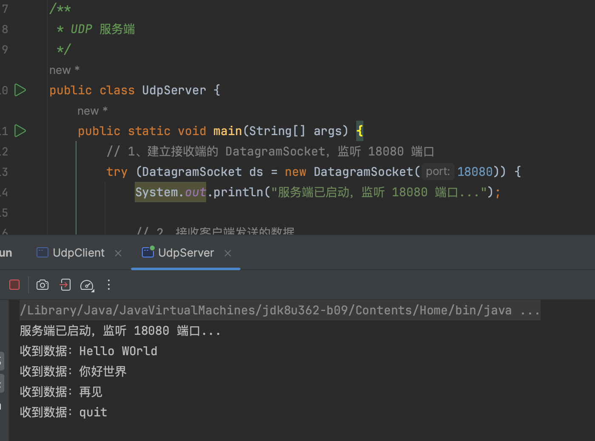
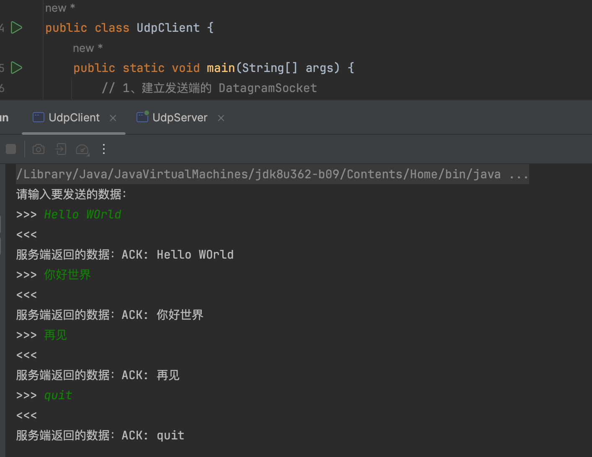
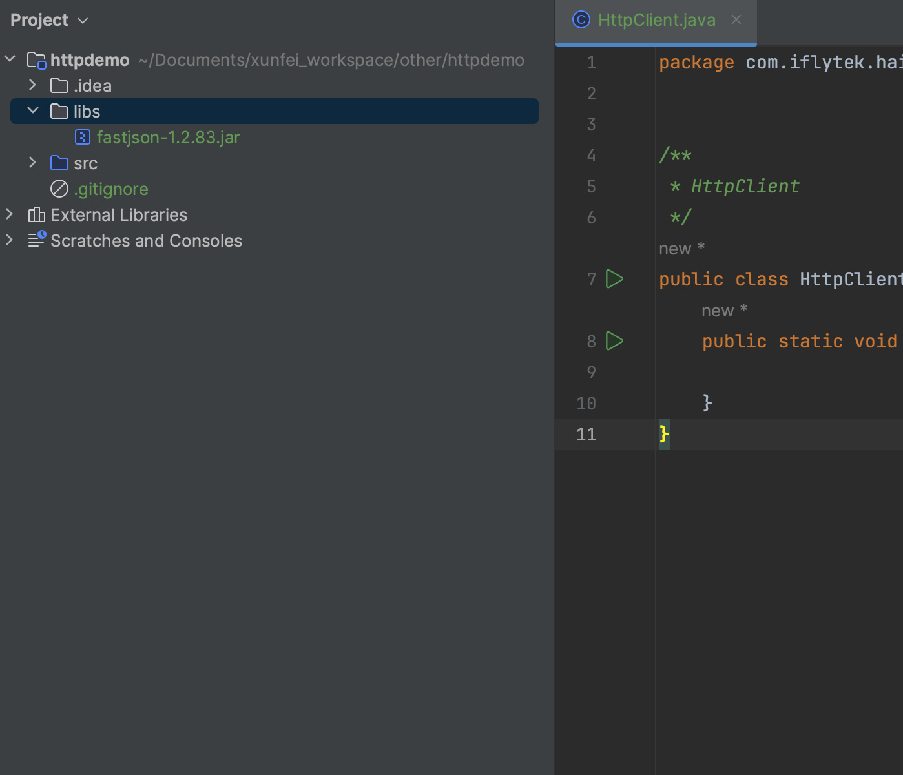

# Java 高级部分

## 常用内置类型与集合类

### 常用内置类

#### String、StringBuilder 与 StringBuffer

Java 中所有的字符串例如 "Hello World" 都可以看做是 `String` 类的实例。在 Java 中字符串是不可变的，也就是说一旦一个字符串被创建，它的值就不能被改变。  
字符串的创建有两种方式

```text
String str = "Hello World";
// 或者
String str = new String("Hello World");
```

一些常用方法如下，都比较直观

```java
/**
 * 常用内置类测试
 */
public class CommonTest {
    public static void main(String[] args) {
        // 创建字符串
        String str1 = "Hello World";
        String str2 = "你好世界";

        // 获取字符串长度（字符数）
        int strLen = str2.length();
        System.out.println(strLen); // 4

        // 字符串拼接
        String str3 = str1 + " " + str2;
        System.out.println(str3); // Hello World 你好世界
        // 字符串与基本类型拼接
        System.out.println("Hello World " + 2024); // Hello World 2024
        // 字符串与引用类型拼接，先调用引用类型的 toString 方法，然后再拼接
        Object obj = new Object();
        System.out.println("Hello World " + obj); // Hello World java.lang.Object@75b84c92

        // 提取子字符串
        String str4 = str3.substring(0, 5);
        System.out.println(str4); // Hello

        // 比较两个字符串是否相等
        String str5 = "Hello World";
        String str6 = "hello world";
        System.out.println(str5.equals(str1)); // true
        System.out.println(str6.equals(str1)); // false

        // ... 其它方法 查看 java.lang.String
    }
}
```

String 本身是不可变的，当遇到大量的字符串拼接时，使用 `+` 来拼接时很低效的。`StringBuilder` 与 `StringBuffer` 来提高效率。  
`StringBuilder` 与 `StringBuffer` 的API是完全一致的，并且很多方法与 `String` 相同，他们的区别在于并发场景下是否安全。  
`StringBuilder` 是线程不安全的，`StringBuffer` 是线程安全的，相对的，在非并发场景下 `StringBuilder` 比 `StringBuffer` 的性能更好。  
实际开发中，极少使用 `StringBuffer`，至于并发安全问题，一般都通过其它方式解决，所以遇到大量字符串拼接的需求，基本上选择 `StringBuilder` 就可以了。

```java
/**
 * 常用内置类测试
 */
public class CommonTest {
    public static void main(String[] args) {
        StringBuilder sb = new StringBuilder();

        for (int i = 0; i < 5; i++) {
            // append 将字符串拼接在后面
            sb.append("Hello World ");
        }
        // toString 将 StringBuilder 转为字符串
        String str = sb.toString();
        System.out.println(str); // Hello World Hello World Hello World Hello World Hello World 
    }
}
```

> JavaScript 中没有与 StringBuilder 与 StringBuffer 相对应的类，所有的操作都有 String 提供，功能跟 Java 中字符串的功能也都差不多。

#### Date、LocalDate、LocalTime 与 LocalDateTime

`Date` 是 Java 中早期处理日期时间的类，表示特定的瞬间，精确到毫秒，常用功能如下

```java
public class CommonTest {
    public static void main(String[] args) {
        // 获取当前日期和时间
        Date currentDate = new Date();
        System.out.println("当前日期和时间：" + currentDate); // 当前日期和时间：Wed Apr 17 16:05:08 CST 2024

        // 将日期格式化为字符串
        SimpleDateFormat dateFormat = new SimpleDateFormat("yyyy-MM-dd HH:mm:ss");
        String formattedDate = dateFormat.format(currentDate);
        System.out.println("格式化后的日期：" + formattedDate); // 格式化后的日期：2024-04-17 16:05:08

        // 将字符串解析为日期对象
        String dateString = "2024-04-17 12:30:45";
        try {
            Date parsedDate = dateFormat.parse(dateString);
            System.out.println("解析后的日期：" + parsedDate); // 解析后的日期：Wed Apr 17 12:30:45 CST 2024
        } catch (ParseException e) {
            e.printStackTrace();
        }

        // 执行日期计算和比较
        Date futureDate = new Date(currentDate.getTime() + 1000 * 60 * 60 * 24); // 增加一天
        System.out.println("未来日期：" + futureDate); // 未来日期是否在当前日期之后：true

        boolean isAfter = futureDate.after(currentDate); // 比较日期
        System.out.println("未来日期是否在当前日期之后：" + isAfter);
    }
}
```

在 JDK8 及以后得版本中，除非是为了兼容就有的代码，否则不推荐再使用 `Date`，转为使用 `LocalDate`、`LocalTime` 与 `LocalDateTime`

1. `LocalDate` 表示日期，包含年、月、日，但不包含时间信息
2. `LocalTime` 表示时间，包含时、分、秒，但不包含日期信息
3. `LocalDateTime` 表示日期时间，包含年、月、日、时、分、秒

示例如下，更多的功能查看对应的文档即可

```java

/**
 * 常用内置类测试
 */
public class CommonTest {
    public static void main(String[] args) {
        printLocalDate();
        printLocalTime();
        printLocalDateTime();
    }

    //  LocalDate 的常用功能
    public static void printLocalDate() {
        LocalDate currentDate = LocalDate.now();
        System.out.println("当前日期：" + currentDate);

        LocalDate futureDate = currentDate.plusDays(7); // 增加一周
        System.out.println("一周后的日期：" + futureDate);

        LocalDate pastDate = currentDate.minusMonths(1); // 减少一个月
        System.out.println("一个月前的日期：" + pastDate);

        DateTimeFormatter formatter = DateTimeFormatter.ofPattern("yyyy-MM-dd");
        String formattedDate = currentDate.format(formatter);
        System.out.println("格式化后的日期：" + formattedDate);
    }

    //  LocalTime 的常用功能
    public static void printLocalTime() {
        LocalTime currentTime = LocalTime.now();
        System.out.println("当前时间：" + currentTime);

        LocalTime futureTime = currentTime.plusHours(2); // 增加两小时
        System.out.println("两小时后的时间：" + futureTime);

        LocalTime pastTime = currentTime.minusMinutes(30); // 减少30分钟
        System.out.println("30分钟前的时间：" + pastTime);

        DateTimeFormatter formatter = DateTimeFormatter.ofPattern("HH:mm:ss");
        String formattedTime = currentTime.format(formatter);
        System.out.println("格式化后的时间：" + formattedTime);
    }

    //  LocalDateTime 的常用功能
    public static void printLocalDateTime() {
        LocalDateTime currentDateTime = LocalDateTime.now();
        System.out.println("当前日期时间：" + currentDateTime);

        LocalDateTime futureDateTime = currentDateTime.plusMonths(3).plusHours(2); // 增加3个月2小时
        System.out.println("三个月后两小时的日期时间：" + futureDateTime);

        LocalDateTime pastDateTime = currentDateTime.minusWeeks(1).minusDays(2); // 减少一周两天
        System.out.println("一周两天前的日期时间：" + pastDateTime);

        DateTimeFormatter formatter = DateTimeFormatter.ofPattern("yyyy-MM-dd HH:mm:ss");
        String formattedDateTime = currentDateTime.format(formatter);
        System.out.println("格式化后的日期时间：" + formattedDateTime);
    }
}
```

> JavaScript 中时间的处理只提供了一个 Date 对象，它更像 Java 中的 Date  
> 它们的一些对比如下

| 特征    | Java Date                             | JavaScript Date                                          |
|-------|---------------------------------------|----------------------------------------------------------|
| 创建对象  | 使用`new Date()`构造函数创建对象                | 使用`new Date()`构造函数创建对象                                   |
| 表示时间  | 存储自1970年1月1日00:00:00 GMT以来的毫秒数        | 存储自1970年1月1日00:00:00 UTC以来的毫秒数                           |
| 时间单位  | 以毫秒为单位                                | 以毫秒为单位                                                   |
| 获取年份  | 使用`getYear()`（已废弃）或`getYear() + 1900` | 使用`getFullYear()`                                        |
| 获取月份  | 使用`getMonth()`（0到11）                  | 使用`getMonth()`（0到11）                                     |
| 获取日期  | 使用`getDate()`（1到31）                   | 使用`getDate()`（1到31）                                      |
| 获取小时  | 使用`getHours()`（0到23）                  | 使用`getHours()`（0到23）                                     |
| 获取分钟  | 使用`getMinutes()`（0到59）                | 使用`getMinutes()`（0到59）                                   |
| 获取秒钟  | 使用`getSeconds()`（0到59）                | 使用`getSeconds()`（0到59）                                   |
| 获取毫秒  | 使用`getTime()`返回的时间戳的末尾3位              | 使用`getMilliseconds()`                                    |
| 格式化输出 | 需要使用`SimpleDateFormat`等类来格式化          | 直接使用 `toDateString()`，`toTimeString()` 或 `toISOString()` |
| 时区处理  | 时区信息存储在日期对象中                          | 时区信息在方法中隐式处理                                             |
| 日期比较  | 使用`before()`、`after()`等方法             | 直接使用 `<`、`>`、`===` 等运算符                                  |
| 日期计算  | 通过毫秒数间接计算                             | 直接使用 `setXXX()` 方法进行日期计算                                 |

### 常用集合类

在先前已经使用过数组来存储一组相同类型的数据。数组是一个相对较为底层的数据格式，在实际的开发中有着一些限制

1. 数组的长度是固定的，一旦初始化之后编不可改变，无法动态扩展。
2. 数组自身提供的方法有限，很多复杂的操作无法直接完成。
3. 由于其内存组织方式，在插入、删除这样的操作时效率较低。

总体说来就是数组不够灵活强大，为此 Java 提供了一系列的集合类库来解决这些问题，Java 中的集合类库分为两个概念，分别继承自两个接口

1. 集合（Collection）：存储**一组元素序列**，不同的子类会对其中存储的元素序列有不同的规则限制，例如 List 需要保证元素的顺序、Set 需要保证元素的唯一性等等。

- 对于提供了索引的集合，我们可以通过索引来访问集合中的元素，例如 List

2. 映射（Map）：存储**一组键值对**，键值对是一种映射关系，通过键查找对应的值。

- 与数组和某些集合通过数组索引查找值类似，映射通过引用类型的键来查找值，映射有时也被称为 `关联数组` 或者 `字典`。

> 所有的集合类都是`泛型类`，所有的集合接口都是 `泛型接口`。`泛型` 概念在后面介绍，在集合类的语境下，可以理解为指定集合中存放元素的类型。

整个集合类库的继承关系如下
<!---  -->
<!---  --->


#### Collection 接口

Collection 接口为所有实现了该接口的集合类提供了一些公共的方法，主要有

1. `boolean add(E e)` 添加一个元素
2. `boolean remove(Object o)` 删除一个元素
3. `int size()` 获取集合中元素的个数
4. `boolean isEmpty()` 判断集合是否为空
5. `boolean contains(Object o)` 判断集合中是否包含某个元素
6. `Iterator<E> iterator()` 返回一个用于遍历集合元素点的迭代器
7. `clear()` 清空集合中的元素

Collection 本身是一个接口，无法直接创建对象，根据多态性，我们可以将 Collection 子类的对象赋值给 Collection 引用，此时我们可以通过 Collection 引用调用 Collection 接口中的方法。  
Collection 子类中最常用的莫过于 `ArrayList`，这里使用 `ArrayList` 作为示例（使用 Collection 的任何其它接口都是一样的）
> 下面代码中 `\<T\>` 这种尖括号语法表示泛型，`T` 是 Type 的缩写，表示未知的某种通用类型。  
> `Collection<String>` 表示当前集合中只能存放 String 类型的元素  
> `new ArrayList<String>()` 表示创建一个只能存放 String 类型元素的列表。

```java
/**
 * Collection 接口测试
 */
public class CollectionTest {
    public static void main(String[] args) {
        // 创建一个 ArrayList 集合，coll 对象是多态的
        Collection<String> coll = new ArrayList<>();

        // 添加元素
        coll.add("Apple");
        coll.add("Banana");
        coll.add("Orange");
        System.out.println("集合中的元素：" + coll); // [Apple, Banana, Orange]

        // 添加另一个集合的所有元素
        Collection<String> otherCollection = new ArrayList<>();
        otherCollection.add("Grapes");
        otherCollection.add("Pineapple");
        coll.addAll(otherCollection);
        System.out.println("添加另一个集合后的元素：" + coll); // [Apple, Banana, Orange, Grapes, Pineapple]

        // 删除元素
        coll.remove("Banana");
        System.out.println("删除元素后的集合：" + coll);  // [Apple, Orange, Grapes, Pineapple]

        // 判断集合中是否包含某个元素
        System.out.println("集合中是否包含\"Apple\"：" + coll.contains("Apple")); // true

        // 判断集合是否为空
        System.out.println("集合是否为空：" + coll.isEmpty()); // false

        // 获取集合的大小
        System.out.println("集合的大小：" + coll.size()); // 4

        // 清空集合
        coll.clear();
        System.out.println("清空集合后的大小：" + coll.size()); // 0
    }
}
```

#### Iterator 迭代器接口

任何时候，获取集合中元素的需求都是很自然的，但是 `Collection` 接口并没有提供这样的抽象方法去要求每个子类实现，而是提供了一个更加通用且抽象程度更高的获取集合迭代器的方法 `Iterator<E> iterator()`。  
它的作用是返回一个用于遍历当前集合中所有元素的迭代器 `Iterator`。  
直观的通过索引遍历数组

```java
public class CollectionTest {
    public static void main(String[] args) {
        Collection<String> coll = new ArrayList<>();
        coll.add("Apple");
        coll.add("Banana");
        coll.add("Orange");

        // 通过索引遍历数组
        String[] arr = new String[]{"apple", "banana", "Orange"};
        for (int i = 0; i < arr.length; i++) {
            System.out.println(arr[i]);
        }
    }
}
```

具有一定的局限性，例如如果需要遍历的不是数组而是一个链表，便无法通过索引来遍历。迭代器提供了一种不依赖于集合底层数据结构的遍历集合中元素的方式，它是对**遍历一个序列**这种操作的抽象。  
迭代器在遍历一个集合时，会在一个序列中进行移动，然后选择当前指向的元素，直至到达序列的末尾。  
Java 中的 `Iterator` 接口就是迭代器的抽象，核心的方法只有三个

1. `boolean hasNext()` 判断集合中是否还有下一个元素，也就是判断是否到达序列末尾
2. `E next()` 返回迭代器当前指向的元素，并将迭代器移动到下一个位置
3. `void remove()` 从集合中删除由 `next()` 方法返回的最后一个元素


```java
import java.util.ArrayList;
import java.util.Collection;
import java.util.Iterator;

/**
 * Collection 接口测试
 */
public class CollectionTest {
    public static void main(String[] args) {
        // 创建一个 ArrayList 集合，coll 对象是多态的
        Collection<String> coll = new ArrayList<>();

        // 添加元素
        coll.add("Apple");
        coll.add("Banana");
        coll.add("Orange");
        coll.add("Grapes");
        coll.add("Pineapple");
        System.out.println("集合中的元素：" + coll); // [Apple, Banana, Orange, Grapes, Pineapple]
        System.out.println();


        // 1、获取到迭代器对象
        Iterator<String> iterator = coll.iterator();
        // 2、调用迭代器的 hasNext() 方法判断迭代器是否已到达集合尾部
        while (iterator.hasNext()) {
            // 3、调用迭代器的 next() 迭代器当前位置的元素，并将迭代器的位置向后移动一位
            String item = iterator.next();
            System.out.print(item + " "); // Apple Banana Orange Grapes Pineapple
        }
        System.out.println();

        // 利用迭代器删除指定元素
        iterator = coll.iterator();
        while (iterator.hasNext()) {
            String item = iterator.next();
            if ("Banana".equals(item)) {
                iterator.remove();
            }
        }
        System.out.println("删除元素后的集合：" + coll); // [Apple, Orange, Grapes, Pineapple]
    }
}
```

#### Iterable 可迭代接口

上述我们看到由于 `Collection` 接口提供的 `Iterator<E> iterator()` 抽象方法，是的所有实现 `Collection` 接口的集合类都可以通过迭代器来遍历集合中的元素。  
但是还需要我们手动获取到迭代器然后依次调用 `hasNext()` 和 `next()` 方法来遍历集合，这样的方式显得有些繁琐。  
为此 Java 提供了一个更加简洁的方式，通过 `Iterable` 接口，它是 `Collection` 接口的父接口，实现了该接口的集合可以像数组那样使用 `增强for循环` 遍历集合中的元素。

```java
/**
 * Collection 接口测试
 */
public class CollectionTest {
    public static void main(String[] args) {
        // 创建一个 ArrayList 集合，coll 对象是多态的
        Collection<String> coll = new ArrayList<>();

        // 添加元素
        coll.add("Apple");
        coll.add("Banana");
        coll.add("Orange");
        coll.add("Grapes");
        coll.add("Pineapple");

        StringBuilder sb1 = new StringBuilder();
        StringBuilder sb2 = new StringBuilder();

        // 利用迭代器遍历集合
        Iterator<String> iterator = coll.iterator();
        while (iterator.hasNext()) {
            String item = iterator.next();
            sb1.append(item).append(" ");
        }
        System.out.println("迭代器循环得到的结果：" + sb1); // Apple Banana Orange Grapes Pineapple 


        // 利用增强 for 循环遍历集合
        for (String item : coll) {
            sb2.append(item).append(" ");
        }
        System.out.println("增强for循环得到的结果：" + sb2); // Apple Banana Orange Grapes Pineapple 
    }
}
```

> 所以在实际开发中，除非需要遍历删除集合中的元素，一般都推荐使用增强 for 循环来遍历集合中的元素。  
> 实际上增强 for 循环的底层实现就是通过迭代器来实现的，只不过 Java 编译器帮我们自动完成了 获取 `Iterator` 对象、调用 `hasNext()` 和 `next()` 方法的操作。
> 另外，可以看到 `Collection` 接口和 `Iterable` 接口里面都有 `iterator()` 这个抽象方法，这只是一个历史原因而已，两者都包含这个抽象方法是为了向后兼容。

`Iterator` 接口和 `Iterable` 接口二者名字有些相似，如果对此有混淆感的话，可以考虑一下两者的词性 `able` 结尾的一般表示 `可以xxx的`，`or` 结尾的一般表示名词。  
`Iterator` 表示迭代器，`Iterable` 表示可迭代的。 Java 中还有好几个也是以这种风格命名的接口都是这样的意思。

> JavaScript 中也有类似的迭代器。一个数据结构只要部署了 `Symbol.iterator` 属性，就被视为具有 `iterator` 接口，就可以用 `for...of` 循环遍历它的成员。

#### List 子接口

作为 `Collection` 的子接口除了从 `Collection` 继承的方法外，还提供了一些额外的方法，主要是关于元素的索引操作，包括

1. `E get(int index)` 获取指定索引位置的元素
2. `E set(int index, E element)` 替换指定索引位置的元素
3. `void add(int index, E element)` 在指定索引位置插入元素
4. `E remove(int index)` 删除指定索引位置的元素
5. `int indexOf(Object o)` 返回指定元素在集合中第一次出现的索引
6. `int lastIndexOf(Object o)` 返回指定元素在集合中最后一次出现的索引
7. `List<E> subList(int fromIndex, int toIndex)` 返回集合中指定范围的子集合
8. 其它一些开发红不太常用的方法

```java
/**
 * List 接口测试
 */
public class ListTest {
    public static void main(String[] args) {
        // 创建一个ArrayList对象
        List<String> list = new ArrayList<>();

        // 添加元素到列表中（从 Collection 接口继承而来的方法）
        list.add("苹果");
        list.add("香蕉");
        list.add("橙子");
        list.add("葡萄");
        list.add("菠萝");

        // get(int index) - 获取指定索引位置的元素
        String elementAtIndex2 = list.get(2);
        System.out.println("索引2处的元素: " + elementAtIndex2); // 橙子

        // set(int index, E element) - 设置指定索引位置的元素
        list.set(1, "芒果");
        System.out.println("设置索引1处的元素后的列表: " + list); // [苹果, 芒果, 橙子, 葡萄, 菠萝]

        // add(int index, E element) - 在指定索引位置插入元素
        list.add(3, "樱桃");
        System.out.println("在索引3处插入元素后的列表: " + list); // [苹果, 芒果, 橙子, 樱桃, 葡萄, 菠萝]

        // remove(int index) - 移除指定索引位置的元素
        list.remove(4);
        System.out.println("移除索引4处的元素后的列表: " + list); // [苹果, 芒果, 橙子, 樱桃, 菠萝]

        // indexOf(Object o) - 获取指定元素第一次出现的索引
        int indexOfOrange = list.indexOf("橙子");
        System.out.println("'橙子'的索引位置: " + indexOfOrange); // 2

        // lastIndexOf(Object o) - 获取指定元素最后一次出现的索引
        int lastIndexOfMango = list.lastIndexOf("芒果");
        System.out.println("'芒果'的最后一次出现的索引位置: " + lastIndexOfMango); // 1

        // subList(int fromIndex, int toIndex) - 获取指定范围内的子列表
        List<String> subList = list.subList(1, 4);
        System.out.println("从索引1到3的子列表: " + subList); // [芒果, 橙子, 樱桃]
    }
}
```

`List` 接口两个最重要的实现类 `ArrayList` 和 `LinkedList`，它们可以称为是兄弟类，作为同样实现了 `List` 接口的类，上面演示的方法自然都是实现了的。他们的区别在于底层用于存储数据的结构。  
`ArrayList` 底层使用数组来存储数据，`LinkedList` 使用一个双向链表来存储数据。  
两者的差别主要在使用场景上，`ArrayList` 适合按索引随机访问比较频繁的场合，`LinkedList` 适合插入、删除操作比较频繁的场合。这个区别自然源自于它们各自底层的数据结构。
> 其实在实际性能测试中，除了在集合的头部进行插入删除操作这种特定场景下 `LinkedList` 性能大幅度领先 `ArrayList` 外，  
> 其它情况下，即使是频繁在集合中间位置插入和删除元素都是 `ArrayList` 的性能更好。  
> 所以实际开发中，没有特殊情况的话，就直接使用 `ArrayList` 就可以了。
>
> 特殊情况1：如果需要频繁在集合的头部进行插入和删除操作，例如模拟一个 `栈` 的结构（Java 原生提供的 Stack 类由于设计问题性能太低了，不建议用）  
> 特殊情况2：处理的元素数量实在太多（例如几十甚至上百万），由于数组每次申请一块完整内存，同时可能存在需要将原有数据复制到新的内存中，导致内存溢出，此时考虑使用 `LinkedList`。不过这总情况下可能使用专门的数据库处理可能是更好的选择。

#### Set 子接口

同样是继承自 `Collection` 接口，`Set` 接口的特点是集合中的元素是唯一的，不允许重复。  
判断是否重复主要是通过元素的 `equals()` 方法来判断的，如果两个元素通过 `equals()` 方法比较返回 `true`，则认为这两个元素是相同的。  
`Set` 接口的实现类主要有 `HashSet`、`LinkedHashSet` 和 `TreeSet`。三者的对比如下

| 特性         | HashSet             | LinkedHashSet        | TreeSet            |
|------------|---------------------|----------------------|--------------------|
| 实现方式       | 基于哈希表（散列表）          | 基于哈希表（散列表）+ 双向链表     | 基于红黑树              |
| 元素顺序       | 无序                  | 插入顺序                 | 自然顺序或者自定义排序        |
| 元素唯一性      | 元素不重复               | 元素不重复                | 元素不重复              |
| 允许 null 元素 | 允许                  | 允许                   | 不允许                |
| 应用场景       | 不需要保持元素顺序，并且需要快速查找时 | 需要保持元素插入顺序，并且需要快速查找时 | 需要保持元素排序，并且需要快速查找时 |

##### HashSet

HashSet 注意事项

1. HashSet 不能保证元素的排列顺序
2. 集合元素可以是 null
3. HashSet 集合判断两个元素相等的标准：两个对象通过 `hashCode()` 方法得到的哈希值相等，并且两个对象的 `equals()` 方法返回值为 `true`。
4. 对于存放在容器中的对象，对应的类一定要 **重写 hashCode() 和 equals()方法**，并且满足 **相等的对象必须具有相等的散列码**。
5. HashSet 集合中元素的无序性，表示遍历集合中的元素时，得到元素的顺序既不保证是按照添加的顺序，也不保证按照元素比较的顺序。但是对于同一个 HashSet 集合多次遍历得到接的元素顺序是一样的。

```java
/**
 * Set 测试类
 */
public class SetTest {
    public static void main(String[] args) {
        // 创建一个HashSet对象
        Set<String> hashSet = new HashSet<>();

        // 添加元素
        hashSet.add("apple");
        hashSet.add("banana");
        hashSet.add("cherry");
        hashSet.add("durian");
        hashSet.add("fig");
        hashSet.add("grape");
        hashSet.add("orange");

        hashSet.add("apple"); // 重复元素
        hashSet.add("banana"); // 重复元素
        hashSet.add("grape"); // 重复元素

        // 获取元素个数
        int size = hashSet.size();
        System.out.println("HashSet中的元素个数：" + size); // 7

        // 遍历元素
        System.out.print("HashSet中的元素：");
        for (String fruit : hashSet) {
            System.out.print(fruit + " ");
        }
        System.out.println();
        // banana orange apple cherry fig grape durian
        // 既不是添加的顺序也不是字母顺序

        // 判断元素是否存在
        System.out.println("HashSet中是否包含 banana：" + hashSet.contains("banana")); // true
        System.out.println("HashSet中是否包含 blueberry：" + hashSet.contains("blueberry")); // false

        // 删除元素
        hashSet.remove("banana");

        // 获取元素个数
        size = hashSet.size();
        System.out.println("HashSet中的元素个数：" + size); // 6
    }
}
```

重写元素的 `hashCode()` 和 `equals()` 方法对 `HashSet` 的影响，示例如下

```java
/**
 * 既没有重写 hashCode 也没有重写 equals 的 Person
 */
public class Person {
    String name;
    int age;

    public Person(String name, int age) {
        this.name = name;
        this.age = age;
    }

    @Override
    public String toString() {
        return "{" +
                "姓名：'" + name + '\'' +
                ", 年龄：" + age +
                '}';
    }
}

/**
 * 重写 hashCode 但是没有重写 equals 的 Person
 */
public class PersonWithHash extends Person {
    public PersonWithHash(String name, int age) {
        super(name, age);
    }

    @Override
    public int hashCode() {
        return Objects.hash(name, age);
    }
}

/**
 * 重写 equals 但是没重写 hashCode 的 Person
 */
public class PersonWithEqual extends Person {
    public PersonWithEqual(String name, int age) {
        super(name, age);
    }


    @Override
    public boolean equals(Object obj) {
        if (this == obj) {
            return true;
        }
        if (obj instanceof PersonWithEqual) {
            PersonWithEqual person = (PersonWithEqual) obj;
            return this.name.equals(person.name) && this.age == person.age;
        }
        return false;
    }
}

/**
 * 既重写 hashCode 又重写 equals 的 Person
 * 但是 hashCode 和 equals 方法不满足一致性的规则
 * <p>
 * 计算 hashCode 时只使用了 name 属性，而 equals 方法只使用了 age 属性
 * 导致 hashCode 相同时 equals 方法可能返回 false
 * equals 方法返回 true 时 hashCode 可能不相等
 */
public class PersonWithHashAndEqualWrong extends Person {
    public PersonWithHashAndEqualWrong(String name, int age) {
        super(name, age);
    }

    @Override
    public int hashCode() {
        return Objects.hash(name);
    }

    @Override
    public boolean equals(Object obj) {
        if (this == obj) {
            return true;
        }
        if (obj instanceof PersonWithHashAndEqualWrong) {
            PersonWithHashAndEqualWrong person = (PersonWithHashAndEqualWrong) obj;
            return this.age == person.age;
        }
        return false;
    }
}


/**
 * 既重写 hashCode 又重写 equals 的 Person
 * 并且 hashCode 和 equals 方法满足一致性的规则
 */
public class PersonWithHashAndEqual extends Person {
    public PersonWithHashAndEqual(String name, int age) {
        super(name, age);
    }

    @Override
    public int hashCode() {
        return Objects.hash(name, age);
    }

    @Override
    public boolean equals(Object obj) {
        if (this == obj) {
            return true;
        }
        if (obj instanceof PersonWithHashAndEqual) {
            PersonWithHashAndEqual person = (PersonWithHashAndEqual) obj;
            return this.name.equals(person.name) && this.age == person.age;
        }
        return false;
    }
}


/**
 * Set 测试类
 */
public class SetTest {
    public static void main(String[] args) {
        // 1.0、存储既没有重写 hashCode 也没有重写 equals 的 Person
        Set<Person> personSet = new HashSet<>();
        personSet.add(new Person("张三", 18));
        personSet.add(new Person("李四", 20));
        personSet.add(new Person("王五", 22));

        personSet.add(new Person("张三", 18));
        personSet.add(new Person("李四", 20));
        personSet.add(new Person("王五", 22));

        // 1.1、获取元素个数
        System.out.println("personSet 包含元素个数：" + personSet.size()); // 6

        // 1.2、遍历集合
        System.out.print("personSet 包含元素：");
        for (Person person : personSet) {
            System.out.print(person + "\t");
        }
        // {姓名：'李四', 年龄：20}	{姓名：'王五', 年龄：22}	{姓名：'李四', 年龄：20}	
        // {姓名：'张三', 年龄：18}	{姓名：'王五', 年龄：22}	{姓名：'张三', 年龄：18}
        System.out.println();

        // 1.3、判断是否包含元素
        System.out.println(
                "personSet 是否包含{张三，18}：" + personSet.contains(new Person("张三", 18))
        ); // false
        System.out.println();

        //
        // 2.0 存储只重写 hashCode 没有重写 equals 的 Person
        Set<PersonWithHash> personWithHashSet = new HashSet<>();
        personWithHashSet.add(new PersonWithHash("张三", 18));
        personWithHashSet.add(new PersonWithHash("李四", 20));
        personWithHashSet.add(new PersonWithHash("王五", 22));

        personWithHashSet.add(new PersonWithHash("张三", 18));
        personWithHashSet.add(new PersonWithHash("李四", 20));
        personWithHashSet.add(new PersonWithHash("王五", 22));

        // 2.1、获取元素个数
        System.out.println(
                "personWithHashSet 包含元素个数：" + personWithHashSet.size()
        ); // 6

        // 2.2、遍历集合
        System.out.print("personWithHashSet 包含元素：");
        for (PersonWithHash person : personWithHashSet) {
            System.out.print(person + "\t");
        }
        // {姓名：'张三', 年龄：18}	{姓名：'张三', 年龄：18}	{姓名：'王五', 年龄：22}	
        // {姓名：'王五', 年龄：22}	{姓名：'李四', 年龄：20}	{姓名：'李四', 年龄：20}
        System.out.println();

        // 2.3、判断是否包含元素
        System.out.println(
                "personWithHashSet 是否包含{张三，18}："
                        + personWithHashSet.contains(new PersonWithHash("张三", 18))
        ); // false
        System.out.println();

        //
        // 3.0 存储只重写 equals 没有重写 hashCode 的 Person
        Set<PersonWithEqual> personWithEqualSet = new HashSet<>();
        personWithEqualSet.add(new PersonWithEqual("张三", 18));
        personWithEqualSet.add(new PersonWithEqual("李四", 20));
        personWithEqualSet.add(new PersonWithEqual("王五", 22));

        personWithEqualSet.add(new PersonWithEqual("张三", 18));
        personWithEqualSet.add(new PersonWithEqual("李四", 20));
        personWithEqualSet.add(new PersonWithEqual("王五", 22));

        // 3.1、获取元素个数
        System.out.println("personWithEqualSet 包含元素个数：" + personWithEqualSet.size()); // 6

        // 3.2、遍历集合
        System.out.print("personWithEqualSet 包含元素：");
        for (PersonWithEqual person : personWithEqualSet) {
            System.out.print(person + "\t");
        }
        // {姓名：'李四', 年龄：20}	{姓名：'张三', 年龄：18}	{姓名：'张三', 年龄：18}	
        // {姓名：'王五', 年龄：22}	{姓名：'王五', 年龄：22}	{姓名：'李四', 年龄：20}
        System.out.println();

        // 3.3、判断是否包含元素
        System.out.println(
                "personWithEqualSet 是否包含{张三，18}："
                        + personWithEqualSet.contains(new PersonWithEqual("张三", 18))
        ); // false
        System.out.println();

        // 4.0、存储既重写 hashCode 又重写 equals 但是两者不满足一致性规则的 Person
        Set<PersonWithHashAndEqualWrong> personWithHashAndEqualWrongSet = new HashSet<>();
        personWithHashAndEqualWrongSet.add(new PersonWithHashAndEqualWrong("张三Aa", 18));
        personWithHashAndEqualWrongSet.add(new PersonWithHashAndEqualWrong("李四Aa", 20));
        personWithHashAndEqualWrongSet.add(new PersonWithHashAndEqualWrong("王五Aa", 22));

        personWithHashAndEqualWrongSet.add(new PersonWithHashAndEqualWrong("张三Aa", 18));
        personWithHashAndEqualWrongSet.add(new PersonWithHashAndEqualWrong("李四Aa", 20));
        personWithHashAndEqualWrongSet.add(new PersonWithHashAndEqualWrong("王五Aa", 22));

        // 4.1、获取元素个数
        System.out.println(
                "personWithHashAndEqualWrongSet 包含元素个数：" + personWithHashAndEqualWrongSet.size()
        ); // 3

        // 4.2、遍历集合
        System.out.print("personWithHashAndEqualWrongSet 包含元素：");
        for (PersonWithHashAndEqualWrong person : personWithHashAndEqualWrongSet) {
            System.out.print(person + "\t");
        }
        // {姓名：'王五Aa', 年龄：22}	{姓名：'李四Aa', 年龄：20}	{姓名：'张三Aa', 年龄：18}
        System.out.println();

        // 4.3、判断是否包含元素
        System.out.println(
                "personWithHashAndEqualWrongSet 是否包含{张三BB，18}："
                        + personWithHashAndEqualWrongSet.contains(new PersonWithHashAndEqualWrong("张三BB", 18))
        ); // true
        System.out.println();


        // 5.0 存储既重写 hashCode 又重写 equals 并且两者满足一致性规则的 Person
        Set<PersonWithHashAndEqual> personWithHashAndEqualSet = new HashSet<>();
        personWithHashAndEqualSet.add(new PersonWithHashAndEqual("张三", 18));
        personWithHashAndEqualSet.add(new PersonWithHashAndEqual("李四", 20));
        personWithHashAndEqualSet.add(new PersonWithHashAndEqual("王五", 22));

        personWithHashAndEqualSet.add(new PersonWithHashAndEqual("张三", 18));
        personWithHashAndEqualSet.add(new PersonWithHashAndEqual("李四", 20));
        personWithHashAndEqualSet.add(new PersonWithHashAndEqual("王五", 22));

        // 5.1、获取元素个数
        System.out.println(
                "personWithHashAndEqualSet 包含元素个数：" + personWithHashAndEqualSet.size()

        ); // 3

        // 5.2、遍历集合
        System.out.print("personWithHashAndEqualSet 包含元素：");
        for (PersonWithHashAndEqual person : personWithHashAndEqualSet) {
            System.out.print(person + "\t");
        }
        // {姓名：'张三', 年龄：18}	{姓名：'王五', 年龄：22}	{姓名：'李四', 年龄：20}
        System.out.println();

        // 5.3、判断是否包含元素
        System.out.println(
                "personWithHashAndEqualSet 是否包含{张三，18}："
                        + personWithHashAndEqualSet.contains(new PersonWithHashAndEqual("张三", 18))
        ); // true


        System.out.println();
        System.out.println("张三Aa 的 hashCode：" + "张三Aa".hashCode());
        System.out.println("张三BB 的 hashCode：" + "张三BB".hashCode());
    }
}
```

> 可以看到，对于 `HashSet` 集合中的元素，重写 `hashCode()` 和 `equals()` 方法是很重要的。
> 1. 重写时两个方法都要重写
> 2. 两个方法要满足一致性规则，即如果两个对象通过 `equals()` 方法比较返回 `true`，那么它们的 `hashCode()` 方法返回的哈希值也应该相等。

##### LinkedHashSet

LinkedHashSet 是 HashSet 的子类，它的特点是可以保持元素的插入顺序。除此之外没有其它明显差异

```java
/**
 * Set 测试类
 */
public class SetTest {
    public static void main(String[] args) {
        // 1.0、使用 HashSet
        Set<PersonWithHashAndEqual> hashSet = new HashSet<>();
        hashSet.add(new PersonWithHashAndEqual("张三", 18));
        hashSet.add(new PersonWithHashAndEqual("李四", 20));
        hashSet.add(new PersonWithHashAndEqual("王五", 22));

        hashSet.add(new PersonWithHashAndEqual("李四", 20));
        hashSet.add(new PersonWithHashAndEqual("张三", 18));
        hashSet.add(new PersonWithHashAndEqual("王五", 22));

        // 1.1、遍历集合
        System.out.print("personWithHashAndEqualSet 包含元素：");
        for (PersonWithHashAndEqual person : hashSet) {
            System.out.print(person + "\t");
        }
        // {姓名：'张三', 年龄：18} {姓名：'王五', 年龄：22} {姓名：'李四', 年龄：20}
        System.out.println();


        // 2.0、使用 LinkedHashSet
        Set<PersonWithHashAndEqual> linkedHashSet = new LinkedHashSet<>();
        linkedHashSet.add(new PersonWithHashAndEqual("张三", 18));
        linkedHashSet.add(new PersonWithHashAndEqual("李四", 20));
        linkedHashSet.add(new PersonWithHashAndEqual("王五", 22));

        linkedHashSet.add(new PersonWithHashAndEqual("李四", 20));
        linkedHashSet.add(new PersonWithHashAndEqual("张三", 18));
        linkedHashSet.add(new PersonWithHashAndEqual("王五", 22));

        // 2.1、遍历集合
        System.out.print("linkedHashSet 包含元素：");
        for (PersonWithHashAndEqual person : linkedHashSet) {
            System.out.print(person + "\t");
        }
        // {姓名：'张三', 年龄：18} {姓名：'李四', 年龄：20} {姓名：'王五', 年龄：22}

    }
}
```

> 可以发现 `LinkedHashSet` 保持了元素的插入顺序，并且后添加的元素会覆盖先添加的元素。

##### TreeSet

`TreeSet` 是 `Set` 接口的另一个实现类，在继承的体系机构中可以说是 `HashSet` 的兄弟类。

1. 与 `HashSet` 和 `LinkedHashSet` 不同的是，`TreeSet` 中判断两个元素是否相同的标准是通过特定规则比较两个元素的大小来确定的，当两个元素通过比较返回 `0` 时，认为这两个元素是相同的。
2. `TreeSet` 中的元素必须实现 `Comparable` 接口，或者在创建 `TreeSet` 对象时传入一个 `Comparator` 对象，用于比较元素的大小。

`Comparable<T>` 接口 `可比较的`，它只有一个方法 `int compareTo(T o)`，用于比较当前对象和参数对象 `o` 的大小，实现了该接口的类便是可比较大小的类。

````java
/**
 * 实现 Comparable 接口的 Person 类
 * 根据年龄排序
 */
public class PersonWithComparable extends Person implements Comparable<PersonWithComparable> {
    public PersonWithComparable(String name, int age) {
        super(name, age);
    }

    @Override
    public int compareTo(PersonWithComparable o) {
        return this.age - o.age;
    }
}
````

`Comparator<T>` 接口 `比较器`，它也只有一个方法 `int compare(T o1, T o2)`，用于比较两个对象 `o1` 和 `o2` 的大小，实现了该接口的类便是一个可以比对特定类型对象的比较器。
> 与 JavaScript 中的 `sort` 方法的比较函数类似。

```java
/**
 * Person 类的比较器
 * 根据年龄比较大小
 */
public class PersonComparator implements Comparator<Person> {
    @Override
    public int compare(Person o1, Person o2) {
        return o1.age - o2.age;
    }
}
```

使用 `TreeSet`

```java
/**
 * Set 测试类
 */
public class SetTest {
    public static void main(String[] args) {
        // 1.0、使用 HashSet
        Set<PersonWithComparable> hashSet = new HashSet<>();
        hashSet.add(new PersonWithComparable("张三", 18));
        hashSet.add(new PersonWithComparable("李四", 24));
        hashSet.add(new PersonWithComparable("王五", 21));
        hashSet.add(new PersonWithComparable("赵六", 20));
        hashSet.add(new PersonWithComparable("孙七", 22));
        hashSet.add(new PersonWithComparable("周八", 19));
        // 1.1、遍历集合，顺序跟年龄大小无关
        System.out.print("hashSet 中包含元素：");
        for (PersonWithComparable person : hashSet) {
            System.out.print(person + " ");
        }
        // {姓名：'李四', 年龄：24} {姓名：'王五', 年龄：21} {姓名：'孙七', 年龄：22}
        // {姓名：'赵六', 年龄：20} {姓名：'周八', 年龄：19} {姓名：'张三', 年龄：18}
        System.out.println();


        // 2.0、使用 TreeSet，使用元素的 compareTo 方法进行排序
        Set<PersonWithComparable> treeSet0 = new TreeSet<>();
        treeSet0.add(new PersonWithComparable("张三", 18));
        treeSet0.add(new PersonWithComparable("李四", 24));
        treeSet0.add(new PersonWithComparable("王五", 21));
        treeSet0.add(new PersonWithComparable("赵六", 20));
        treeSet0.add(new PersonWithComparable("孙七", 22));
        treeSet0.add(new PersonWithComparable("周八", 19));
        // 2.1、遍历集合，按年龄从小到大排序
        System.out.print("treeSet0 中包含元素：");
        for (PersonWithComparable person : treeSet0) {
            System.out.print(person + " ");
        }
        // {姓名：'张三', 年龄：18} {姓名：'周八', 年龄：19} {姓名：'赵六', 年龄：20}
        // {姓名：'王五', 年龄：21} {姓名：'孙七', 年龄：22} {姓名：'李四', 年龄：24}
        System.out.println();

        // 3.0、使用 TreeSet，元素本身没有实现 Comparable 接口，手动传一个 Comparator 比较器进行排序
        Set<Person> treeSet1 = new TreeSet<>(new PersonComparator());
        treeSet1.add(new Person("张三", 18));
        treeSet1.add(new Person("李四", 24));
        treeSet1.add(new Person("王五", 21));
        treeSet1.add(new Person("赵六", 20));
        treeSet1.add(new Person("孙七", 22));
        treeSet1.add(new Person("周八", 19));

        // 3.1、遍历集合，按年龄从小到大排序
        System.out.print("treeSet1 中包含元素：");
        for (Person person : treeSet1) {
            System.out.print(person + " ");
        }
        // {姓名：'张三', 年龄：18} {姓名：'周八', 年龄：19} {姓名：'赵六', 年龄：20} 
        // {姓名：'王五', 年龄：21} {姓名：'孙七', 年龄：22} {姓名：'李四', 年龄：24} 
    }
}
```

#### Map 接口

`Map（映射）`是一个接口，它的实现类主要有 `HashMap`、`LinkedHashMap` 和 `TreeMap`。  
作为最为基础的接口，`Map` 提供了如下常用的方法

1. `V put(K key, V value)`：将指定的值与此映射中的指定键关联。
2. `V get(Object key)`：返回到指定键所映射的值，或如果此映射不包含该键的映射关系，则返回 `null`。
3. `int size()`：返回此映射中的键-值映射关系数。
4. `boolean isEmpty()`：如果此映射未包含键-值映射关系，则返回 `true`。
5. `void clear()`：从该映射中移除所有映射关系。
6. `V remove(Object key)`：如果存在一个键的映射关系，则将其从此映射中移除。
7. `boolean containsKey(Object key)`：如果此映射包含指定键的映射关系，则返回 `true`。
8. `Set<Map.Entry<K,V>> entrySet()`：返回此映射中包含的映射关系的 `Set` 视图。
9. `Set<K> keySet()`：返回此映射中包含的键的 `Set` 视图。
10. `Collection<V> values()`：返回此映射中包含的值的 `Collection` 视图。

前面我们已经看到过 `Set` 的实现类 `HashSet`、`LinkedHashSet` 和 `TreeSet` 的对比，下面我们来看看 `Map` 的实现类 `HashMap`、`LinkedHashMap` 和 `TreeMap` 的对比

| 特性        | HashMap             | LinkedHashMap        | TreeMap            |
|-----------|---------------------|----------------------|--------------------|
| 数据结构      | 哈希表（散列表）            | 哈希表（散列表）+ 链表         | 红黑树                |
| 元素顺序      | 无序                  | 插入顺序                 | 自然顺序或自定义顺序         |
| 键值唯一性     | 键值不重复               | 键值不重复                | 键值不重复              |
| 是否允许null值 | 允许键和值为null          | 允许键和值为null           | 不允许键为null，值可以为null |
| 应用场景      | 不需要保持元素顺序，并且需要快速查找时 | 需要保持元素插入顺序，并且需要快速查找时 | 需要保持元素排序，并且需要快速查找时 |

> 需要注意的是，这里说的有序或者无序是针对**键**或者**键值对**而言的，并不考虑**值**的顺序。  
> 唯一性也是针对 **键** 而言的，**值** 可以重复。

##### HashMap

1. 通过 `hashCode()` 和 `equals()` 方法判断键是否相同。
2. 遍历时，元素的顺序是不确定的。

```java
/**
 * Map 测试类
 */
public class MapTest {
    public static void main(String[] args) {
        // 创建一个HashMap对象
        Map<String, Integer> hashMap = new HashMap<>();

        // 添加元素
        hashMap.put("apple", 10);
        hashMap.put("banana", 20);
        hashMap.put("orange", 30);
        hashMap.put("blueberry", 40);
        hashMap.put("cherry", 50);

        // 获取元素
        int appleCount = hashMap.get("apple");
        System.out.println("苹果的数量：" + appleCount); // 10

        // 删除元素
        hashMap.remove("banana");

        // 判断是否包含键
        boolean containsKey = hashMap.containsKey("orange");
        System.out.println("是否包含橙子：" + containsKey); // true

        // 遍历元素
        System.out.print("遍历元素：");
        for (Map.Entry<String, Integer> entry : hashMap.entrySet()) {
            String key = entry.getKey();
            int value = entry.getValue();
            System.out.printf("{%s: %d}  ", key, value);
        }
        // {orange: 30}  {apple: 10}  {cherry: 50}  {blueberry: 40}
    }
}
```

##### LinkedHashMap

1. 通过 `hashCode()` 和 `equals()` 方法判断键是否相同。
2. 遍历时，元素的顺序是按照插入顺序的。

```java
/**
 * Map 测试类
 */
public class MapTest {
    public static void main(String[] args) {
        // 创建一个 LinkedHashMap 对象
        Map<String, Integer> linkedHashMap = new LinkedHashMap<>();

        // 添加元素
        linkedHashMap.put("apple", 10);
        linkedHashMap.put("banana", 20);
        linkedHashMap.put("orange", 30);
        linkedHashMap.put("blueberry", 40);
        linkedHashMap.put("cherry", 50);

        // 获取元素
        int appleCount = linkedHashMap.get("apple");
        System.out.println("苹果的数量：" + appleCount); // 10

        // 删除元素
        linkedHashMap.remove("banana");

        // 判断是否包含键
        boolean containsKey = linkedHashMap.containsKey("orange");
        System.out.println("是否包含橙子：" + containsKey); // true

        // 遍历元素
        System.out.print("遍历元素：");
        for (Map.Entry<String, Integer> entry : linkedHashMap.entrySet()) {
            String key = entry.getKey();
            int value = entry.getValue();
            System.out.printf("{%s: %d}  ", key, value);
        }
        // {apple: 10}  {orange: 30}  {blueberry: 40}  {cherry: 50}
    }
}
```

##### TreeMap

1. 通过 `compareTo()` 方法或者 `Comparator` 对象判断键是否相同。
2. 遍历时，元素的顺序是按照键的自然顺序或者自定义顺序的。

```java
/**
 * Map 测试类
 */
public class MapTest {
    public static void main(String[] args) {
        // 创建一个 TreeMap 对象
        Map<String, Integer> treeMap = new TreeMap<>();

        // 添加元素
        treeMap.put("apple", 10);
        treeMap.put("banana", 20);
        treeMap.put("orange", 30);
        treeMap.put("blueberry", 40);
        treeMap.put("cherry", 50);

        // 获取元素
        int appleCount = treeMap.get("apple");
        System.out.println("苹果的数量：" + appleCount); // 10

        // 删除元素
        treeMap.remove("banana");

        // 判断是否包含键
        boolean containsKey = treeMap.containsKey("orange");
        System.out.println("是否包含橙子：" + containsKey); // true

        // 遍历元素，按照建的自然顺序
        System.out.print("遍历元素：");
        for (Map.Entry<String, Integer> entry : treeMap.entrySet()) {
            String key = entry.getKey();
            int value = entry.getValue();
            System.out.printf("{%s: %d}  ", key, value);
        }
        // {apple: 10}  {blueberry: 40}  {cherry: 50}  {orange: 30} 
    }
}
```

#### Map 与 Set

看起来 `HashSet`、`LinkedHashSet` 、 `TreeSet` 与 `HashMap`、`LinkedHashMap` 和 `TreeMap` 非常的相似，事实也确实如此。  
`HashSet`、`LinkedHashSet` 和 `TreeSet` 分别对应 `HashMap`、`LinkedHashMap` 和 `TreeMap`。  
`HashSet`底层实现是基于 `HashMap` 的，`LinkedHashSet` 是基于 `LinkedHashMap` 的，`TreeSet` 是基于 `TreeMap` 的。  
以 `HashSet` 为例看下 `HashSet` 与 `HashMap` 的关系

```java
public class HashSet<E> {
    // HashSet的底层是 HashMap，
    // HashSet 的元素是 HashMap 的 key，
    // HashMap 的 value 是一个 Object 对象
    private transient HashMap<E, Object> map;

    private static final Object PRESENT = new Object();

    public HashSet() {
        map = new HashMap<>();
    }

    public Iterator<E> iterator() {
        return map.keySet().iterator();
    }

    public int size() {
        return map.size();
    }

    public boolean isEmpty() {
        return map.isEmpty();
    }

    public boolean contains(Object o) {
        return map.containsKey(o);
    }

    public boolean add(E e) {
        return map.put(e, PRESENT) == null;
    }

    public boolean remove(Object o) {
        return map.remove(o) == PRESENT;
    }

    public void clear() {
        map.clear();
    }

    // 省略其他方法
}
```

可以看到 `HashSet` 就是只使用了 `Key` 部分的 `HashMap`。对于 `LinkedHashSet` 和 `TreeSet` 也是同样的。  
另一方面，在遍历 `Map` 时也都是在遍历 `Map` 的 `Key` 组成的 `Set` 或者 `Value` 组成的 `Set` 或者 `Key-Value 对` 组成的 `Set`。  
`Map` 这个顶层接口便给出了获取这些 `Set` 的抽象方法。


总结一下，对于集合类，日常开发中最常用的是

1. 列表：`ArrayList`
2. 集合：`HashSet`
3. 映射：`HashMap`

基本上可以满足绝大部分的功能需求了。

> 这三种集合类在 JavaScript 中也都有对应的数据结构  
> 列表 `List` 对应 JavaScript 中的 `Array`  
> 集合 `Set` 对应 JavaScript 中的 `Set`  
> 映射 `Map` 对应 JavaScript 中的 `Map`

### 函数式编程与 Stream

#### 函数式接口与 Lambda 表达式

在使用 `TreeSet` 是我们说到，要使得元素能够排序，元素必须实现 `Comparable` 接口，或者在创建 `TreeSet` 对象时传入一个 `Comparator` 对象，更确切地说是传入 `Comparator` 接口实现类的实例。  
当时我们新建了一个 `PersonComparator` 类，实现了 `Comparator` 接口，然后在创建 `TreeSet` 对象时传入了 `PersonComparator` 类的实例。  
`Comparator` 接口包含了多个方法，但是只有一个抽象方法，即实现类必须实现的方法 `int compare(T o1, T o2)`，用于比较两个对象的大小。  
这种**只有一个抽象方法**的接口称为 **函数式接口**，抽象接口当然可以有其它静态方法、多个默认方法，但是只能有一个抽象方法。  
对于这种函数式接口，我们在使用时不需要要单独创建一个实现该接口的类，然后实例化这个类，直接使用 lambda 表达式即可。  
函数式接口一般都会添加一个 `@FunctionalInterface` 注解，用于标识这是一个函数式接口，但这不是必须的，仅仅是为了协助编译期检查接口是否满足函数式接口的定义。

```java
public class SetTest {
    public static void main(String[] args) {
        Person zhangSan = new Person("张三", 18);
        Person liSi = new Person("李四", 24);
        Person wangWu = new Person("王五", 21);
        Person zhaoLiu = new Person("赵六", 20);
        Person sunQi = new Person("孙七", 22);
        Person zhouBa = new Person("周八", 19);

        // 1.0、使用 Comparator 接口的实现类 PersonComparator 的实例作为比较器
        PersonComparator personComparator = new PersonComparator();
        Set<Person> treeSet1 = new TreeSet<>(personComparator);
        treeSet1.add(zhangSan);
        treeSet1.add(liSi);
        treeSet1.add(wangWu);
        treeSet1.add(zhaoLiu);
        treeSet1.add(sunQi);
        treeSet1.add(zhouBa);

        // 1.1、遍历集合，按年龄从小到大排序
        System.out.print("treeSet1 中包含元素：");
        for (Person person : treeSet1) {
            System.out.print(person + " ");
        }
        // {姓名：'张三', 年龄：18} {姓名：'周八', 年龄：19} {姓名：'赵六', 年龄：20}
        // {姓名：'王五', 年龄：21} {姓名：'孙七', 年龄：22} {姓名：'李四', 年龄：24}
        System.out.println();

        // 2.0、使用 lambda 表达式
        Comparator<Person> comparator = (Person p1, Person p2) -> {
            return p1.age - p2.age;
        };
        Set<Person> treeSet2 = new TreeSet<>(comparator);
        treeSet2.add(zhangSan);
        treeSet2.add(liSi);
        treeSet2.add(wangWu);
        treeSet2.add(zhaoLiu);
        treeSet2.add(sunQi);
        treeSet2.add(zhouBa);

        // 2.1、遍历集合，按年龄从小到大排序
        System.out.print("treeSet2 中包含元素：");
        for (Person person : treeSet2) {
            System.out.print(person + " ");
        }
        // {姓名：'张三', 年龄：18} {姓名：'周八', 年龄：19} {姓名：'赵六', 年龄：20}
        // {姓名：'王五', 年龄：21} {姓名：'孙七', 年龄：22} {姓名：'李四', 年龄：24}
    }
}
```

语句

```text
Comparator<Person> comparator = (Person p1, Person p2) -> { return p1.age - p2.age; };
```

就是一个将 `lambda 表达式` 赋值给 `Comparator` 接口的实例的语句，等号右侧的部分就是 `lambda 表达式`。一般语法为

```text
(参数列表) -> { 方法体 }
```

lambda 表达式的参数列表和方法体的语法与方法的参数列表和方法体的语法是一样的，只是省略了方法的修饰符、返回值类型和方法名。  
由于对应的接口只有一个抽象方法，所以编译器可以根据上下文推断出参数类型，所以参数列表中的参数类型可以省略。  
根据参数数量不同和是否有返回值，lambda 表达式还有几种简化写法

1. 如果参数列表中只有一个参数，那么参数列表的括号 `()` 可以省略，参数列表为空时，括号不能省略
2. 如果方法体中只有一条语句，那么方法体的大括号可以省略
3. 如果方法体中只有一条语句，那么方法体的大括号和 `return` 关键字都可以省略

> lambda 表达式看起来非常像是一个匿名函数，但是它并不是一个函数。  
> 函数的求值将会执行函数体内的逻辑，但是 lambda 表达式的求值将会生成一个函数式接口的实例而不会执行函数体的逻辑 [参考](https://docs.oracle.com/javase/specs/jls/se8/html/jls-15.html#jls-15.27)  
> 在运行时，JVM 虚拟机将会动态生成并加载一个实现了函数式接口的匿名类，该类重写了接口的抽象方法，并在重写的方法中执行 lambda 表达式的逻辑。  
> 接着实例化这个类，并将其返回给调用者 [参考1](https://blogs.oracle.com/javamagazine/post/behind-the-scenes-how-do-lambda-expressions-really-work-in-java) [参考2](https://developer.aliyun.com/article/1137107)。    
> 当然，在使用时，完全可以把 lambda 表达式当作一个函数来使用。


更进一步，当要传递给 Lambda 体的操作，已经有实现的方法了，可以使用方法引用。
> 方法引用可以看做是 Lambda 表达式深层次的表达。换句话说，方法引用就是 Lambda 表达式，也就是函数式接口的一个实例，通过方法的名字来指向一个方法，可以认为是 Lambda 表达式的一个语法糖。

格式：使用方法引用操作符 `::` 将类(或对象) 与 方法名分隔开来。  
两个`:`中间不能有空格，而且必须英文状态下半角输入。有如下三种主要使用情况：

1. 情况1：`对象::实例方法名`

- 函数式接口中的抽象方法 `ma` 在被重写时使用了某一个对象的方法 `mb`。如果方法 `ma` 的形参列表、返回值类型与方法 `mb` 的形参列表、返回值类型都相同，则我们可以使用方法 `mb`实现对方法 `ma` 的重写、替换。

2. 情况2：`类::静态方法名`

- 函数式接口中的抽象方法 `ma` 在被重写时使用了某一个类的静态方法 `mb`。如果方法 `ma` 的形参列表、返回值类型与方法 `mb` 的形参列表、返回值类型都相同，则我们可以使用方法 `mb` 实现对方法 `ma`的重写、替换。

3. 情况3：`类::实例方法名`

- 函数式接口中的抽象方法 `ma` 在被重写时使用了某一个对象的方法 `mb`。如果方法 `ma` 的返回值类型与方法 `mb` 的返回值类型相同，同时方法 `ma` 的形参列表中有 **n** 个参数，方法 `mb` 的形参列表有**n-1**个参数，且方法 `ma` 的**第1个参数**作为**方法
  mb 的调用者**，且方法`ma`的后`n-1`参数与方法`mb`的`n-1`参数匹配（类型相同或满足多态场景也可以）

```java
public class Test {
    public static void main(String[] args) {
        // 1、使用 lambda 表达式
        List<Integer> list1 = new ArrayList<>();
        // 添加10个随机值
        Random random = new Random();
        for (int i = 0; i < 10; i++) {
            list1.add(random.nextInt(1000));
        }
        // 输出原始列表
        System.out.println("原始列表1：" + list1);
        // 使用 lambda 表达式
        list1.sort((o1, o2) -> o1 - o2);
        System.out.println("排序后列表1：" + list1);

        //
        // 2、使用方法引用 实例::实例方法
        List<Integer> list2 = new ArrayList<>();
        // 添加10个随机值
        for (int i = 0; i < 10; i++) {
            list2.add(random.nextInt(1000));
        }
        // 输出原始列表
        System.out.println("原始列表2：" + list2);
        // 使用方法引用 实例::实例方法
        // 方法签名 public int compare(Integer o1, Integer o2)
        list2.sort(new IntegerCompare()::compare);
        System.out.println("排序后列表2：" + list2);

        // 3、使用方法引用 类::静态方法
        List<Integer> list3 = new ArrayList<>();
        // 添加10个随机值
        for (int i = 0; i < 10; i++) {
            list3.add(random.nextInt(1000));
        }
        // 输出原始列表
        System.out.println("原始列表3：" + list3);
        // 使用方法引用 类::静态方法
        // 方法签名 public static int compareStatic(Integer o1, Integer o2)
        list3.sort(IntegerCompare::compareStatic);
        System.out.println("排序后列表3：" + list3);


        // 4、使用方法引用 类::实例方法
        List<Integer> list4 = new ArrayList<>();
        // 添加10个随机值
        for (int i = 0; i < 10; i++) {
            list4.add(random.nextInt(1000));
        }
        // 输出原始列表
        System.out.println("原始列表4：" + list4);
        // 使用方法引用 类::实例方法
        // 方法签名 public int compareTo(Integer anotherInteger)
        list4.sort(Integer::compareTo);
        System.out.println("排序后列表4：" + list4);
    }
}

/**
 * 整数比较类
 */
public class IntegerCompare {
    // 实例方法，比较两个整数的大小
    public int compare(Integer o1, Integer o2) {
        return o1 - o2;
    }

    // 静态方法，比较两个整数的大小
    public static int compareStatic(Integer o1, Integer o2) {
        return o1 - o2;
    }
}
```

Java 已经内置了非常多实用点的函数式接口  
**核心函数式接口**
| 函数式接口 | 称谓 | 参数类型 | 用途 |
| ------------------ | ---------- | -------- | ------------------------------------------------------------ |
| `Consumer<T>  `    | 消费型接口 | T | 对类型为T的对象应用操作，包含方法：  `void accept(T t)  `    |
| `Supplier<T>  `    | 供给型接口 | 无 | 返回类型为T的对象，包含方法：`T get()  `                     |
| `Function<T, R>  ` | 函数型接口 | T | 对类型为T的对象应用操作，并返回结果。结果是R类型的对象。包含方法：`R apply(T t)  ` |
| `Predicate<T>  `   | 判断型接口 | T | 确定类型为T的对象是否满足某约束，并返回 boolean 值。包含方法：`boolean test(T t)  ` |

**消费型接口**  
消费型接口的抽象方法特点：有形参，但是返回值类型是void

| 接口名                  | 抽象方法                           | 描述               |
|----------------------|--------------------------------|------------------|
| BiConsumer<T,U>      | void accept(T t, U u)          | 接收两个对象用于完成功能     |
| DoubleConsumer       | void accept(double value)      | 接收一个double值      |
| IntConsumer          | void accept(int value)         | 接收一个int值         |
| LongConsumer         | void accept(long value)        | 接收一个long值        |
| ObjDoubleConsumer<T> | void accept(T t, double value) | 接收一个对象和一个double值 |
| ObjIntConsumer<T>    | void accept(T t, int value)    | 接收一个对象和一个int值    |
| ObjLongConsumer<T>   | void accept(T t, long value)   | 接收一个对象和一个long值   |

**供给型接口**
这类接口的抽象方法特点：无参，但是有返回值

| 接口名             | 抽象方法                   | 描述           |
|-----------------|------------------------|--------------|
| BooleanSupplier | boolean getAsBoolean() | 返回一个boolean值 |
| DoubleSupplier  | double getAsDouble()   | 返回一个double值  |
| IntSupplier     | int getAsInt()         | 返回一个int值     |
| LongSupplier    | long getAsLong()       | 返回一个long值    |

**函数型接口**

这类接口的抽象方法特点：既有参数又有返回值

| 接口名                     | 抽象方法                                            | 描述                          |
|-------------------------|-------------------------------------------------|-----------------------------|
| UnaryOperator<T>        | T apply(T t)                                    | 接收一个T类型对象，返回一个T类型对象结果       |
| DoubleFunction<R>       | R apply(double value)                           | 接收一个double值，返回一个R类型对象       |
| IntFunction<R>          | R apply(int value)                              | 接收一个int值，返回一个R类型对象          |
| LongFunction<R>         | R apply(long value)                             | 接收一个long值，返回一个R类型对象         |
| ToDoubleFunction<T>     | double applyAsDouble(T value)                   | 接收一个T类型对象，返回一个double        |
| ToIntFunction<T>        | int applyAsInt(T value)                         | 接收一个T类型对象，返回一个int           |
| ToLongFunction<T>       | long applyAsLong(T value)                       | 接收一个T类型对象，返回一个long          |
| DoubleToIntFunction     | int applyAsInt(double value)                    | 接收一个double值，返回一个int结果       |
| DoubleToLongFunction    | long applyAsLong(double value)                  | 接收一个double值，返回一个long结果      |
| IntToDoubleFunction     | double applyAsDouble(int value)                 | 接收一个int值，返回一个double结果       |
| IntToLongFunction       | long applyAsLong(int value)                     | 接收一个int值，返回一个long结果         |
| LongToDoubleFunction    | double applyAsDouble(long value)                | 接收一个long值，返回一个double结果      |
| LongToIntFunction       | int applyAsInt(long value)                      | 接收一个long值，返回一个int结果         |
| DoubleUnaryOperator     | double applyAsDouble(double operand)            | 接收一个double值，返回一个double      |
| IntUnaryOperator        | int applyAsInt(int operand)                     | 接收一个int值，返回一个int结果          |
| LongUnaryOperator       | long applyAsLong(long operand)                  | 接收一个long值，返回一个long结果        |
| BiFunction<T,U,R>       | R apply(T t, U u)                               | 接收一个T类型和一个U类型对象，返回一个R类型对象结果 |
| BinaryOperator<T>       | T apply(T t, T u)                               | 接收两个T类型对象，返回一个T类型对象结果       |
| ToDoubleBiFunction<T,U> | double applyAsDouble(T t, U u)                  | 接收一个T类型和一个U类型对象，返回一个double  |
| ToIntBiFunction<T,U>    | int applyAsInt(T t, U u)                        | 接收一个T类型和一个U类型对象，返回一个int     |
| ToLongBiFunction<T,U>   | long applyAsLong(T t, U u)                      | 接收一个T类型和一个U类型对象，返回一个long    |
| DoubleBinaryOperator    | double applyAsDouble(double left, double right) | 接收两个double值，返回一个double结果    |
| IntBinaryOperator       | int applyAsInt(int left, int right)             | 接收两个int值，返回一个int结果          |
| LongBinaryOperator      | long applyAsLong(long left, long right)         | 接收两个long值，返回一个long结果        |

**判断型接口**

这类接口的抽象方法特点：有参，但是返回值类型是boolean结果。

| 接口名              | 抽象方法                       | 描述          |
|------------------|----------------------------|-------------|
| BiPredicate<T,U> | boolean test(T t, U u)     | 接收两个对象      |
| DoublePredicate  | boolean test(double value) | 接收一个double值 |
| IntPredicate     | boolean test(int value)    | 接收一个int值    |
| LongPredicate    | boolean test(long value)   | 接收一个long值   |

````java
public class Test {
    public static void main(String[] args) {
        List<Integer> list = new ArrayList<>();
        // 添加10个随机值
        Random random = new Random();
        for (int i = 0; i < 10; i++) {
            list.add(random.nextInt(1000));
        }
        // 输出原始列表
        System.out.println("原始列表：" + list);

        // 消费型接口 Consumer
        list.forEach(System.out::println);
    }
}
````

> JavaScript 中也有类似的函数式接口，如 `Array.prototype.forEach`、`Array.prototype.map`、`Array.prototype.filter`、`Array.prototype.reduce` 等。  
> 同时也有 lambda 表达式的概念，如 `Array.prototype.forEach` 的回调函数就是一个 lambda 表达式，称为箭头函数。

#### Stream 流式编程

`Stream` 是 Java 中处理集合的关键抽象概念，它可以指定你希望对集合进行的操作，可以执行非常复杂的查找、过滤和映射数据等操作。  
使用 `Stream API` 对集合数据进行操作，就类似于使用 `SQL` 执行的数据库查询。也可以使用 `Stream API` 来并行执行操作。简言之，`Stream API` 提供了一种高效且易于使用的处理数据的方式。  
使用 Stream 的操作三个步骤

1. 创建 Stream 一个数据源（如：集合、数组），获取一个流
2. 中间操作 每次处理都会返回一个持有结果的新 Stream，即中间操作的方法返回值仍然是 Stream 类型的对象。因此中间操作可以是个操作链，可对数据源的数据进行n次处理，但是在终结操作前，并不会真正执行。
3. 终止操作(终端操作) 终止操作的方法返回值类型就不再是 Stream了，因此**一旦执行终止操作，就结束整个 Stream 操作了**。一旦执行终止操作，就执行中间操作链，最终产生结果并结束 Stream。

```java
public class Test {
    public static void main(String[] args) {
        Random random = new Random();
        AtomicInteger atomicI = new AtomicInteger(0);

        // 生成包含 10 个 Person 对象的列表
        List<Person> persons = Stream
                // 供给型接口 Supplier
                .generate(() -> new Person("人员" + atomicI.incrementAndGet(), random.nextInt(200)))
                .limit(10)
                .collect(Collectors.toList());

        // 统计所有用户的平均年龄
        double averageAge = persons.stream()
                // 函数式接口 ToIntFunction
                .mapToInt(Person::getAge)
                .average()
                .orElse(0);
        System.out.println("平均年龄: " + averageAge);

        // 统计所有用户的最大年龄
        int maxAge = persons.stream()
                .mapToInt(Person::getAge)
                .max()
                .orElse(0);
        System.out.println("最大年龄: " + maxAge);

        // 统计所有用户的姓名
        String names = persons.stream()
                .map(Person::getName)
                .collect(Collectors.joining(", "));
        System.out.println("年龄列表: " + names);

        // 统计所有用户的总年龄
        int totalAge = persons.stream()
                .mapToInt(Person::getAge)
                .sum();
        System.out.println("总年龄: " + totalAge);

        // 统计所有用户年龄的标准差和方差
        double variance = persons.stream()
                .mapToInt(Person::getAge)
                .mapToDouble(age -> Math.pow(age - averageAge, 2))
                .average()
                .orElse(0);
        double standardDeviation = Math.sqrt(variance);
        System.out.println("年龄方差: " + variance);
        System.out.println("年龄标准差: " + standardDeviation);
    }
}
```


`Stream` 极大的提升了 Java 集合操作的效率和便利性，尤其是与 lambda 表达式以及方法引用结合之后，可以大大简化集合的处理。在实际开发中也有着大量使用。

### 泛型

在Java中，我们在声明方法时，当在完成方法功能时如果有未知的数据需要参与，这些未知的数据需要在调用方法时才能确定，那么我们把这样的数据通过形参表示。  
在方法体中，用这个形参名来代表那个未知的数据，而调用者在调用时，对应的传入实参就可以了。  
为此 JDK 提供了泛型的概念。在声明它**类**、**接口**或**方法**中，添加**类型参数**，代表未知的某种通用类型。此时

1. 包含类型参数的接口称为`泛型接口`
2. 包含类型参数的类称为`泛型类`
3. 包含类型参数的方法称为`泛型方法`

#### 声明泛型类型

`<类型>` 这种语法形式就叫泛型。

- `<类型>` 的形式我们称为类型参数，这里的"类型"习惯上使用T表示，是Type的缩写。即：\<T\>。
- `<T>`：代表未知的数据类型，我们可以指定为 \<String\>，\<Integer\>，\<Circle\>等。
    - 类比方法的参数的概念，我们把 \<T\>，称为类型形参，将 \<String\> 称为类型实参，有助于我们理解泛型
    - 在同一个声明语句中，类型参数也可以有多个，例如 `\<T, E, K, V\>`
- 这里的 `T`，可以替换成 `K`，`V` 等任意字母。

##### 泛型类或泛型接口

当我们在类或接口中定义某个成员时，该成员的相关类型是不确定的，而这个类型需要在使用这个类或接口时才可以确定，那么我们可以使用泛型类、泛型接口。  
声明泛型类或泛型接口时，在类名或接口名后面声明泛型类型。

```text
【修饰符】 class 类名<类型变量列表> 【extends 父类】 【implements 接口们】{
    
}
【修饰符】 interface 接口名<类型变量列表> 【implements 接口们】{
    
}
```

例如集合类的顶层接口 `Collection<T>` 和映射类的顶层接口 `Map<K,V>` 都是泛型接口。  
前者在定义接口时并不能确定集合中元素的类型，后者在定义接口时并不能确定键值对的类型。

```java
/**
 * 泛型测试类
 */
public class GenericTest {
    public static void main(String[] args) {
        // 创建只能存放 String 的列表
        List<String> strList = new ArrayList<>();
        strList.add("123");
        // 存放数字会编译错误
        // strList.add(123); // 编译错误

        // 创建只能存放 Dog 的列表
        List<Dog> dogList = new ArrayList<>();
        dogList.add(new Dog("旺财", "黄色", "田园犬"));
        // 存放 Cat 会编译错误
        // dogList.add(new Cat("喵喵", "黄色", "橘猫")); // 编译错误
    }
}
```

使用泛型说明

1. 我们在声明完自定义泛型类以后，可以在类的内部（比如：属性、方法、构造器中）使用类的泛型。
2. 我们在创建自定义泛型类的对象时，可以指明泛型参数类型。一旦指明，内部凡是使用类的泛型参数的位置，都具体化为指定的类的泛型类型。
3. 泛型的指定中必须使用引用数据类型。不能使用基本数据类型，此时只能使用包装类替换。
4. 除创建泛型类对象外，子类继承泛型类时、实现类实现泛型接口时，也可以确定泛型结构中的泛型参数。
5. 如果我们在给泛型类提供子类时，子类也不确定泛型的类型，则可以继续使用泛型参数。
6. 我们还可以在现有的父类的泛型参数的基础上，新增泛型参数。

使用泛型注意

1. 泛型类可能有多个参数，此时应将多个参数一起放在尖括号内。比如：\<E1,E2,E3\>
2. 不能使用new E[]。但是可以：E[] elements = (E[])new Object[capacity];
3. 在类/接口上声明的泛型，在本类或本接口中即代表某种类型，但不可以在静态方法中使用类的泛型。
4. 异常类不能是带泛型的。

示例1

```java
class Father<T1, T2> {
}

// 子类不保留父类的泛型
// 1)没有类型 擦除
class Son1 extends Father { // 等价于class Son extends Father<Object,Object>{
}

// 2)具体类型
class Son2 extends Father<Integer, String> {
}

// 子类保留父类的泛型
// 1)全部保留
class Son3<T1, T2> extends Father<T1, T2> {
}

// 2)部分保留
class Son4<T2> extends Father<Integer, T2> {
}
```

示例2

```java
class Father<T1, T2> {
}

// 子类不保留父类的泛型
// 1)没有类型 擦除
class Son<A, B> extends Father {//等价于class Son extends Father<Object,Object>{
}

// 2)具体类型
class Son2<A, B> extends Father<Integer, String> {
}

// 子类保留父类的泛型
// 1)全部保留
class Son3<T1, T2, A, B> extends Father<T1, T2> {
}

// 2)部分保留
class Son4<T2, A, B> extends Father<Integer, T2> {
}
```

##### 泛型方法

当我们定义方法时，如果方法的参数类型在定义时是不确定的，那我们可以使用泛型方法。
声明泛型方法时，在【修饰符】与返回值类型之间声明类型变量。

```text
[访问权限]  <泛型>  返回值类型  方法名([泛型标识 参数名称])  [抛出的异常] {
    
}
```

示例

```java
/**
 * 数组反转工具类
 */
public class ArrayReverse {
    /**
     * 反转数组
     *
     * @param array 待反转的数组
     * @param <T>   数组元素类型
     */
    public static <T> void reverse(T[] array) {
        int left = 0;
        int right = array.length - 1;

        while (left < right) {
            T temp = array[left];
            array[left] = array[right];
            array[right] = temp;

            left++;
            right--;
        }
    }

    // 打印数组
    public static <T> void printArray(T[] array) {
        for (T item : array) {
            System.out.print(item + " ");
        }
        System.out.println();
    }


    // 示例：主函数
    public static void main(String[] args) {
        Integer[] intArray = {1, 2, 3, 4, 5};
        String[] stringArray = {"apple", "banana", "orange", "pare"};

        // 反转整型数组
        System.out.println("原本的整型数组:");
        printArray(intArray); // 1 2 3 4  5
        reverse(intArray);
        System.out.println("反转后的整型数组:");
        printArray(intArray); // 5 4 3 2 1 

        // 反转字符串数组
        System.out.println("\n原本的字符串数组:");
        printArray(stringArray);  // apple banana orange pare
        reverse(stringArray);
        System.out.println("反转后的字符串数组:");
        printArray(stringArray);  // pare orange banana apple
    }
}
```

##### 泛型擦除

无论何时定义一个泛型类型，都会提供一个响应的原始类型。这个原始类型的名字就是去掉类型参数后的泛型类型名。类型变量会被擦除，替换为它们的限定类型（无限定的变量用 Object）。  
例如泛型类型 `ArrayList<E>` 的原始类型就是是 `ArrayList`，泛型类型 `HashMap<K, V>` 的原始类型是 `HashMap`。  
类型擦除发生在编译阶段，在类型擦除之后，`ArrayList` 代码内 `E` 会被替换为 `Object`。

```java
/**
 * 篮子泛型类
 *
 * @param <T> 类型参数
 */
public class Basket<T> {
    private T item;

    public void setItem(T item) {
        this.item = item;
    }

    public T getItem() {
        return item;
    }
}

/**
 * 泛型测试类
 */
public class GenericTest {
    public static void main(String[] args) {
        Basket<Apple> appleBasket = new Basket<>();
        appleBasket.setItem(new Apple());

        Apple apple = appleBasket.getItem();
        System.out.println(apple);
    }
}
```

上述泛型类在类型擦除后等价于

```java
public class Basket {
    private Object item;

    public void setItem(Object item) {
        this.item = item;
    }

    public Object getItem() {
        return item;
    }
}

/**
 * 泛型测试类
 */
public class GenericTest {
    public static void main(String[] args) {
        Basket appleBasket = new Basket();
        appleBasket.setItem(new Apple());

        Object obj = appleBasket.getItem();
        // 编译器会在类型擦除之后自动补上这一行类型转换的代码
        Apple apple = (Apple) obj;
        System.out.println(apple);
    }
}
```

所以类型擦除后，在 `Basket` 代码的内部，编译器并不知道类型参数 `T` 的类型信息，唯一能够知道的就是，他是 `Object` 类型的。其它类型信息都已被丢弃。
> 之所以在调用 `getItem()` 方法时不需要进行强制类型转换，是因为 Java 编译器会自动插入强制类型转换代码，也是在编译阶段完成的。

```java
public class GenericTest {
    public static void main(String[] args) {
        // 装苹果的篮子
        Basket<Apple> appleBasket = new Basket<>();
        appleBasket.setItem(new Apple());

        // 装橙子的篮子
        Basket<Orange> orangeBasket = new Basket<>();
        orangeBasket.setItem(new Orange());

        System.out.println(appleBasket.getClass()); // class com.iflytek.haic.training.generic.Basket
        System.out.println(orangeBasket.getClass()); // class com.iflytek.haic.training.generic.Basket
        System.out.println(appleBasket.getClass() == orangeBasket.getClass()); // true
    }
}
```

这里也可以发现即使是使用不同的具体类型替换了类型参数，但是在类型擦除后，这两个泛型类的类型是相同的，都是原始的类型。  
类型擦除确实带来了一定的编程障碍 [泛型的限制](https://docs.oracle.com/javase/tutorial/java/generics/restrictions.html)

1. 无法使用原始类型实例化泛型类型
2. 无法创建类型参数的实例
3. 无法声明类型为类型参数的静态字段
4. 不能对参数化类型使用强制转换或 instanceof
5. 无法创建参数化类型的数组

- [JVM内部的数组](https://blogs.oracle.com/javamagazine/post/java-array-objects)
- [协变性与逆变性](https://en.wikipedia.org/wiki/Covariance_and_contravariance_(computer_science))
- [数组的协变性与泛型的不变性](https://stackoverflow.com/questions/18666710/why-are-arrays-covariant-but-generics-are-invariant)

6. 无法创建、捕获或抛出参数化类型的对象
7. 无法重载每个重载的形参类型都擦除为相同原始类型的方法

详细的示例代码和原因参考上面的链接。这些限制的本质原因都是因为类型擦除，在编译之后，所有的泛型类型参数将会被替换为**最左侧第一个限定类型**，如果没有指定限定类型，则会被替换为 `Object`。  
这导致了泛型类型的信息在运行时是不可用的，但是 Java 又需要保证类型安全问题在编译阶段就被解决，所以就在烟头上对泛型可进行的操作做了诸多限制。

> 当泛型与继承结合在一起时，可能会造成一些误解。例如 `Apple` 是 `Fruit` 的子类，但是 `List<Apple>` 不是 `List<Fruit>` 的子类。  
> 更通用的说类型 A 是类型 B 的子类型，但是泛型类型 `Generic<A>` 并不是 `Generic<B>` 的子类型。  
> 这正是泛型的 `不变性（Invariant）`

> 泛型作为强类型语言的一种编程范式，在 JavaScript 中自然无法提供这样的编程范式，或者换种说法，对于弱类型语言，泛型的概念并不是必须的。

##### 泛型通配符

当我们`声明一个变量/形参时`，这个变量/形参的类型是一个泛型类或泛型接口，例如：Comparator类型，但是我们仍然无法确定这个泛型类或泛型接口的类型变量的具体类型，此时我们考虑使用类型通配符 `?` 。  
例如 `List<?> someList`
使用通配符的限制

1. 将任意元素加入到其中不是类型安全的
2. 从通配符类型的泛型对象中获取元素时，总是安全的。

```java
/**
 * 泛型测试类
 */
public class GenericTest {
    public static void main(String[] args) {
        Collection<?> coll = new ArrayList<String>();
        // coll.add(new Object()); // 编译时错误

        printCollection(coll);
    }

    public static void printCollection(Collection<?> c) {
        // 从通配符类型的集合中读取元素总是安全可行的
        for (Object e : c) {
            System.out.println(e);
        }
    }
}
```

因为我们不知道 `coll` 的元素类型，我们不能向其中添加对象。`add` 方法有类型参数 E 作为集合的元素类型。我们传给 `add` 的任何参数都必须是一个`未知类型的子类`。  
因为我们不知道那是什么类型，所以我们无法传任何东西进去。   
唯一可以插入的元素是 `null`，因为它是所有引用类型的默认值。

另一方面，读取 `Collection<?>` 中的元素时，永远是安全的，因为不管 `Collection<?>` 中元素的的真实类型是什么，在类型擦除之后，它包含的都是 `Object`。

所以一般来说，我们可以使用 `Collection<?>` 来接收任意类型的集合，并安全地读取其中的元素，但是我们不能向其中添加元素。

##### 有限制的通配符

限定上界通配符 **\<? extends T\>**   
考虑上面的 `printCollection(Collection<?> c)` 方法，虽然我们可以安全地读取 `Collection<?>` 中的元素，但是没法获取到元素的更多信息。例如我们希望传入的集合中的元素都是 `Shape` 类型或者其子类。

```java
public class GenericTest {
    public static void main(String[] args) {
        List<Shape> list = new ArrayList<>();
        list.add(new Shape());
        // 传入 Shape 类型的集合可以
        printCollection(list);

        List<Circle> circles = new ArrayList<>();
        circles.add(new Circle());
        // 传入 Circle 类型的集合也可以
        printCollection(circles);

        List<Object> objects = new ArrayList<>();
        objects.add(new Object());
        // 传入 Object 类型的集合便会编译错误
        // printCollection(objects);

    }

    public static void printCollection(List<? extends Shape> shapes) {
        // 此时从集合中取出的元素类型是Shape或其子类
        Shape shape = shapes.get(0);
        shape.draw();

        // 但是仍然无法向其中添加除了 null 以外的元素
        // shapes.add(new Shape()); // 编译错误
    }
}
```

限定下界通配符 **\<? super T\>**  
利用限定上界的泛型通配符可以对集合中元素的类型进行限制，但是我们无法向其中添加元素。

```java
public class GenericTest {
    public static void main(String[] args) {
        List<? super Rectangle> list = new ArrayList<>();

        // 添加 Rectangle 类型的对象可以
        list.add(new Rectangle());
        // 添加 Rectangle 的子类型的对象也可以
        list.add(new Square());

        // 添加 Rectangle 的父类型的对象不可以
        // list.add(new Shape()); // 编译错误
    }

    public static void printCollection(List<? super Rectangle> list) {
        // 此时从集合中取出的元素类型是 Rectangle 或其父类，
        // 并不能确定就是 Shape，唯一能确定的就是，取出的元素是一个 Object 类型的对象
        Object obj = list.get(0);
    }
}
```

具体何时使用限定上界通配符和限定下界通配符，取决于我们的需求。

1. 如果我们只需要从集合中获取元素，而不需要向其中添加元素，那么使用限定上界通配符是最好的选择。
2. 如果我们需要向集合中添加元素，那么使用限定下界通配符是最好的选择。

- 当元素添加到集合中再取出时，便丢失了原始的类型信息

## 反射与代理

Java程序中，所有的对象都有两种类型：`编译时类型`和`运行时类型`，而很多时候对象的编译时类型和运行时类型不一致，例如 `Object obj = new String("hello");`  
例如：某些变量或形参的声明类型是Object类型，但是程序却需要调用该对象运行时类型的方法，该方法不是Object中的方法，那么如何解决呢？  
解决这个问题，有两种方案：

1. 在编译和运行时都完全知道类型的具体信息，在这种情况下，我们可以直接先使用instanceof运算符进行判断，再利用强制类型转换符将其转换成运行时类型的变量即可。
2. 编译时根本无法预知该对象和类的真实信息，程序只能依靠运行时信息来发现该对象和类的真实信息，这就必须使用反射。

### 反射机制

Reflection（反射）是被视为动态语言的关键，反射机制允许程序在运行期间借助于Reflection API取得任何类的内部信息，并能直接操作任意对象的内部属性及方法。
Java反射机制提供的功能：

1. 在运行时判断任意一个对象所属的类
2. 在运行时构造任意一个类的对象
3. 在运行时判断任意一个类所具有的成员变量和方法
4. 在运行时获取泛型信息
5. 在运行时调用任意一个对象的成员变量和方法
6. 在运行时处理注解
7. 生成动态代理

反射所有功能的前提是获取到运行时对象的详细地类型信息。在Java中，任何一个类都有一个对应的 `Class` 对象，这个 Class 对象保存的正式关于类的信息，包括类的名称、类的属性、类的方法等。

#### Class 对象

`Class<T>` 类也是一个泛型类，类型参数 `T` 标识其关联的类。 获取 Class 对象主要有以下三种方式

1. 通过类的静态属性 `class` 获取
    ```text
    Class<String> clazz = String.class;
    ```
2. 通过对象的 `getClass()` 方法获取
    ```text
    String str = "Hello World";
    Class<String> clazz = str.getClass();
    ```
3. 通过 `Class.forName()` 方法获取，要求传入类的`全限定类名`
    ```text
    Class<String> clazz = Class.forName("java.lang.String");
    ```   

Class类的常用方法

| 方法                                                           | 描述                       |
|--------------------------------------------------------------|--------------------------|
| `getName()`                                                  | 返回类的名称。                  |
| `getSimpleName()`                                            | 返回类的简单名称。                |
| `getCanonicalName()`                                         | 返回类的规范化名称。               |
| `getTypeParameters()`                                        | 返回类型参数的数组。               |
| `getModifiers()`                                             | 返回类的修饰符。                 |
| `getSuperclass()`                                            | 返回超类的 Class 对象。          |
| `getInterfaces()`                                            | 返回接口的 Class 对象数组。        |
| `isInterface()`                                              | 判断是否为接口。                 |
| `isArray()`                                                  | 判断是否为数组。                 |
| `isPrimitive()`                                              | 判断是否为基本数据类型。             |
| `newInstance()`                                              | 创建此 Class 对象所表示的类的一个新实例。 |
| `getDeclaredFields()`                                        | 返回类中声明的所有字段的数组。          |
| `getDeclaredMethods()`                                       | 返回类中声明的所有方法的数组。          |
| `getDeclaredConstructors()`                                  | 返回类中声明的所有构造函数的数组。        |
| `getField(String name)`                                      | 返回指定名称的公共字段。             |
| `getDeclaredField(String name)`                              | 返回指定名称的字段（包括私有字段）。       |
| `getMethod(String name, Class<?>... types)`                  | 返回指定名称和参数类型的公共方法。        |
| `getDeclaredMethod(String name, Class<?>... parameterTypes)` | 返回指定名称和参数类型的方法（包括私有方法）。  |
| `getConstructor(Class<?>... parameterTypes)`                 | 返回指定参数类型的公共构造函数。         |
| `getDeclaredConstructor(Class<?>... parameterTypes)`         | 返回指定参数类型的构造函数（包括私有构造函数）。 |

示例

```java
package com.iflytek.haic.training.reflect;

import java.lang.reflect.Constructor;
import java.lang.reflect.Field;
import java.lang.reflect.Method;
import java.lang.reflect.Modifier;
import java.lang.reflect.Type;
import java.lang.reflect.TypeVariable;
import java.util.ArrayList;

/**
 * 反射测试
 */
public class ReflectTest {
    public static void main(String[] args) throws InstantiationException, IllegalAccessException {
        Class<ArrayList> clazz = ArrayList.class;

        System.out.println("全限定类名: " + clazz.getName()); // java.util.ArrayList

        // 获取类型参数
        TypeVariable<Class<ArrayList>>[] typeParams = clazz.getTypeParameters();
        System.out.print("类型参数: ");
        for (TypeVariable<?> typeParam : typeParams) {
            System.out.print(typeParam.getName() + " ");
        }  // E
        System.out.println();

        System.out.println("访问修饰符: " + Modifier.toString(clazz.getModifiers())); // public

        // 获取超类
        System.out.println("父类: " + clazz.getSuperclass()); // java.util.AbstractList

        // 获取实现的接口
        Type[] interfaces = clazz.getInterfaces();
        System.out.print("实现的接口: ");
        for (Type iface : interfaces) {
            System.out.print(iface + " ");
        } // ava.util.List interface java.util.RandomAccess interface java.lang.Cloneable interface java.io.Serializable
        System.out.println();

        // 创建实例
        ArrayList instance = clazz.newInstance();
        instance.add("example");
        System.out.println("实例: " + instance);

        // 获取声明的字段
        Field[] fields = clazz.getDeclaredFields();
        System.out.println("字段列表:");
        for (Field field : fields) {
            System.out.println(field);
        }
        System.out.println();
        // private static final long java.util.ArrayList.serialVersionUID ...

        // 获取声明的方法
        Method[] methods = clazz.getDeclaredMethods();
        System.out.println("方法列表:");
        for (Method method : methods) {
            System.out.println(method);
        }
        // public void java.util.ArrayList.add(int,java.lang.Object) ...
        System.out.println();

        // 获取声明的构造函数
        Constructor<?>[] constructors = clazz.getDeclaredConstructors();
        System.out.println("构造函数列表:");
        for (Constructor<?> constructor : constructors) {
            System.out.println(constructor);
        }
        // public java.util.ArrayList() ...
    }
}
```

#### 反射应用

反射可以说是 Java 中最为强大的功能，也是许多框架的基础。它可以让我们在运行时获取类的信息，动态创建对象，调用方法，访问属性等等。  
我们可以完全使用反射来完成整个 `ArrayList` 的操作，甚至是读取和修改私有字段。

```java
package com.iflytek.haic.training.reflect;

import java.lang.reflect.Constructor;
import java.lang.reflect.Field;
import java.lang.reflect.InvocationTargetException;
import java.lang.reflect.Method;

/**
 * 反射测试
 */
public class ReflectTest {
    public static void main(String[] args) throws
            InstantiationException, IllegalAccessException,
            ClassNotFoundException, NoSuchMethodException,
            InvocationTargetException, NoSuchFieldException {
        // 获取类对象
        Class<?> clazz = Class.forName("java.util.ArrayList");
        // 获取无参构造函数
        Constructor<?> constructor = clazz.getDeclaredConstructor(null);
        // 调用构造函数创建实例
        Object instance = constructor.newInstance(null);
        System.out.println(instance); // []

        // 获取到 add 方法
        Method addMethod = clazz.getDeclaredMethod("add", Object.class);
        // 调用 add 方法添加元素
        addMethod.invoke(instance, "Hello");
        addMethod.invoke(instance, "World");
        addMethod.invoke(instance, "!");
        System.out.println(instance); // [Hello, World, !]

        // 获取到 size 方法
        Method sizeMethod = clazz.getDeclaredMethod("size");
        // 调用 size 方法获取元素个数
        Object size = sizeMethod.invoke(instance);
        System.out.println(size); // 3

        // 获取到 get 方法
        Method getMethod = clazz.getDeclaredMethod("get", int.class);
        // 调用 get 方法获取元素
        Object element0 = getMethod.invoke(instance, 0);
        System.out.println(element0); // Hello
        Object element1 = getMethod.invoke(instance, 1);
        System.out.println(element1); // World

        // 获取到 remove 方法
        Method removeMethod = clazz.getDeclaredMethod("remove", int.class);
        // 调用 remove 方法删除元素
        removeMethod.invoke(instance, 0);
        // 再次调用 size 方法获取元素个数
        size = sizeMethod.invoke(instance);
        System.out.println(size); // 2
        System.out.println(instance); // [World, !]


        // 获取 elementData 私有字段
        Field elementDataField = clazz.getDeclaredField("elementData");
        // 设置私有字段可访问
        elementDataField.setAccessible(true);
        // 获取 elementData 的值
        Object elementDataObj = elementDataField.get(instance);
        // 强制类型转换
        Object[] elementData = (Object[]) elementDataObj;
        for (Object object : elementData) {
            System.out.print(object + " ");
        } // World ! null null null null null null null null
        System.out.println();
        // 修改私有字段 elementData 的值
        elementData[0] = "你好";
        elementData[1] = "世界";
        System.out.println(instance); // [你好, 世界]


        // 获取 clear 方法
        Method clearMethod = clazz.getDeclaredMethod("clear");
        // 调用 clear 方法清空元素
        clearMethod.invoke(instance);
        // 再次调用 size 方法获取元素个数
        size = sizeMethod.invoke(instance);
        System.out.println(size); // 0
    }
}
```

回过头再来看下之前的自定义注解的例子，注解处理器也主要是利用反射来实现的

```java
public class AgeValidatorProcessor {
    // 校验方法
    @SuppressWarnings("all")
    public static String validateAge(Object obj) {
        // 获取入参的 Class 对象
        Class<?> clazz = obj.getClass();
        // 获取所有字段
        Field[] fields = clazz.getDeclaredFields();
        // 遍历所有字段，找到标记了 AgeValidator 注解的字段
        for (Field field : fields) {
            if (field.isAnnotationPresent(AgeValidator.class)) {
                AgeValidator annotation = field.getAnnotation(AgeValidator.class);
                // 设置私有字段可访问
                field.setAccessible(true);
                try {
                    // 获取字段的值
                    int age = field.getInt(obj);
                    int minAge = annotation.minAge();
                    int maxAge = annotation.maxAge();
                    // 校验字段值是否在指定范围内
                    if (age < minAge || age > maxAge) {
                        return annotation.message();
                    }
                } catch (IllegalAccessException e) {
                    e.printStackTrace();
                }
            }
        }
        return null;
    }
}
```

许多动态配置功能的实现也是基于反射机制，例如一个简化的数据库连接

```java
/**
 * 数据库工具接口
 */
public interface DBUtil {
    void connect(String url, String username, String password);
}

/**
 * 第一类数据库连接工具
 */
public class DBType1 implements DBUtil {
    @Override
    public void connect(String url, String username, String password) {
        System.out.println("{使用 Type1 数据库连接方式，url: " + url + ", username: " + username + ", password: " + password + "}");
    }
}

/**
 * 第二类数据库连接工具
 */
public class DBType2 implements DBUtil {
    @Override
    public void connect(String url, String username, String password) {
        System.out.println("{使用 Type2 数据库连接方式，url: " + url + ", username: " + username + ", password: " + password + "}");
    }
}

/**
 * 反射测试
 */
public class ReflectTest {
    public static void main(String[] args) {
        // 读取 Properties 文件
        try (InputStream is = ReflectTest.class.getResourceAsStream("db.properties")) {
            Properties properties = new Properties();
            properties.load(is);

            // 读取配置的属性
            String type = properties.getProperty("type");
            String url = properties.getProperty("url");
            String username = properties.getProperty("username");
            String password = properties.getProperty("password");

            // 根据 type 动态创建不同工具类的实例
            Class<?> clazz = Class.forName(type);
            Constructor<?> constructor = clazz.getConstructor();
            DBUtil dbUtil = (DBUtil) constructor.newInstance();
            // 调用 connect 方法
            dbUtil.connect(url, username, password);
        } catch (Exception e) {
            e.printStackTrace();
        }

        // db.properties 文件内容如下：
        // type=com.iflytek.haic.training.reflect.DBType1
        // url=host1:port1
        // username=user1
        // password=pwd1
        // 得到的输出结果：{使用 Type1 数据库连接方式，url: host1:port1, username: user1, password: pwd1}

        // db.properties 文件内容如下：
        // type=com.iflytek.haic.training.reflect.DBType2
        // url=host2:port2
        // username=user2
        // password=pwd2
        // 得到的输出结果：{使用 Type2 数据库连接方式，url: host2:port2, username: user2, password: pwd2}
    }
}
```

### 动态代理

与反射密切关联并且大量运用于当今的Java各大框架中的一个概念就是动态代理。  
Java的动态代理是一种在运行时动态生成代理类的机制，用于代理其他类的方法调用。    
动态代理通常用于实现AOP（面向切面编程）等场景，其中代理类可以在执行目标方法之前或之后执行额外的逻辑，而无需修改目标类的代码。  
不过这项技术更多的是用于框架的实现，对于普通的业务代码，我们很少会直接使用动态代理。

```java
/**
 * 登录功能接口
 */
public interface BaseLoginService {
    // 校验用户名密码
    boolean check(String username, String password);

    // 登录
    void login(String username, String password);
}

/**
 * 登录功能服务类
 */
public class LoginLoginService implements BaseLoginService {
    @Override
    public boolean check(String username, String password) {
        if ("admin".equals(username) && "123456".equals(password)) {
            return true;
        }
        return false;
    }

    @Override
    public void login(String username, String password) {
        if (check(username, password)) {
            System.out.println("登录成功");
        } else {
            System.out.println("登录失败");
        }
    }
}

/**
 * 病例服务接口
 */
public interface BaseMedicalService {
    // 质检病例
    String qualityCheck(String medicalRecord);

    // 保存病例
    void save(String medicalRecord);
}

/**
 * 门诊病例服务类
 */
public class MedicalService implements BaseMedicalService {
    @Override
    public String qualityCheck(String medicalRecord) {
        System.out.println("质检病例");
        return "质检通过";
    }

    @Override
    public void save(String medicalRecord) {
        System.out.println("保存病例");
    }
}
```

```java
/**
 * 代理工具类
 * 为所有有接口的实现类生成代理对象
 * 使得所有服务类的方法调用前后都打印日志记录出入参以及方法执行时间
 */
public class ProxyUtil {
    public static <T> T getProxy(Class<T> service) throws InstantiationException, IllegalAccessException {
        // 创建原始对象
        T instance = service.newInstance();
        // 创建代理对象
        Object proxyInstance = Proxy.newProxyInstance(
                service.getClassLoader(),
                service.getInterfaces(),
                (proxy, method, args) -> {
                    StringBuilder sb = new StringBuilder();
                    sb.append("调用方法：").append(method.getName()).append("\t");
                    sb.append("参数：").append(args[0]).append("\t");

                    long start = System.currentTimeMillis();
                    Object result = method.invoke(instance, args);

                    sb.append("返回值：").append(result).append("\t");
                    sb.append("耗时：").append(System.currentTimeMillis() - start).append("ms");

                    System.out.println(sb);
                    return result;
                });

        return (T) proxyInstance;
    }
}

public class ReflectTest {
    public static void main(String[] args) throws InstantiationException, IllegalAccessException {
        // 普通方式调用
        BaseLoginService loginService = new LoginLoginService();
        loginService.check("admin", "123456");
        loginService.login("admin", "123456");  // 登录成功

        BaseMedicalService medicalService = new MedicalService();
        medicalService.qualityCheck("病例内容");  // 质检病例
        medicalService.save("病例内容");  // 保存病例
        System.out.println();


        // 通过代理工具类生成代理对象调用
        BaseLoginService loginServiceProxy = ProxyUtil.getProxy(LoginLoginService.class);
        loginServiceProxy.check("admin", "123456");
        // 调用方法：check	参数：admin	返回值：true	耗时：0ms
        loginServiceProxy.login("admin", "123456");
        // 登录成功
        // 调用方法：login	参数：admin	返回值：null	耗时：0ms

        BaseMedicalService medicalServiceProxy = ProxyUtil.getProxy(MedicalService.class);
        medicalServiceProxy.qualityCheck("病例内容");
        // 质检病例
        // 调用方法：qualityCheck	参数：病例内容	返回值：质检通过	耗时：0ms
        medicalServiceProxy.save("病例内容");
        // 保存病例
        // 调用方法：save	参数：病例内容	返回值：null	耗时：0ms
    }
}
```

> JavaScript 中 `Proxy` 和 `Reflect` 对象提供了元编程和对对象的拦截与反射操作，与 Java 中的反射机制类似。
>

## 多线程

### 线程的基本概念

#### 并发

同时完成多任务。无需等待当前任务完成即可执行其他任务。`并发` 解决了程序因外部控制而无法进一步执行的阻塞问题。  
最常见的例子就是 `I/O` 操作，任务必须等待数据输入（在一些例子中也称阻塞）。这个问题常见于 `I/O 密集型任务`。


#### 并行

同时在多个位置完成多任务。这解决了所谓的 `CPU密集型问题`：将程序分为多部分，在多个处理器上同时处理不同部分来加快程序执行效率。

上面的定义说明了这两个术语令人困惑的原因：两者的核心都是“同时完成多个任务”，不过并行增加了跨多个处理器的分布。  
更重要的是，它们可以解决不同类型的问题：并行可能对解决 I/O 密集型问题没有任何好处，因为问题不在于程序的整体执行速度，而在于 I/O 阻塞。  
而尝试在单个处理器上使用并发来解决计算密集型问题也可能是浪费时间。  
两种方法都试图在更短的时间内完成更多工作，但是它们实现加速的方式有所不同，这取决于问题施加的约束。


这两个概念混合在一起的一个主要原因是包括 Java 在内的许多编程语言使用相同的机制 - 线程来实现并发和并行。

### 创建和启动线程

Java语言的JVM允许程序运行多个线程，使用 `java.lang.Thread` 类代表线程，所有的线程对象都必须是Thread类或其子类的实例。  
Thread类的特性

1. 每个线程都是通过某个特定 `Thread` 对象的 `run()` 方法来完成操作的，因此把 `run()` 方法体称为线程执行体。
2. 通过该 `Thread` 对象的 `start()` 方法来启动这个线程，而非直接调用` run()`
3. 要想实现多线程，必须在主线程中创建新的线程对象。

创建线程主要有两种方式：

1. 继承 `Thread` 类
2. 实现 `Runnable` 接口

```java
class MyThread extends Thread {
    @Override
    public void run() {
        System.out.println("MyThread.run(): " + Thread.currentThread().getName());
    }
}

class MyRunnable implements Runnable {
    @Override
    public void run() {
        System.out.println("MyRunnable.run(): " + Thread.currentThread().getName());
    }
}

public class ThreadTest {
    public static void main(String[] args) {
        System.out.println("主线程名称: " + Thread.currentThread().getName());
        // 主线程名称: main

        // 通过继承 Thread 类创建线程
        MyThread myThread = new MyThread();
        myThread.start();
        // MyThread.run(): Thread-0


        // 通过实现 Runnable 接口创建线程
        MyRunnable myRunnable = new MyRunnable();
        Thread thread = new Thread(myRunnable);
        thread.start();
        // MyRunnable.run(): Thread-1
    }
}
```

### 线程同步与锁

多线程技术在绝大多数情况下确实能够提高程序的运行效率，但是在多线程技术中，有一个非常重要的问题，那就是线程安全问题。  
当我们使用多个线程访问同一资源（可以是同一个变量、同一个文件、同一条记录等）的时候，若多个线程只有读操作，那么不会发生线程安全问题。  
但是如果多个线程中对资源有读和写的操作，就容易出现线程安全问题。

```java
/**
 * 模拟12306购票类
 */
public class Mini12306 {
    // 总票数
    private int ticketNum;


    // 设置总票数
    public void setTicketNum(int ticketNum) {
        this.ticketNum = ticketNum;
    }

    // 获取当前剩余票数
    public int getTicketNum() {
        return ticketNum;
    }

    // 购票方法，每人每次购买一张票
    public void buyTicket(String name) {
        if (ticketNum > 0) {
            // 模拟购票耗时 10 毫秒
            try {
                Thread.sleep(10);
            } catch (InterruptedException e) {
                e.printStackTrace();
            }
            ticketNum -= 1;
            System.out.println(name + " 购买了一张票，剩余票数：" + ticketNum);
        } else {
            System.out.println(name + " 购票失败，票已售罄！");
        }
    }
}

public class ThreadTest {
    public static void main(String[] args) {
        // 创建 Mini12306 对象
        Mini12306 mini12306 = new Mini12306();
        // 设置总票数 1000
        mini12306.setTicketNum(1000);
        // 查看当前总票数
        System.out.println("当前总票数：" + mini12306.getTicketNum());

        // 创建两个线程，模拟三个用户购票，分别叫 张三 、李四 和 王五
        Thread zhangSan = new Thread(new Runnable() {
            @Override
            public void run() {
                while (mini12306.getTicketNum() > 0) {
                    mini12306.buyTicket("张三");
                }
            }
        });

        Thread liSi = new Thread(new Runnable() {
            @Override
            public void run() {
                while (mini12306.getTicketNum() > 0) {
                    mini12306.buyTicket("李四");
                }
            }
        });

        Thread wangwu = new Thread(new Runnable() {
            @Override
            public void run() {
                while (mini12306.getTicketNum() > 0) {
                    mini12306.buyTicket("王五");
                }
            }
        });


        // 开始抢票
        zhangSan.start();
        liSi.start();
        wangwu.start();

        // 防止主线程提前结束，等待 10 秒钟
        try {
            Thread.sleep(10000);
        } catch (InterruptedException e) {
            e.printStackTrace();
        }

        // 查看最终剩余票数
        System.out.println("抢票结束剩余票数：" + mini12306.getTicketNum());

    }
}
```

很容易看到如下结果
  
这是因为多个线程同时访问了 `ticketNum` 变量，导致了线程安全问题。  
为了解决多线程并发操作共享资源导致的安全性问题，Java中提供了同步机制 (synchronized)来解决。其中最为常用的是同步代码块和同步方法。

同步代码块：`synchronized` 关键字可以用于某个区块前面，表示只对这个区块的资源实行互斥访问。 格式:

```text
synchronized(同步锁对象) {
     需要同步操作的代码
}
```

同步方法：`synchronized` 关键字直接修饰方法，表示同一时刻只有一个线程能进入这个方法，其他线程在外面等着。 格式:

```text
public synchronized void method(){
    可能会产生线程安全问题的代码
}
```

使用同步方法解决上面的问题

```java
public class Mini12306 {
    // 总票数
    private int ticketNum;


    // 设置总票数
    public void setTicketNum(int ticketNum) {
        this.ticketNum = ticketNum;
    }

    // 获取当前剩余票数
    public int getTicketNum() {
        return ticketNum;
    }

    // 购票方法，每人每次购买一张票
    // 使用 synchronized 关键字修饰方法，解决多线程并发问题
    public synchronized void buyTicket(String name) {
        if (ticketNum > 0) {
            // 模拟购票耗时 10 毫秒
            try {
                Thread.sleep(10);
            } catch (InterruptedException e) {
                e.printStackTrace();
            }
            ticketNum -= 1;
            System.out.println(name + " 购买了一张票，剩余票数：" + ticketNum);
        } else {
            System.out.println(name + " 购票失败，票已售罄！");
        }
    }
}
```


### 线程池

Java 中的每一个线程在底层都是通过操作系统的物理线程来实现的，因此线程的创建和销毁都是需要消耗系统资源的。所以在实际开发中，我们应该尽量减少线程的创建和销毁，而是重复利用已经创建的线程。    
一般都是提前创建一个`线程池`。为线程池提供一个`任务`，线程池便会自动分配线程来执行这个任务。当任务执行完毕，线程并不会销毁，而是再次放入线程池中等待下一个任务。如此便能最大限度地减少线程的创建和销毁，提高系统性能。
> 任务：一段需要执行的代码逻辑，将其封装在 `Runnable` 或 `Callable` 接口的实现中。  
> `Runnable` 与 `Callable` 都是函数式接口，可以使用 `Lambda` 表达式来创建实例。

在 `java.util.concurrent` 包下提供了线程池相关API： `ExecutorService` 和 `Executors`。

1. `ExecutorService`：真正的线程池接口。常见子类ThreadPoolExecutor

- `void execute(Runnable command)` ：执行任务/命令，没有返回值，一般用来执行 `Runnable`
- `<T> Future<T> submit(Callable<T> task)`：执行任务，有返回值，一般又来执行 `Callable`
- `void shutdown()` ：关闭连接池

2. `Executors`：一个线程池的工厂类，通过此类的静态工厂方法可以创建多种类型的线程池对象

- `Executors.newCachedThreadPool()`：创建一个可根据需要创建新线程的线程池
- `Executors.newFixedThreadPool(int nThreads)`; 创建一个可重用固定线程数的线程池
- `Executors.newSingleThreadExecutor()` ：创建一个只有一个线程的线程池
- `Executors.newScheduledThreadPool(int corePoolSize)`：创建一个线程池，它可安排在给定延迟后运行命令或者定期地执行。

```java
public class ThreadTest {
    public static void main(String[] args) {
        // 创建 Mini12306 对象
        Mini12306 mini12306 = new Mini12306();
        // 设置总票数 1000
        mini12306.setTicketNum(1000);
        // 查看当前总票数
        System.out.println("当前总票数：" + mini12306.getTicketNum());

        // 创建一个固定3个线程的线程池
        ExecutorService pool = Executors.newFixedThreadPool(3);

        // 向线程池提交任务
        pool.submit(() -> {
            while (mini12306.getTicketNum() > 0) {
                mini12306.buyTicket("张三");
            }
        });
        pool.submit(() -> {
            while (mini12306.getTicketNum() > 0) {
                mini12306.buyTicket("李四");
            }
        });
        pool.submit(() -> {
            while (mini12306.getTicketNum() > 0) {
                mini12306.buyTicket("王五");
            }
        });

        // 关闭线程池
        pool.shutdown();

        // 等待线程池中的任务执行完毕
        try {
            pool.awaitTermination(Long.MAX_VALUE, TimeUnit.SECONDS);
        } catch (InterruptedException e) {
            throw new RuntimeException(e);
        }

        // 查看最终剩余票数
        System.out.println("抢票结束剩余票数：" + mini12306.getTicketNum());
    }
}
```

  
可以看到使用线程池管理线程，不仅更加方便高效，而且能够灵活控制线程数量，避免线程数量过多导致资源浪费。  
实际开发中线程池的创建比这里的要复杂很多，不仅需要靠许世纪服务器的配置（主要是 CPU 核心数）还要考虑执行任务的性质是`I/O 密集型任务`还是`计算密集型任务`，以及线程池的扩展性等等。  
不过整体的思路是一样的，通过线程池来管理线程，提高程序的性能。

### 并发集合类

我们已经学过很多集合类了，如 `ArrayList`、`LinkedList`、`HashMap` 等，这些集合类都是非线程安全的。在并发情况下，集合中的数据可能会出现不一致的情况。

```java
public class ThreadTest {
    public static void main(String[] args) {
        Map<String, Integer> map = new HashMap<>();
        List<String> list = new ArrayList<>();

        // 创建线程池
        ExecutorService threadPool = Executors.newFixedThreadPool(5);

        // 提交任务，每个任务负责向 map 中添加 1000 个键值对，向 list 中添加 1000 哥元素
        for (int i = 0; i < 5; i++) {
            threadPool.submit(() -> {
                for (int j = 0; j < 1000; j++) {
                    String str = Thread.currentThread().getName() + j;
                    // 向 map 中添加键值对
                    map.put(str, 1);
                    // 向 list 中添加元素
                    list.add(str);
                }
            });
        }
        // 关闭线程池
        threadPool.shutdown();

        // 等待线程池中的任务执行完毕
        try {
            threadPool.awaitTermination(Long.MAX_VALUE, TimeUnit.SECONDS);
        } catch (InterruptedException e) {
            throw new RuntimeException(e);
        }

        // 统计 map 中键值对个数
        System.out.println("map 中键值对个数：" + map.size()); // 2339、3052、4359、4051
        // 统计 list 中元素个数
        System.out.println("list 中元素个数：" + list.size()); // 2271、3066、4266、4046
    }
}
```

多线程情况下，不仅最终的结果不一定是 5000，而且每次运行的结果都不一样。这显然是不符合我们的预期的。  
当然可以使用之前提到的的 `synchronized` 关键字来解决这个问题，将所有的操作都放在同步代码块中，但是这样会降低程序的性能。  
为了解决这个问题，Java 提供了一些并发集合类，这些集合类都是线程安全的，可以在多线程环境下安全使用。这些类都位于 `java.util.concurrent` 包中，主要有

1. `ConcurrentHashMap`：线程安全的哈希表
2. `CopyOnWriteArrayList`：线程安全的动态数组
3. `CopyOnWriteArraySet`：线程安全的集合
4. 其它并发集合类

使用 `ConcurrentHashMap` 和 `CopyOnWriteArrayList` 重写上面的例子

```java
public class ThreadTest {
    public static void main(String[] args) {
        Map<String, Integer> map = new ConcurrentHashMap<>();
        List<String> list = new CopyOnWriteArrayList<>();

        // 创建线程池
        ExecutorService threadPool = Executors.newFixedThreadPool(5);

        // 提交任务，每个任务负责向 map 中添加 1000 个键值对，向 list 中添加 1000 哥元素
        for (int i = 0; i < 5; i++) {
            threadPool.submit(() -> {
                for (int j = 0; j < 1000; j++) {
                    String str = Thread.currentThread().getName() + j;
                    // 向 map 中添加键值对
                    map.put(str, 1);
                    // 向 list 中添加元素
                    list.add(str);
                }
            });
        }
        // 关闭线程池
        threadPool.shutdown();

        // 等待线程池中的任务执行完毕
        try {
            threadPool.awaitTermination(Long.MAX_VALUE, TimeUnit.SECONDS);
        } catch (InterruptedException e) {
            throw new RuntimeException(e);
        }

        // 统计 map 中键值对个数
        System.out.println("map 中键值对个数：" + map.size()); // 5000
        // 统计 list 中元素个数
        System.out.println("list 中元素个数：" + list.size()); // 5000
    }
}
```

此时无论运行多少次，最终的结果都是 5000。并且这种方式对程序的性能影响很小。  
另外，我们仅仅只修改了两行代码，由此可以看到并发集合类的使用非常简单，只需要将原来的集合类替换为并发集合类即可。

> 并发编程本身是一个非常复杂的问题，这里只是简单介绍了一些基本概念和常用的类。在实际开发中，有更多其它的问题需要考虑  
> 对于线程，例如需要考虑线程中断问题，线程内异常捕获问题  
> 对于线程间，需要考虑线程间安全通信问题（共享内存或者发送消息）、线程间协作问题（等待、唤醒、条件等待和唤醒）、线程间同步问题（互斥锁、信号量、屏障等）、线程间死锁问题等  
> 对于同步锁，需要考虑锁的粒度问题（偏向锁、自旋锁、监视器锁）、需要考虑是否区分读写而是用读写锁等等  
> 更多内容可参考《Java并发编程实战》。
>
> 另外：实际开发中，遇到多线程问题时，时刻牢记：  
> 能不自己手写多线程代码就不要自己手写多线程代码，尽量使用现成的并发集合类、原子类等

## 文件操作与IO流

`IO` 是指 `Input/Output`，即输入和输出。**以内存为中心**：

- `Input` 指从外部读入数据到内存，例如，把文件从磁盘读取到内存，从网络读取数据到内存等等。
- `Output` 指把数据从内存输出到外部，例如，把数据从内存写入到文件，把数据从内存输出到网络等等。

### File 类

Java 的标准库 `java.io` 提供 `File` 类来操作文件和目录。

- 一个File对象代表硬盘或网络中可能存在的一个文件或者文件目录（俗称文件夹），与平台无关。
- File 能新建、删除、重命名文件和目录，但 File 不能访问文件内容本身。如果需要访问文件内容本身，则需要使用输入/输出流。
- File 对象可以作为参数传递给流的构造器。
- 想要在Java程序中表示一个真实存在的文件或目录，那么必须有一个File对象，但是Java程序中的一个File对象，可能没有一个真实存在的文件或目录。

构造一个 File 对象的方式有很多种，最常用的是根据一个路径名字符串构造，路径名可以是绝对路径，也可以是相对路径。  
路径分隔符不同平台有所差异，Windows平台使用`\`作为路径分隔符，在Java字符串中需要用`\\`表示一个`\`。  
Linux平台使用`/`作为路径分隔符。为了保证跨平台，可以使用 Java 提供的 `File.separator` 常量来表示路径分隔符，JVM 会自动根据运行的平台信息选择不同的分隔符。

文件操作

```java
import java.io.File;
import java.time.Instant;
import java.time.LocalDateTime;
import java.time.ZoneId;

/**
 * 文件测试
 */
public class FileTest {
    public static void main(String[] args) {
        // 使用绝对路径创建文件类型的 File 对象
        File file = new File("/Users/jiangxzh/Documents/xunfei_workspace/other/java-training/chapter02/src/com/iflytek/haic/training/file/tmp.txt");
        // windows 下使用
        // File file = new File("D:\\work\\projetc_local\\java-training\\file\\tmp.txt");

        // 判断文件是否存在 file.exists()
        if (file.exists()) {
            System.out.println("文件存在");
        } else {
            System.out.println("文件不存在");
        }

        // 文件不存在则创建 file.createNewFile()
        if (!file.exists()) {
            try {
                file.createNewFile();
                System.out.println("文件创建成功");
            } catch (Exception e) {
                e.printStackTrace();
                System.out.println("文件创建失败");
            }
        }

        // 获取文件名称 file.getName()
        System.out.println("文件名称：" + file.getName());

        // 获取文件字节数 file.length()
        System.out.println("文件大小：" + file.length() + " 字节");

        // 获取文件最后修改时间 file.lastModified()
        System.out.println("文件最后修改时间：" + LocalDateTime.ofInstant(Instant.ofEpochMilli(file.lastModified()), ZoneId.systemDefault()));

        // 修改文件名称 file.renameTo()
        // 重命名后原文件不在了
        File newFile = new File("/Users/jiangxzh/Documents/xunfei_workspace/other/java-training/chapter02/src/com/iflytek/haic/training/file/tmp2.txt");
        if (file.renameTo(newFile)) {
            System.out.println("文件重命名成功");
        } else {
            System.out.println("文件重命名失败");
        }

        // 删除文件 file.delete()
        if (newFile.delete()) {
            System.out.println("文件删除成功");
        } else {
            System.out.println("文件删除失败");
        }
    }
}
```

目录操作

```java
public class FileTest {
    public static void main(String[] args) {
        // String separator = File.separator;

        // 使用绝对路径创建目录类型的 File 对象
        File file = new File("/Users/jiangxzh/Documents/xunfei_workspace/other/java-training/chapter02/src/com/iflytek/haic/training/file");
        // windows 下使用
        // File file = new File("D:\\work\\projetc_local\\java-training\\file");

        // 判断是否是目录 file.isDirectory()
        if (file.isDirectory()) {
            System.out.println("是目录");
        } else {
            System.out.println("不是目录");
        }

        // 判断目录是否存在 file.exists()
        if (file.exists()) {
            System.out.println("目录存在");
        } else {
            System.out.println("目录不存在");
        }

        // 目录不存在则创建目录 file.mkdir()
        if (!file.exists()) {
            if (file.mkdir()) {
                System.out.println("目录创建成功");
            } else {
                System.out.println("目录创建失败");
            }
        }

        // 列出目录下的文件和目录 file.list()
        String[] files = file.list();
        for (String f : files) {
            System.out.println(f);
        }


        // 重命名目录 file.renameTo()
        File newFile = new File("/Users/jiangxzh/Documents/xunfei_workspace/other/java-training/chapter02/src/com/iflytek/haic/training/file2");
        if (file.renameTo(newFile)) {
            System.out.println("重命名成功");
        } else {
            System.out.println("重命名失败");
        }

        // 删除目录 file.delete()
        // 目录下存在文件时 无法删除
        if (newFile.delete()) {
            System.out.println("删除成功");
        } else {
            System.out.println("删除失败");
        }
    }
}
```

Java 还提供了 `Path` 和 `Paths` 类来进行各种路径的操作，包括路径的解析、拼接、相对路径解析等等

```java
public class FileTest {
    public static void main(String[] args) {
        // 当前项目的根目录
        Path baseDir = Paths.get("");
        System.out.println("当前工作目录：" + baseDir.toAbsolutePath());
        // 定位到 file 目录下
        Path path = baseDir.resolve("chapter02/src/com/iflytek/haic/training/file");
        // 定位到 tmp.txt 文件
        path = path.resolve("tmp.txt");

        // 使用 path 创建 File 对象
        File file = path.toFile();


        // 判断文件是否存在 file.exists()
        if (file.exists()) {
            System.out.println("文件存在");
        } else {
            System.out.println("文件不存在");
        }

        // 文件不存在则创建 file.createNewFile()
        if (!file.exists()) {
            try {
                file.createNewFile();
                System.out.println("文件创建成功");
            } catch (Exception e) {
                e.printStackTrace();
                System.out.println("文件创建失败");
            }
        }

        // 获取文件名称 file.getName()
        System.out.println("文件名称：" + file.getName());

        // 获取文件字节数 file.length()
        System.out.println("文件大小：" + file.length() + " 字节");

        // 获取文件最后修改时间 file.lastModified()
        System.out.println("文件最后修改时间：" + LocalDateTime.ofInstant(Instant.ofEpochMilli(file.lastModified()), ZoneId.systemDefault()));

        // 修改文件名称 file.renameTo()
        // 重命名后原文件不在了
        File newFile = path.getParent().resolve("tmp2.txt").toFile();
        if (file.renameTo(newFile)) {
            System.out.println("文件重命名成功");
        } else {
            System.out.println("文件重命名失败");
        }

        // 删除文件 file.delete()
        if (newFile.delete()) {
            System.out.println("文件删除成功");
        } else {
            System.out.println("文件删除失败");
        }
    }
}
```

其它一些 API 可以直接查看 File 类文件本身的注释。

### IO流操作

Java的IO流共涉及40多个类，实际上非常规则，都是从如下4个抽象基类派生的。

| （抽象基类） |     输入流     |     输出流      |
|:------:|:-----------:|:------------:|
|  字节流   | InputStream | OutputStream |
|  字符流   |   Reader    |    Writer    |

由这四个类派生出来的子类名称都是以其父类名作为子类名后缀。  
`InputStream` 与 `OutputStream` 以 `byte（字节）`为最小单位，因此也称为字节流。  
`Reader` 与 `Writer` 以 `char（字符）` 为最小单位，因此也称为字符流。

> 注意：当完成流的操作时，必须调用close()方法，释放系统资源，否则会造成内存泄漏。  
> 为了保证流一定会被关闭，可以使用 try-with-resources 语句，这是一个 try 语句，括号中包含一个或多个资源的声明，资源会在语句结束时自动关闭，无需手动关闭。

#### InputStream 与 OutputStream 类

`InputStream` 与 `OutputStream` 是所有字节流的父类，分别提供了字节输入流和字节输出流的基本功能。

```java
public class FileTest {
    public static void main(String[] args) throws IOException {
        // 当前项目的根目录
        Path baseDir = Paths.get("");
        System.out.println("当前工作目录：" + baseDir.toAbsolutePath());
        // 定位到 file 目录下 tmp.txt 文件
        Path path = baseDir.resolve("chapter02/src/com/iflytek/haic/training/file/tmp.txt");
        // 使用 path 创建 File 对象
        File file = path.toFile();

        // InputStream 的一个子类 FileInputStream 从 file 对象获取 InputStream，从文件中读取内容
        // 利用 try-with-resources 语法糖，自动关闭资源
        try (InputStream inputStream = new FileInputStream(file)) {
            // 每次读取一个字节，直到读取到文件末尾，返回 -1
            int byteCode;
            while ((byteCode = inputStream.read()) != -1) {
                System.out.print((char) byteCode);
            }
        }


        // 创建一个新的文件
        File newFile = path.getParent().resolve("newFile.txt").toFile();
        // 如果文件不存在，则创建文件，存在则删除
        if (newFile.exists()) {
            newFile.delete();
        }
        newFile.createNewFile();

        // OutputStream 的子类 FileOutputStream 从 file 对象获取 OutputStream 向文件中写入内容
        // 利用 try-with-resources 语法糖，自动关闭资源
        try (OutputStream outputStream = new FileOutputStream(newFile)) {
            // 每次写入一个字节
            // 写入字母 H 对应的 Ascii 码
            outputStream.write(97);
            // 写入字母 b 对应的 Ascii 码
            outputStream.write(98);
            // 写入字母 c 对应的 Ascii 码
            outputStream.write(99);
            // 写入换行符对应的 Ascii 码
            outputStream.write(10);

            // 写入字母 H 对应的 Ascii 码
            outputStream.write(72);
            // 写入字母 e 对应的 Ascii 码
            outputStream.write(101);
            // 写入字母 l 对应的 Ascii 码
            outputStream.write(108);
            // 写入字母 l 对应的 Ascii 码
            outputStream.write(108);
            // 写入空格对应的 Ascii 码
            outputStream.write(32);
            // 写入字母 W 对应的 Ascii 码
            outputStream.write(87);
            // 写入字母 o 对应的 Ascii 码
            outputStream.write(111);
            // 写入字母 r 对应的 Ascii 码
            outputStream.write(114);
            // 写入字母 l 对应的 Ascii 码
            outputStream.write(108);
            // 写入字母 d 对应的 Ascii 码
            outputStream.write(100);
            // 写入换行符对应的 Ascii 码
            outputStream.write(10);
        }
    }
}
```

上述使用 `InputStream` 与 `OutputStream` 读写文件的方式是最基本的方式。  
以此做一个文件复制的功能

```java
public class FileTest {
    public static void main(String[] args) throws IOException {
        // 当前项目的根目录
        Path baseDir = Paths.get("");
        System.out.println("当前工作目录：" + baseDir.toAbsolutePath());
        // 定位到 file 目录下 tmp.txt 文件
        Path path = baseDir.resolve("chapter02/src/com/iflytek/haic/training/file/tmp.txt");
        // 使用 path 创建 File 对象
        File file = path.toFile();

        // 提前准备一个字节列表，保存读取出的字节数据
        List<Byte> buff = new ArrayList<>();

        // 从文件中读取字节数据
        try (InputStream inputStream = new FileInputStream(file)) {
            // 每次读取一个字节，直到读取到文件末尾，返回 -1
            int byteCode;
            while ((byteCode = inputStream.read()) != -1) {
                buff.add((byte) byteCode);
            }
        }


        // 创建一个新的文件
        File newFile = path.getParent().resolve("newFile.txt").toFile();
        // 如果文件不存在，则创建文件，存在则删除
        if (newFile.exists()) {
            newFile.delete();
        }
        newFile.createNewFile();

        // 将读取到的字节数据写入到新文件中
        try (OutputStream outputStream = new FileOutputStream(newFile)) {
            for (Byte b : buff) {
                outputStream.write(b);
            }
        }
    }
}
```

上面 `InputStream` 与 `OutputStream` 每次读写一个字节效率太低了，实际上在使用时，我们会使用缓冲区来提高效率。创建一个 `byte 数组` 将这个数组作为读取或者写入的一个缓冲以提高效率

```java
public class FileTest {
    public static void main(String[] args) throws IOException {
        // 当前项目的根目录
        Path baseDir = Paths.get("");
        System.out.println("当前工作目录：" + baseDir.toAbsolutePath());
        // 定位到 file 目录下 tmp.txt 文件
        Path path = baseDir.resolve("chapter02/src/com/iflytek/haic/training/file/tmp.txt");
        // 使用 path 创建 File 对象
        File fromFile = path.toFile();


        // 创建一个新的文件
        File toFile = path.getParent().resolve("newFile.txt").toFile();
        // 如果文件不存在，则创建文件，存在则删除
        if (toFile.exists()) {
            toFile.delete();
        }
        toFile.createNewFile();


        // 从 from 文件获取输入流
        // 从 to 文件获取输出流
        try (InputStream inputStream = new FileInputStream(fromFile);
             OutputStream outputStream = new FileOutputStream(toFile)) {

            // 创建一个大小为 1024 字节的缓冲数组
            byte[] buffer = new byte[1024];
            // 记录每次实际读取到的字节数
            int len;

            // int read(byte b[]) 这个重载方法，
            // 如果文件剩余的大于等于 b.length 个字节，则一次性读取 b.length 个字节，返回 b.length，
            // 如果文件剩余的字节数小于 b.length 个字节，则一次性读取剩余的字节数，返回实际读取到的字节数
            // 如果文件已经读取到末尾，则返回 -1
            while ((len = inputStream.read(buffer)) != -1) {
                System.out.println("读取到 " + len + " 个字节");
                // write(byte b[], int off, int len) 重载方法，
                // 将 buffer 中索引 off 处开始的 len 个字节写入输出流
                outputStream.write(buffer, 0, len);
            }
        }

    }
}
```

上述改进代码中，我们创建了一个大小为 1024 字节的缓冲数组，每次从输入流中读取数据到缓冲数组中，然后再从缓冲数组中写入到输出流中。这样可以减少读写次数，提高效率。  
同时使用了 `InputStream` 的 `read(byte b[], int off, int len)` 和 `OutputStream` 的 `write(byte b[], int off, int len)` 两个重载的方法。

此处我们只展示了从文件中获取输入流以及从文件中获取输出流的方式，实际上还有很多其他方式，比如从网络中获取输入流，从内存中获取输入流等等。例如

1. 从网络中获取输入流 `InputStream inputStream = new Socket("www.baidu.com", 80).getInputStream();`，这样就可以从百度的主页获取输入流了。
2. 从网络中获取输出流 `OutputStream outputStream = new Socket("www.baidu.com", 80).getOutputStream();`，这样就可以向百度的主页发送数据了。

#### InputStream 与 OutputStream 扩展

前面我们使用了最底层的 `InputStream` 与 `OutputStream` 类，这两个类提供了最基本的读写功能，但是在实陵中，我们经常需要对读取到的数据进行一些处理，比如解密、解压缩等等。  
Java 使用`装饰器模式（Decorator`）对 `InputStream` 与 `OutputStream` 进行增强和扩展来获得各种需要的功能。

1. `BufferedInputStream` 与 `BufferedOutputStream`：提供缓冲功能，减少读写次数，提高效率。
2. `CipherInputStream` 与 `CipherOutputStream`：提供加密解密功能。
3. `GZIPInputStream` 与 `GZIPOutputStream`：提供压缩解压缩功能。
4. `ObjectInputStream` 与 `ObjectOutputStream`：提供对象序列化功能。
5. 等等

```java
public class FileTest {
    public static void main(String[] args) throws IOException {
        // 当前项目的根目录
        Path baseDir = Paths.get("");
        System.out.println("当前工作目录：" + baseDir.toAbsolutePath());
        // 定位到 file 目录下 tmp.txt 文件
        Path path = baseDir.resolve("chapter02/src/com/iflytek/haic/training/file/tmp.txt");
        // 使用 path 创建 File 对象
        File fromFile = path.toFile();


        // 创建一个新的 .gz 压缩文件对象
        File toFile = path.getParent().resolve("newFile.gz").toFile();
        // 如果文件不存在，则创建文件，存在则删除
        if (toFile.exists()) {
            toFile.delete();
        }
        toFile.createNewFile();

        // 记录写入的字节数
        int writeTotal = 0;

        // 从 from 文件获取输入流
        // 从 to 文件获取输出流，此时，使用 GZIPOutputStream 对输出流进行包装
        try (InputStream inputStream = new FileInputStream(fromFile);
             OutputStream outputStream = new GZIPOutputStream(new FileOutputStream(toFile))) {

            // 创建一个大小为 1024 字节的缓冲数组
            byte[] buffer = new byte[1024];
            // 记录每次实际读取到的字节数
            int len;

            // int read(byte b[]) 这个重载方法，
            // 如果文件剩余的大于等于 b.length 个字节，则一次性读取 b.length 个字节，返回 b.length，
            // 如果文件剩余的字节数小于 b.length 个字节，则一次性读取剩余的字节数，返回实际读取到的字节数
            // 如果文件已经读取到末尾，则返回 -1
            while ((len = inputStream.read(buffer)) != -1) {
                System.out.println("读取到 " + len + " 个字节");
                // write(byte b[], int off, int len) 重载方法，
                // 将 buffer 中索引 off 处开始的 len 个字节写入输出流
                outputStream.write(buffer, 0, len);

                writeTotal += len;
            }
        }
        System.out.println("写入总字节数：" + writeTotal);

        // 读取压缩文件
        int readTotal = 0;
        try (InputStream inputStream = new GZIPInputStream(new FileInputStream(toFile))) {
            byte[] buffer = new byte[1024];
            int len;
            while ((len = inputStream.read(buffer)) != -1) {
                System.out.println("读取到 " + len + " 个字节");
                readTotal += len;
            }
        }
        System.out.println("读取总字节数：" + readTotal);
    }
}
```

上述代码使用 `GZIPOutputStream` 和 `GZIPInputStream` 对输出流和输入流进行了包装，实现了对文件的压缩和解压缩。

#### Reader 与 Writer 类

`InputStream` 与 `OutputStream` 以及它们的子类都比较底层，都是直接操作的字节。不仅可以用来读写文本文件，也可以用来读写图片、音频、视频等二进制文件。  
但是如果我们只需要读写文本文件，直接操作字节会比较麻烦，按照字符来读写会更方便。这时候就可以使用 `Reader` 与 `Writer` 以及它们的子类。

```java
public class FileTest {
    public static void main(String[] args) throws IOException {
        // 当前项目的根目录
        Path baseDir = Paths.get("");
        System.out.println("当前工作目录：" + baseDir.toAbsolutePath());
        // 定位到 file 目录下 tmp.txt 文件
        Path path = baseDir.resolve("chapter02/src/com/iflytek/haic/training/file/tmp.txt");
        // 使用 path 创建 File 对象
        File file = path.toFile();

        // Reader 的子类 FileReader 从 file 对象获取 Reader，从文件中读取内容
        // 利用 try-with-resources 语法糖，自动关闭资源
        try (Reader reader = new FileReader(path.toString())) {
            // 每次读取一个字符，直到读取到文件末尾，返回 -1
            int ch;
            while ((ch = reader.read()) != -1) {
                System.out.print((char) ch);
            }
        }

        // 创建一个新的文件
        File newFile = path.getParent().resolve("newFile.txt").toFile();
        // 如果文件不存在，则创建文件，存在则删除
        if (newFile.exists()) {
            newFile.delete();
        }
        newFile.createNewFile();

        // Writer 的子类 FileWriter 从 newFile 对象获取 Writer，向文件中写入内容
        // 利用 try-with-resources 语法糖，自动关闭资源
        try (Writer writer = new FileWriter(newFile)) {
            // 每次写入一个字符
            writer.write('你');
            writer.write('好');
            writer.write('，');
            writer.write('世');
            writer.write('界');
            writer.write('\n');
            // 同时还支持一次写入字符串
            writer.write("Hello, World!");
            writer.write('\n');
        }
    }
}
```

类似于 `InputStream` 与 `OutputStream`，`Reader` 与 `Writer` 也可以通过创建缓冲区来提高效率。`InputStream` 与 `OutputStream` 使用字节数组作为缓冲区，`Reader` 与 `Writer` 使用字符数组作为缓冲区。  
`Reader` 与 `Writer` 也提供了 `BufferedReader` 与 `BufferedWriter` 两个类来提供缓冲功能。并且提供了更加便捷的 API 来读写文件。

1. `BufferedReader` 提供了 `readLine()` 方法，可以一次读取一行数据。
2. `BufferedWriter` 提供了 `newLine()` 方法，可以写入一个换行符。

```java
public class FileTest {
    public static void main(String[] args) throws IOException {
        // 当前项目的根目录
        Path baseDir = Paths.get("");
        System.out.println("当前工作目录：" + baseDir.toAbsolutePath());
        // 定位到 file 目录下 tmp.txt 文件
        Path path = baseDir.resolve("chapter02/src/com/iflytek/haic/training/file/tmp.txt");
        // 使用 path 创建 File 对象
        File file = path.toFile();

        // 使用 BufferedReader 提高读取效率
        // 利用 try-with-resources 语法糖，自动关闭资源
        try (BufferedReader reader = new BufferedReader(new FileReader(path.toString()))) {
            // reader.readLine() 每次读取一行，直到读取到文件末尾，返回null
            String line;
            while ((line = reader.readLine()) != null) {
                System.out.println(line);
            }
        }

        // 创建一个新的文件
        File newFile = path.getParent().resolve("newFile.txt").toFile();
        // 如果文件不存在，则创建文件，存在则删除
        if (newFile.exists()) {
            newFile.delete();
        }
        newFile.createNewFile();


        // 使用 BufferedWriter 提高写入效率
        // 利用 try-with-resources 语法糖，自动关闭资源
        try (BufferedWriter writer = new BufferedWriter(new FileWriter(newFile))) {
            // 每次写入一行
            writer.write("Hello, World!");
            writer.newLine();
            writer.write("你好，世界！");
            writer.newLine();

            // 调用 flush() 方法将缓冲区的内容写入文件
            writer.flush();
        }
    }
}
```

> 使用 `BufferedWriter` 时，最好手动调用 `flush()` 方法将缓冲区的内容写入文件，否则可能会出现数据无法即使输出的情况。

### 字节流与字符流转换与字符编码

有时我们获取到的数据并不是我们想要的类型，比如我们获取到的是字节流，但是我们需要的是字符流，例如从网络上获取到的文本数据，是以字节流的方式传输的，我们要阅读的话必须将其转换为字符流。  
输出数据也是一样，我们要将字符流转换为字节流，然后输出到网络流中。  
Java 提供了 `InputStreamReader` 与 `OutputStreamWriter` 两个类来实现字节流与字符流的转换。

```java
public class FileTest {
    public static void main(String[] args) throws IOException {
        // 创建 gzip 文件为了无法直接使用 Reader 读取
        File gzFile = createGzFile();

        try (// 获取字节输入流
             FileInputStream fileInputStream = new FileInputStream(gzFile);
             // 获取 GZIP 输入流
             GZIPInputStream gzipInputStream = new GZIPInputStream(fileInputStream);
             // 获取 Reader
             InputStreamReader inputStreamReader = new InputStreamReader(gzipInputStream);
             // 获取 BufferedReader
             BufferedReader reader = new BufferedReader(inputStreamReader)) {
            String line;
            while ((line = reader.readLine()) != null) {
                System.out.println(line);
            }
        }
    }


    // 创建一个新的 .gz 压缩文件
    private static File createGzFile() throws IOException {
        // 当前项目的根目录
        Path baseDir = Paths.get("");
        System.out.println("当前工作目录：" + baseDir.toAbsolutePath());
        // 定位到 file 目录下 tmp.txt 文件
        Path path = baseDir.resolve("chapter02/src/com/iflytek/haic/training/file/tmp.txt");
        // 使用 path 创建 File 对象
        File file = path.toFile();

        // 创建一个新的 .gz 压缩文件对象
        File gzFile = file.toPath().getParent().resolve("newFile.gz").toFile();
        // 如果文件不存在，则创建文件，存在则删除
        if (gzFile.exists()) {
            gzFile.delete();
        }
        gzFile.createNewFile();


        try (InputStream inputStream = new FileInputStream(file);
             OutputStream outputStream = new GZIPOutputStream(new FileOutputStream(gzFile))) {
            byte[] buffer = new byte[1024];
            // 记录每次实际读取到的字节数
            int len;
            while ((len = inputStream.read(buffer)) != -1) {
                outputStream.write(buffer, 0, len);
            }
        }

        return gzFile;
    }
}
```

上述代码中，在读取 gz 压缩文件时，如果中间不使用 `GZIPInputStream` 和 `InputStreamReader` 进行转换，直接使用 `FileReader` 读取的话，会出现乱码。

- `GZIPInputStream` 将压缩文件解压得到解压后的`字节流`。
- `InputStreamReader` 将字节流转换为字符流。接下来才能够按照字符来读取。

> 当涉及到文本的读写时，字符编码是一个非常重要的问题。常见的字符编码例如 `UTF-8`、`GBK`、`ISO-8859-1` 等等。  
> 当所有文本的字符都是 ASCII 字符时，不同的字符编码没有区别。但是当文本中包含非 ASCII 字符时，不同的字符编码会导致不同的结果。  
> 整个处理流程中，需要确保所有的流都使用相同的字符编码，否则会出现乱码。

```java
public class FileTest {
    public static void main(String[] args) throws UnsupportedEncodingException {
        String asciiStr = "Hello World";
        String noneAsciiStr = "你好，世界";

        // 从字符串获取字节码

        // 1.1、asciiStr在 ASCII 编码下的字节数组
        byte[] asciiStrInAsciiBytes = asciiStr.getBytes(StandardCharsets.US_ASCII);
        System.out.println("Hello World 在 ASCII 字符编码下的字节数组：" + Arrays.toString(asciiStrInAsciiBytes));
        // [72, 101, 108, 108, 111, 32, 87, 111, 114, 108, 100]
        // 再转为 UTF-8 编码的字符串
        System.out.println(new String(asciiStrInAsciiBytes, StandardCharsets.UTF_8));

        // 1.2、asciiStr在 ISO-8859-1 编码下的字节数组
        byte[] asciiStrInISO88591Bytes = asciiStr.getBytes(StandardCharsets.ISO_8859_1);
        System.out.println("Hello World 在 ISO-8859-1 字符编码下的字节数组：" + Arrays.toString(asciiStrInISO88591Bytes));
        // [72, 101, 108, 108, 111, 32, 87, 111, 114, 108, 100]
        // 再转为 UTF-8 编码的字符串
        System.out.println(new String(asciiStrInISO88591Bytes, StandardCharsets.UTF_8));

        // 1.3、asciiStr在 GBK 编码下的字节数组
        byte[] asciiStrInGBKBytes = asciiStr.getBytes("GBK");
        System.out.println("Hello World 在 GBK 字符编码下的字节数组：" + Arrays.toString(asciiStrInGBKBytes));
        // [72, 101, 108, 108, 111, 32, 87, 111, 114, 108, 100]
        // 再转为 UTF-8 编码的字符串
        System.out.println(new String(asciiStrInGBKBytes, StandardCharsets.UTF_8));

        // 1.4、asciiStr在 UTF-8 编码下的字节数组
        byte[] asciiStrInUTF8Bytes = asciiStr.getBytes(StandardCharsets.UTF_8);
        System.out.println("Hello World 在 UTF-8 字符编码下的字节数组：" + Arrays.toString(asciiStrInUTF8Bytes));
        // [72, 101, 108, 108, 111, 32, 87, 111, 114, 108, 100]
        // 再转为 UTF-8 编码的字符串
        System.out.println(new String(asciiStrInUTF8Bytes, StandardCharsets.UTF_8));


        // 2.1、noneAsciiStr在 ASCII 编码下的字节数组
        byte[] noneAsciiStrInAsciiBytes = noneAsciiStr.getBytes(StandardCharsets.US_ASCII);
        System.out.println("你好，世界 在 ASCII 字符编码下的字节数组：" + Arrays.toString(noneAsciiStrInAsciiBytes));
        // [63, 63, 63, 63, 63]
        // 再转为 UTF-8 编码的字符串
        System.out.println(new String(noneAsciiStrInAsciiBytes, StandardCharsets.UTF_8));

        // 2.2、noneAsciiStr在 ISO-8859-1 编码下的字节数组
        byte[] noneAsciiStrInISO88591Bytes = noneAsciiStr.getBytes(StandardCharsets.ISO_8859_1);
        System.out.println("你好，世界 在 ISO-8859-1 字符编码下的字节数组：" + Arrays.toString(noneAsciiStrInISO88591Bytes));
        // [63, 63, 63, 63, 63]
        // 再转为 UTF-8 编码的字符串
        System.out.println(new String(noneAsciiStrInISO88591Bytes, StandardCharsets.UTF_8));

        // 2.3、noneAsciiStr在 GBK 编码下的字节数组
        byte[] noneAsciiStrInGBKBytes = noneAsciiStr.getBytes("GBK");
        System.out.println("你好，世界 在 GBK 字符编码下的字节数组：" + Arrays.toString(noneAsciiStrInGBKBytes));
        // [-60, -29, -70, -61, -93, -84, -54, -64, -67, -25]
        // 再转为 UTF-8 编码的字符串
        System.out.println(new String(noneAsciiStrInGBKBytes, StandardCharsets.UTF_8));


        // 2.4、noneAsciiStr在 UTF-8 编码下的字节数组
        byte[] noneAsciiStrInUTF8Bytes = noneAsciiStr.getBytes(StandardCharsets.UTF_8);
        System.out.println("你好，世界 在 UTF-8 字符编码下的字节数组：" + Arrays.toString(noneAsciiStrInUTF8Bytes));
        // [-28, -67, -96, -27, -91, -67, -17, -68, -116, -28, -72, -106, -25, -107, -116]
        // 再转为 UTF-8 编码的字符串
        System.out.println(new String(noneAsciiStrInUTF8Bytes, StandardCharsets.UTF_8));
    }
}
```

直接使用 `FileReader` 和 `FileWriter` 读写文件时，使用的是系统默认的字符编码，Windows 系统默认是 `GBK`，Linux、Mac 系统默认是 `UTF-8`。  
并且构造函数并没有提供设置字符编码的参数（JDK11 已经提供了），在使用 `InputStreamReader` 和 `OutputStreamWriter` 作为中间转换层时，可以设置字符编码。

```java
public class FileTest {
    public static void main(String[] args) throws IOException {
        // 当前项目的根目录
        Path baseDir = Paths.get("");
        File fromFile = baseDir.resolve("chapter02/src/com/iflytek/haic/training/file/tmp.txt").toFile();

        File newFile = fromFile.toPath().getParent().resolve("newFile.txt").toFile();
        if (newFile.exists()) {
            newFile.delete();
        }
        newFile.createNewFile();

        try (// 使用 UTF-8 读取原文本
             FileInputStream fis = new FileInputStream(fromFile);
             InputStreamReader isr = new InputStreamReader(fis, StandardCharsets.UTF_8);
             BufferedReader reader = new BufferedReader(isr);
             // 使用 GBK 写入新文件
             FileOutputStream fos = new FileOutputStream(newFile);
             OutputStreamWriter osw = new OutputStreamWriter(fos, "GBK");
             BufferedWriter writer = new BufferedWriter(osw)) {

            String line;
            while ((line = reader.readLine()) != null) {
                writer.write(line);
                writer.newLine();
            }
        }
    }
}
```

## 网络编程

网络编程是Java最擅长的方向之一，使用Java进行网络编程时，由虚拟机实现了底层复杂的网络协议，Java程序只需要调用Java标准库提供的接口，就可以简单高效地编写网络程序。  
相关的网络基础知识可以参考  
[互联网协议入门](https://www.ruanyifeng.com/blog/2012/05/internet_protocol_suite_part_i.html)  [TCP 协议简介](https://www.ruanyifeng.com/blog/2017/06/tcp-protocol.html)
[HTTP 协议入门](https://www.ruanyifeng.com/blog/2016/08/http.html) [HTTP](https://developer.mozilla.org/zh-CN/docs/Web/HTTP)  [图解HTTP](https://github.com/artiely/notes/blob/master/book/%E3%80%8A%E5%9B%BE%E8%A7%A3HTTP%E3%80%8B%E5%AE%8C%E6%95%B4%E5%BD%A9%E8%89%B2%E7%89%88.pdf)

### TCP 通信

`TCP` 是一种面向连接的、可靠的、基于字节流的传输层通信协议，它是一种面向连接的协议，即在正式收发数据前，必须和对方建立可靠的连接。  
`TCP` 编程主要依赖于 `Socket` 和 `ServerSocket` 两个类，一个是客户端，一个是服务端。  
`Socket` 这个概念。`Socket` 是一个抽象概念，一个应用程序通过一个 `Socket` 来建立一个远程连接，而 `Socket` 内部通过 `TCP/IP` 协议把数据传输到网络。  
`Socket`、`TCP`和部分 `IP` 的功能都是由操作系统提供的，不同的编程语言只是提供了对操作系统调用的简单的封装。例如，Java 提供的几个 `Socket` 相关的类就封装了操作系统提供的接口。

创建服务端 `ServerSocket` 主要步骤如下：

1. 调用 ServerSocket(int port) ：创建一个服务器端套接字，并绑定到指定端口上。用于监听客户端的请求。
2. 调用 accept() ：监听连接请求，如果客户端请求连接，则接受连接，返回通信套接字对象。
3. 调用 该Socket 类对象的 getOutputStream() 和 getInputStream () ：获取输出流和输入流，开始网络数据的发送和接收。
4. 关闭Socket 对象：客户端访问结束，关闭通信套接字。

创建客户端 `Socket` 主要步骤如下：

1. 创建 Socket ：根据指定服务端的 IP 地址或端口号构造 Socket 类对象。若服务器端响应，则建立客户端到服务器的通信线路。若连接失败，会出现异常。
2. 打开连接到 Socket 的输入/ 出流： 使用 getInputStream()方法获得输入流，使用getOutputStream()方法获得输出流，进行数据传输
3. 按照一定的协议对 Socket 进行读/ 写操作：通过输入流读取服务器放入线路的信息（但不能读取自己放入线路的信息），通过输出流将信息写入线路。
4. 关闭 Socket ：断开客户端到服务器的连接，释放线路

服务端代码

```java
import java.io.IOException;
import java.net.ServerSocket;
import java.net.Socket;

/**
 * Tcp 服务端
 */
public class TcpServer {
    public static void main(String[] args) throws IOException {
        // 1、创建一个 ServerSocket 实例，监听 8080 端口
        ServerSocket serverSocket = new ServerSocket(18080);
        System.out.println("服务端已启动，监听 18080 端口，等待客户端连接...");

        int clientCount = 0;

        for (; ; ) {
            // 2、等待客户端连接，如果没有客户端连接，会一直阻塞在这里
            // 如果有客户端连接，会返回一个 Socket 实例，用于和客户端通信
            Socket clientSocket = serverSocket.accept();

            // 3、创建一个线程，用于处理客户端的通信
            TcpClientHandler tcpClientHandler = new TcpClientHandler(clientSocket);
            tcpClientHandler.start();
            clientCount++;

            // 4、关闭 ServerSocket（在适当条件下）
            if (clientCount >= 10) {
                System.out.println("已达到最大连接数，关闭服务端...");
                serverSocket.close();
                break;
            }
        }
    }
}
```

```java
import java.io.BufferedReader;
import java.io.BufferedWriter;
import java.io.IOException;
import java.io.InputStream;
import java.io.InputStreamReader;
import java.io.OutputStream;
import java.io.OutputStreamWriter;
import java.net.Socket;
import java.nio.charset.StandardCharsets;

/**
 * Tcp 客户端连接处理类
 */
public class TcpClientHandler extends Thread {
    private Socket clientSocket;

    public TcpClientHandler(Socket clientSocket) {
        this.clientSocket = clientSocket;
    }

    @Override
    public void run() {
        // 获取客户端的 IP 和端口
        String clientIp = clientSocket.getInetAddress().getHostAddress();
        int clientPort = clientSocket.getPort();
        System.out.println("客户端 " + clientIp + ":" + clientPort + " 已连接");

        try (// 获取输入流，用于读取客户端发送的数据
             InputStream inputStream = clientSocket.getInputStream();
             BufferedReader reader =
                     new BufferedReader(new InputStreamReader(inputStream, StandardCharsets.UTF_8));
             // 获取输出流，用于向客户端发送数据
             OutputStream outputStream = clientSocket.getOutputStream();
             BufferedWriter writer =
                     new BufferedWriter(new OutputStreamWriter(outputStream, StandardCharsets.UTF_8));
        ) {
            writer.write("Welcome to server");
            writer.newLine();
            writer.flush();

            for (; ; ) {
                // 读取客户端发送的数据，每次读取一行
                String clientData = reader.readLine();
                System.out.printf("客户端 %s:%d 发送的数据：%s%n", clientIp, clientPort, clientData);

                // 向客户端发送数据
                String respData = "OK: " + clientData;
                writer.write(respData);
                writer.newLine();
                writer.flush();
                System.out.printf("向客户端 %s:%d 发送数据：%s%n", clientIp, clientPort, respData);


                // 关闭客户端连接（当客户端发送 quit 时）
                if ("quit".equals(clientData)) {
                    clientSocket.close();
                    break;
                }
            }
        } catch (IOException e) {
            e.printStackTrace();
            try {
                clientSocket.close();
            } catch (IOException ex) {
                // ignore
            }
        }
    }
}
```

客户端代码

```java
import java.io.BufferedReader;
import java.io.BufferedWriter;
import java.io.IOException;
import java.io.InputStream;
import java.io.InputStreamReader;
import java.io.OutputStream;
import java.io.OutputStreamWriter;
import java.net.Socket;
import java.nio.charset.StandardCharsets;

/**
 * Tcp客户端
 */
public class TcpClient {
    public static void main(String[] args) throws IOException {
        // 1、创建一个 Socket 实例，连接到服务端的 IP 和端口
        // 如果连接成功，会返回一个 Socket 实例，用于和服务端通信，如果连接失败，会抛出异常
        Socket clientSocket = new Socket("127.0.0.1", 18080);


        try (// 2、获取输出流，向服务端发送数据
             OutputStream outputStream = clientSocket.getOutputStream();
             // 3、获取输入流，读取服务端发送的数据
             InputStream inputStream = clientSocket.getInputStream();
        ) {
            // 4、处理输入输出
            handle(outputStream, inputStream);
        }

        // 5、关闭连接
        clientSocket.close();
    }

    private static void handle(OutputStream outputStream, InputStream inputStream) throws IOException {
        BufferedWriter writer =
                new BufferedWriter(new OutputStreamWriter(outputStream, StandardCharsets.UTF_8));
        BufferedReader reader =
                new BufferedReader(new InputStreamReader(inputStream, StandardCharsets.UTF_8));

        System.out.println("[server] " + reader.readLine());
        System.out.println("请输入要发送的数据：");

        // 读取控制台输入
        try (BufferedReader consoleReader =
                     new BufferedReader(new InputStreamReader(System.in, StandardCharsets.UTF_8));) {
            for (; ; ) {
                System.out.print(">>> ");

                // 从控制台读取一行数据
                String line = consoleReader.readLine();

                // 向服务端发送数据
                writer.write(line);
                writer.newLine();
                writer.flush();

                // 接收服务端返回的数据
                String serverData = reader.readLine();
                System.out.println("<<< ");
                System.out.println("服务端返回的数据：" + serverData);
                if ("quit".equals(line)) {
                    break;
                }
            }
        }
    }
}
```

> 其中有几点需要注意：
> 1. 由于TCP通信需要先建立连接，所以服务端需要先启动，客户端才能连接到服务端。先启动客户端的话将会导致连接异常。
> 2. 服务端和客户端的输入输出流需要在 try-with-resources 语句中创建，以确保在使用完毕后能够正确关闭。
> 3. 服务端和客户端的输入输出流都使用了 BufferedReader 和 BufferedWriter，以提高读写效率。BufferedWriter 写完数据后需要调用 flush() 方法，将数据写入到底层流中。
> 4. 客户端和服务端使用的字符编码一定要统一，以确保数据的正确传输，示例中使用的都是 UTF-8。


### UDP 通信

和TCP编程相比，UDP编程就简单得多，因为UDP没有创建连接，数据包也是一次收发一个，所以没有流的概念。  
在Java中使用UDP编程，仍然需要使用Socket，因为应用程序在使用UDP时必须指定网络接口（IP）和端口号。  
注意：UDP端口和TCP端口虽然都使用0~65535，但他们是两套独立的端口，即一个应用程序用TCP占用了端口1234，不影响另一个应用程序用UDP占用端口1234。

服务端主要步骤如下：

1. 创建DatagramSocket ：指定监听的端口号。
2. 创建DatagramPacket：指定接收数据用的字节数组，起到临时数据缓冲区的效果，并指定最大可以接收的数据长度。
3. 调用 该DatagramSocket 类对象的receive方法 ：接收数据报DatagramPacket对象。
4. 关闭DatagramSocket ：接收端程序结束，关闭通信套接字。

客户端主要步骤如下：

1. 创建DatagramSocket ：默认使用系统随机分配端口号。
2. 创建DatagramPacket：将要发送的数据用字节数组表示，并指定要发送的数据长度，接收方的IP地址和端口号。
3. 调用 该DatagramSocket 类对象的 send方法 ：发送数据报DatagramPacket对象。
4. 关闭DatagramSocket 对象：发送端程序结束，关闭通信套接字。

服务端代码

```java
import java.net.DatagramPacket;
import java.net.DatagramSocket;
import java.nio.charset.StandardCharsets;

/**
 * UDP 服务端
 */
public class UdpServer {
    public static void main(String[] args) {
        // 1、建立接收端的 DatagramSocket，监听 18080 端口
        try (DatagramSocket ds = new DatagramSocket(18080)) {
            System.out.println("服务端已启动，监听 18080 端口...");

            // 2、接收客户端发送的数据
            for (; ; ) {
                // 接收数据缓冲区:
                byte[] buffer = new byte[1024];
                DatagramPacket packet = new DatagramPacket(buffer, buffer.length);
                // 收取一个UDP数据包
                ds.receive(packet);

                // 收取到的数据存储在 buffer中，由 packet.getOffset(), packet.getLength() 指定起始位置和长度
                // 将其按 UTF-8 编码转换为 String
                byte[] packetData = packet.getData();
                int offset = packet.getOffset();
                int length = packet.getLength();
                String str = new String(packetData, offset, length, StandardCharsets.UTF_8);
                System.out.println("收到数据：" + str);

                // 发送数据:
                String resp = "ACK: " + str;
                byte[] data = resp.getBytes(StandardCharsets.UTF_8);
                packet.setData(data);
                ds.send(packet);
            }
        } catch (Exception e) {
            e.printStackTrace();
        }
    }
}
```

客户端代码

```java
import java.io.BufferedReader;
import java.io.IOException;
import java.io.InputStreamReader;
import java.net.DatagramPacket;
import java.net.DatagramSocket;
import java.net.InetAddress;
import java.nio.charset.StandardCharsets;

/**
 * UDP 客户端
 */
public class UdpClient {
    public static void main(String[] args) {
        // 1、建立发送端的 DatagramSocket
        try (DatagramSocket datagramSocket = new DatagramSocket()) {
            // 接收方的IP 和 端口号
            InetAddress serverIp = InetAddress.getByName("127.0.0.1");
            int serverPort = 18080;

            // 读取控制台输入
            System.out.println("请输入要发送的数据：");
            try (BufferedReader consoleReader =
                         new BufferedReader(new InputStreamReader(System.in, StandardCharsets.UTF_8))) {
                for (; ; ) {
                    System.out.print(">>> ");
                    // 从控制台读取一行数据
                    String line = consoleReader.readLine();

                    // 2、封装 UDP 数据包
                    byte[] data = line.getBytes(StandardCharsets.UTF_8);
                    DatagramPacket packet = new DatagramPacket(data, 0, data.length, serverIp, serverPort);
                    // 3、调用 Socket 的发送方法
                    datagramSocket.send(packet);

                    // 接收数据包
                    byte[] buffer = new byte[1024];
                    packet = new DatagramPacket(buffer, buffer.length);
                    datagramSocket.receive(packet);
                    // 将接收到的数据包转换为字符串
                    String serverData = new String(packet.getData(), packet.getOffset(), packet.getLength());

                    System.out.println("<<< ");
                    System.out.println("服务端返回的数据：" + serverData);
                    if ("quit".equals(line)) {
                        break;
                    }
                }
            }
        } catch (IOException e) {
            e.printStackTrace();
        }
    }
}
```

> 与TCP通信的主要区别如下
> 1. UDP通信不需要先建立连接，所以服务端和客户端可以同时启动。
> 2. UDP通信发送的是数据包，服务端ip和端口都封装在数据包中




### 发送 HTTP 请求

#### 前置 JSON 处理

但是 JDK 没有内置对于 JSON 数据解析的支持，这里引入阿里的 `fastjson` 库，用于解析 `JSON` 数据。

下载地址：[fastjson](https://repo1.maven.org/maven2/com/alibaba/fastjson/1.2.83/) 选择 `fastjson-1.2.83.jar`

  
项目下新建一个 `libs` 目录，将下载的 `jar` 包放入其中




在 `IDEA` 中导入依赖
`File->Project Structure->Modules->Dependencies->+->JARs or directories`->选择 `libs` 目录下的 `jar` 包


导入成功后，可以看到 `libs` 下的 `jar` 包已经可以展开，依赖的类也可以导入了。使用不叫简单，都是 `JSON`类的静态方法

1. 将 Java 对象序列化为 json 字符串：`String toJSONString(Object object)`
2. 将 json 字符串反序列化为 Java 对象：`<T> T parseObject(String text, Class<T> clazz)`
3. 将 json 数组反序列化为 Java 列表 ：`<T> List<T> parseArray(String text, Class<T> clazz)`

```java
/**
 * 用户信息
 */
public class UserInfo {
    private String name;

    private int age;

    public UserInfo(String name, int age) {
        this.name = name;
        this.age = age;
    }

    public String getName() {
        return name;
    }

    public void setName(String name) {
        this.name = name;
    }

    public int getAge() {
        return age;
    }

    public void setAge(int age) {
        this.age = age;
    }

    @Override
    public String toString() {
        return "{" +
                "name: '" + name + '\'' +
                ", age: " + age +
                '}';
    }
}
```

```java
import com.alibaba.fastjson.JSON;

import java.util.ArrayList;
import java.util.List;

/**
 * fastjson 测试
 */
public class FastJsonTest {
    public static void main(String[] args) {
        UserInfo user1 = new UserInfo("张三", 18);
        UserInfo user2 = new UserInfo("李四", 20);

        // 序列化单个对象
        String jsonString = JSON.toJSONString(user1);
        System.out.println(jsonString); // {"age":18,"name":"张三"}

        // 序列化列表
        List<UserInfo> userList = new ArrayList<>();
        userList.add(user1);
        userList.add(user2);
        String jsonArray = JSON.toJSONString(userList);
        System.out.println(jsonArray); // [{"age":18,"name":"张三"},{"age":20,"name":"李四"}]


        String jsonStr = "{\"name\":\"张三\",\"age\":\"18\"}";
        String jsonArr = "[{\"name\":\"张三\",\"age\":\"18\"},{\"name\":\"李四\",\"age\":\"20\"}]";

        // 反序列化 json 对象
        UserInfo userInfo = JSON.parseObject(jsonStr, UserInfo.class);
        System.out.println(userInfo.getName() + "：" + userInfo.getAge()); // 张三：18

        // 反序列 json 数组
        List<UserInfo> userInfoList = JSON.parseArray(jsonArr, UserInfo.class);
        System.out.println(userInfoList); // [{name: '张三', age: 18}, {name: '李四', age: 20}]
    }
}
```

#### 使用 HttpURLConnection 发送 HTTP 请求

Java 标准库提供了用于发送 `HTTP` 请求的包，JDK11 以前版本是通过 `HttpURLConnection` 访问 `HTTP` 资源的。主要使用步骤如下

1. 创建 `URL` 对象，指定要访问的 `URL` 地址
2. 通过 `URL` 对象的 `openConnection` 方法打开连接，获取 `HttpURLConnection` 对象
3. 设置请求方法、请求头、请求体等
4. 通过 `HttpURLConnection` 对象获取到输出流，向服务器发送请求数据
5. 获取响应码，根据响应码判断请求是否成功

- 当响应码为 `200` 时，通过 `HttpURLConnection` 对象获取输入流，读取响应数据
- 当响应码不为 `200` 时，通过 `HttpURLConnection` 对象获取错误流，读取错误信息

6. 解析响应数据，进行业务逻辑操作
7. 关闭连接

```java
import com.alibaba.fastjson.JSON;

import java.io.BufferedReader;
import java.io.IOException;
import java.io.InputStream;
import java.io.InputStreamReader;
import java.io.OutputStream;
import java.net.HttpURLConnection;
import java.net.URL;
import java.util.List;
import java.util.Map;

/**
 * HTTP 请求客户端
 */
public class HttpClient {
    public static void main(String[] args) throws IOException {
        HttpURLConnection connection = null;
        try {
            // 1、创建 URL 对象
            URL url = new URL("http://ip:port/用户中心服务/v1/pb/UapAccount/login");

            // 2、打开连接，获取到 HttpURLConnection 对象
            connection = (HttpURLConnection) url.openConnection();
            // 2.1、设置连接配置：不使用缓存 (可选)
            connection.setUseCaches(false);
            // 2.2、设置连接超时时间：5秒 (可选)
            connection.setConnectTimeout(5000);
            // 2.3、设置请求方法：POST (必填，默认为 GET)
            connection.setRequestMethod("POST");
            // 2.4、设置是否向连接输出，因为这个是 post 请求，需要发送请求体，因此需要设为 true
            connection.setDoOutput(true);

            // 3、设置请求头
            connection.setRequestProperty("Content-Type", "application/json");
            connection.setRequestProperty("Accept", "application/json");
            connection.setRequestProperty("User-Agent", "Mozilla/5.0 (Windows NT 10.0; Win64; x64) AppleWebKit/537.36 (KHTML, like Gecko) Chrome/124.0.0.0 Safari/537.36");

            // 4、发送请求数据
            String requestData = "{\"loginType\": xxxx,\"username\": \"xxxx\",\"password\": \"xxxx\"}";
            // 4.1、从连接中获取输出流
            try (OutputStream outputStream = connection.getOutputStream()) {
                // 4.2、向输出流写入请求数据
                outputStream.write(requestData.getBytes());
            }


            // 5、获取响应
            // 5.1、获取响应头
            System.out.println("响应头列表:");
            Map<String, List<String>> map = connection.getHeaderFields();
            for (Map.Entry<String, List<String>> entry : map.entrySet()) {
                System.out.println(entry.getKey() + ": " + entry.getValue());
            }

            // 5.2、获取响应码
            int responseCode = connection.getResponseCode();
            if (responseCode == HttpURLConnection.HTTP_OK) {
                // 5.3、当响应码为 200 时，获取响应体
                try (InputStream inputStream = connection.getInputStream();
                     BufferedReader reader = new BufferedReader(new InputStreamReader(inputStream))) {
                    StringBuilder response = new StringBuilder();
                    String line;
                    while ((line = reader.readLine()) != null) {
                        response.append(line);
                    }
                    // 5.4、解析响应体
                    String jsonResponse = response.toString();
                    System.out.println("响应内容: ");
                    System.out.println(jsonResponse);

                    UserToken userToken = JSON.parseObject(jsonResponse, UserToken.class);
                    System.out.println("登录accessToken：" + userToken.getAccessToken());
                }
            } else {
                // 5.5、当响应码不为 200 时，获取异常信息
                System.out.println("请求发生异常：" + responseCode);
                try (InputStream errorStream = connection.getErrorStream();
                     BufferedReader reader = new BufferedReader(new InputStreamReader(errorStream))) {
                    StringBuilder response = new StringBuilder();
                    String line;
                    while ((line = reader.readLine()) != null) {
                        response.append(line);
                    }
                    System.out.println("异常信息: ");
                    System.out.println(response);
                }
            }
        } finally {
            // 6、关闭连接
            if (connection != null) {
                connection.disconnect();
            }
        }
    }
}
```


